# Week 3 Report — LimaCharlie EDR Detection and Response

## 1. Executive Summary

This phase extended the existing Wazuh and Sysmon lab with LimaCharlie EDR. A Windows sensor was deployed to `win-endpoint.lan`, its local service was verified as running automatically, and safe commands were executed to generate endpoint telemetry.

The strongest fully validated result was the Windows reconnaissance rule. LimaCharlie generated four detections for `whoami /priv`, `net user`, `net localgroup administrators`, and `ipconfig /all`. Sysmon independently recorded process-creation evidence for the tested commands.

Encoded PowerShell execution was visible in LimaCharlie Timeline and was also correlated with Sysmon Event ID 1 and a Wazuh level-12 alert. The submitted screenshots do not show a LimaCharlie detection card for the custom encoded-PowerShell rule, so that result remains `Pending Evidence` rather than being reported as passed.

Endpoint isolation was also tested. Ping and HTTP access to the Ubuntu/Wazuh server worked before isolation and failed afterward. The available console screenshot remained in `AWAITING`, and no recovery screenshot was captured, so command completion is marked `Partial` and network recovery is marked `Pending Evidence`.

## 2. Objectives

- Deploy and validate a LimaCharlie sensor on the Windows endpoint.
- Generate safe endpoint process telemetry.
- Develop detection logic for encoded PowerShell.
- Detect Windows reconnaissance commands.
- Investigate process, command-line, user, and parent-process context.
- Correlate LimaCharlie telemetry with Sysmon and Wazuh.
- Test endpoint network isolation.
- Map observed behavior to MITRE ATT&CK.
- Record incomplete evidence honestly.

## 3. Lab Environment

| Host / Service | Address or Name | Role |
|---|---|---|
| Windows endpoint | `WIN-ENDPOINT`, `192.168.56.20` | LimaCharlie sensor, Sysmon, Wazuh agent, test endpoint |
| LimaCharlie sensor name | `win-endpoint.lan` | Endpoint identity in LimaCharlie |
| Ubuntu/Wazuh server | `SOC-WAZUH`, `192.168.56.10` | Wazuh manager, dashboard, and Nginx connectivity target |
| LimaCharlie organization | `blue-team-endpoint-lab` | EDR telemetry, detections, and response console |

## 4. Architecture

```text
                        LimaCharlie Cloud EDR
                   /             |               \
                  /              |                \
              Telemetry   D&R detections    Response console
                 |               |                 |
                 v               v                 v
           WIN-ENDPOINT / win-endpoint.lan / 192.168.56.20
        LimaCharlie sensor
        Sysmon Event ID 1
        Wazuh agent
        Safe PowerShell and discovery commands
                  |
                  | Sysmon and Windows telemetry
                  v
        SOC-WAZUH / 192.168.56.10
        Wazuh manager, indexer, and dashboard
        Nginx service used for connectivity testing
```

## 5. Sensor Deployment

The LimaCharlie Sensors page showed `win-endpoint.lan` online. Windows PowerShell confirmed the local sensor service:

| Field | Value |
|---|---|
| Service name | `rphcpsvc` |
| Display name | `LimaCharlie` |
| Status | `Running` |
| Startup type | `Automatic` |

[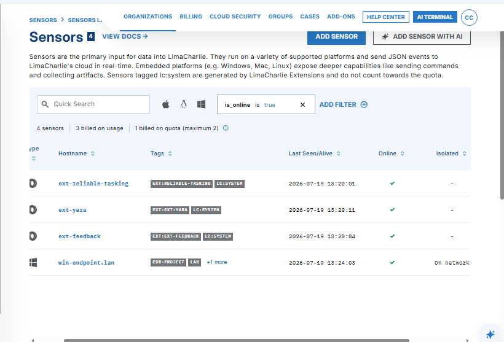](screenshots/01-setup/01-sensor-online.png)

[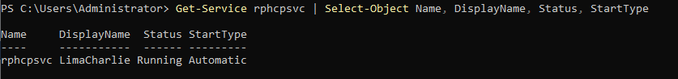](screenshots/01-setup/02-service-running.png)

**Result:** Passed.

## 6. Detection 1 — Suspicious Encoded PowerShell

### 6.1 Safe Test Command

```powershell
$PlainText = 'Write-Output "Week4-EDR-Test"'
$Encoded = [Convert]::ToBase64String(
    [Text.Encoding]::Unicode.GetBytes($PlainText)
)
powershell.exe -NoProfile -EncodedCommand $Encoded
```

The command only printed `Week4-EDR-Test`. The marker was created before the project was moved into the third portfolio sequence and is retained because it appears in the original screenshot.

[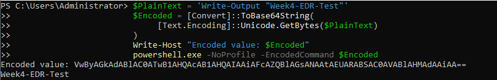](screenshots/02-suspicious-powershell/01-safe-test-command.png)

### 6.2 Detection Logic

The rule detects `powershell.exe` or `pwsh.exe` when the command line contains indicators such as:

- `-EncodedCommand`
- `-enc`
- `FromBase64String`
- `DownloadString`
- `IEX`

MITRE ATT&CK: **T1059.001 — PowerShell**.

### 6.3 LimaCharlie Telemetry

LimaCharlie recorded a `NEW_PROCESS` event containing:

- endpoint hostname;
- user context;
- PowerShell image path;
- full encoded command line;
- process and parent-process context.

[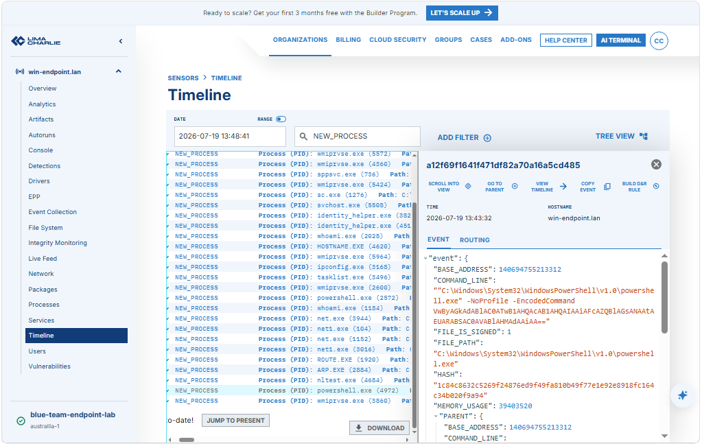](screenshots/02-suspicious-powershell/02-limacharlie-process-telemetry.png)

### 6.4 Wazuh and Sysmon Correlation

The event was also visible through Wazuh/Sysmon:

| Field | Value |
|---|---|
| Agent | `WIN-ENDPOINT` |
| Data source | Sysmon Event ID 1 |
| Process ID | `4972` |
| Parent process ID | `5308` |
| Wazuh rule | `92057` |
| Rule level | `12` |
| MITRE | T1059.001 |

[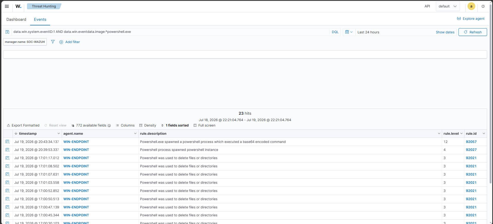](screenshots/02-suspicious-powershell/03-wazuh-powershell-hunt.png)

[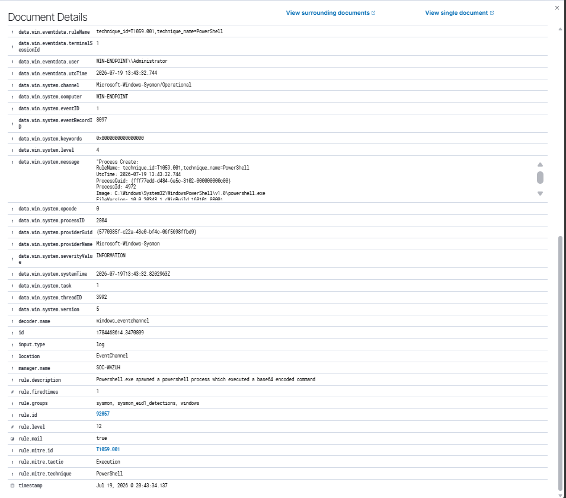](screenshots/02-suspicious-powershell/04-wazuh-encoded-alert.png)

A normal PowerShell process matched a lower-severity Wazuh rule (`92027`, level 4), providing a useful comparison with the encoded event.

[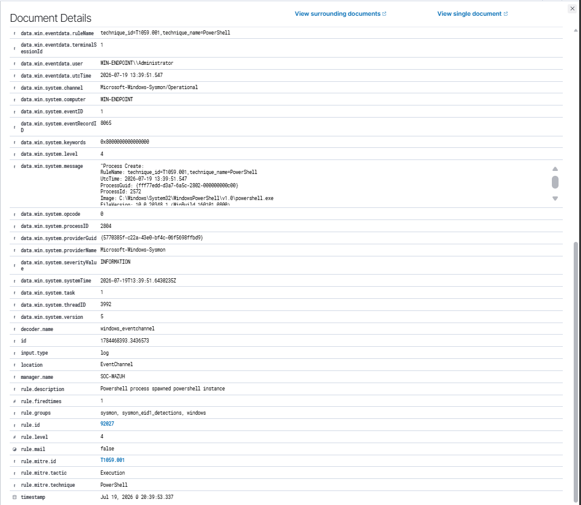](screenshots/02-suspicious-powershell/05-benign-powershell-comparison.png)

### 6.5 Assessment

| Validation Area | Status |
|---|---|
| LimaCharlie process telemetry | Passed |
| Sysmon process creation | Passed |
| Wazuh encoded PowerShell alert | Passed |
| LimaCharlie custom detection card | Pending Evidence |

The current screenshots prove telemetry and SIEM detection, but they do not prove that the LimaCharlie custom rule generated a detection card.

## 7. Detection 2 — Windows Reconnaissance Commands

### 7.1 Detection Logic

The rule matches:

```text
whoami.exe /priv
net.exe user
net.exe localgroup administrators
ipconfig.exe /all
nltest.exe /domain_trusts
```

[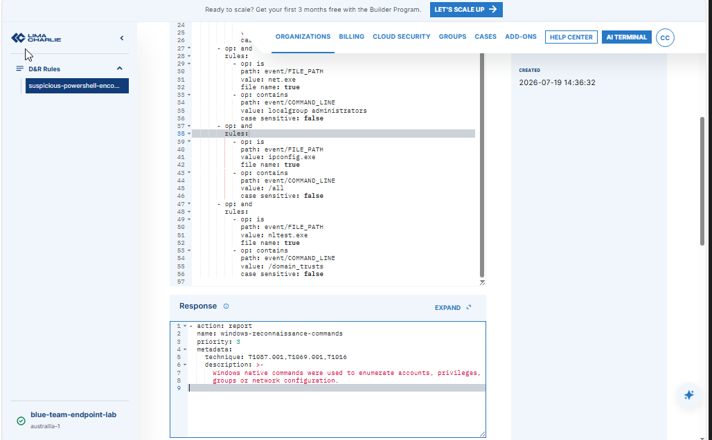](screenshots/03-reconnaissance/01-recon-rule.png)

[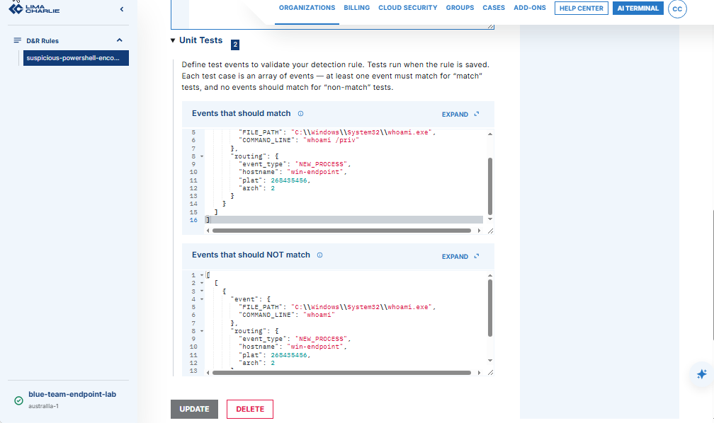](screenshots/03-reconnaissance/02-rule-unit-tests.png)

### 7.2 LimaCharlie Detection Results

Four detections were captured:

| UTC Time | Command | Status |
|---|---|---|
| 14:41:01 | `whoami.exe /priv` | Detected |
| 14:41:06 | `net.exe user` | Detected |
| 14:41:15 | `net.exe localgroup administrators` | Detected |
| 14:41:24 | `ipconfig.exe /all` | Detected |

[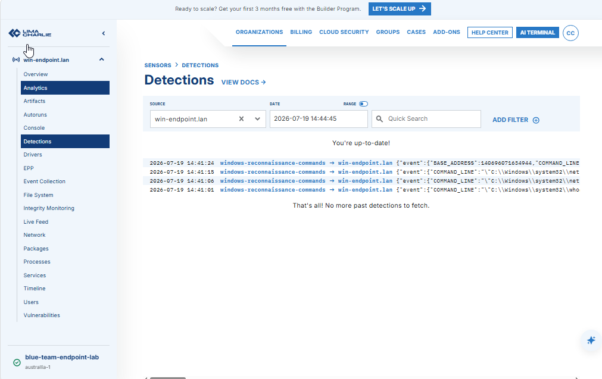](screenshots/03-reconnaissance/03-detections-overview.png)

[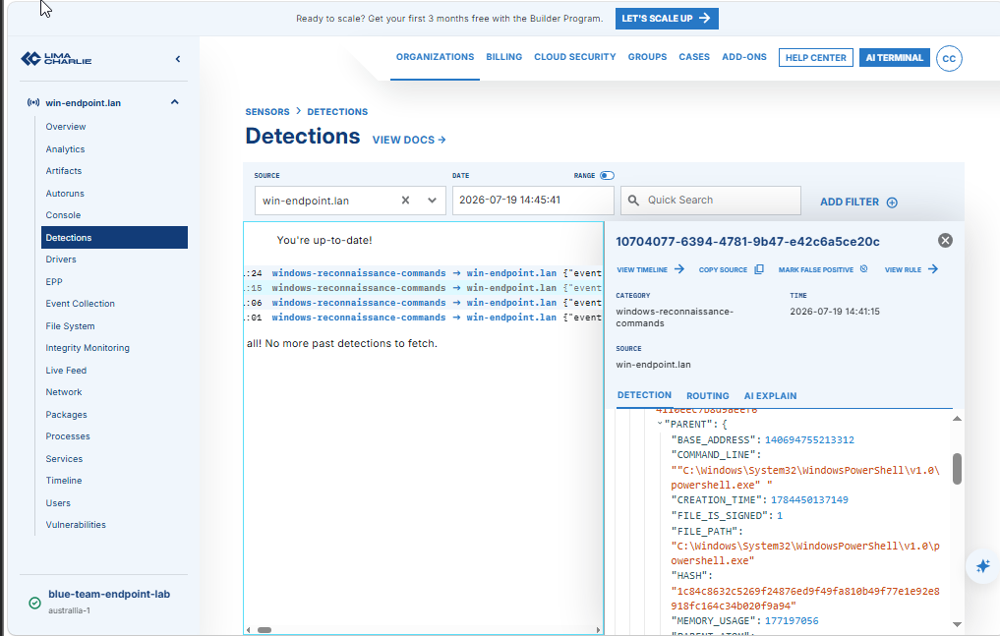](screenshots/03-reconnaissance/04-detection-event-context.png)

### 7.3 Sysmon Validation

Sysmon Event ID 1 independently recorded the command executions and their PowerShell parent process.

#### Network configuration discovery

```text
Image: C:\Windows\System32\ipconfig.exe
CommandLine: ipconfig.exe /all
Parent: powershell.exe
MITRE: T1016
```

[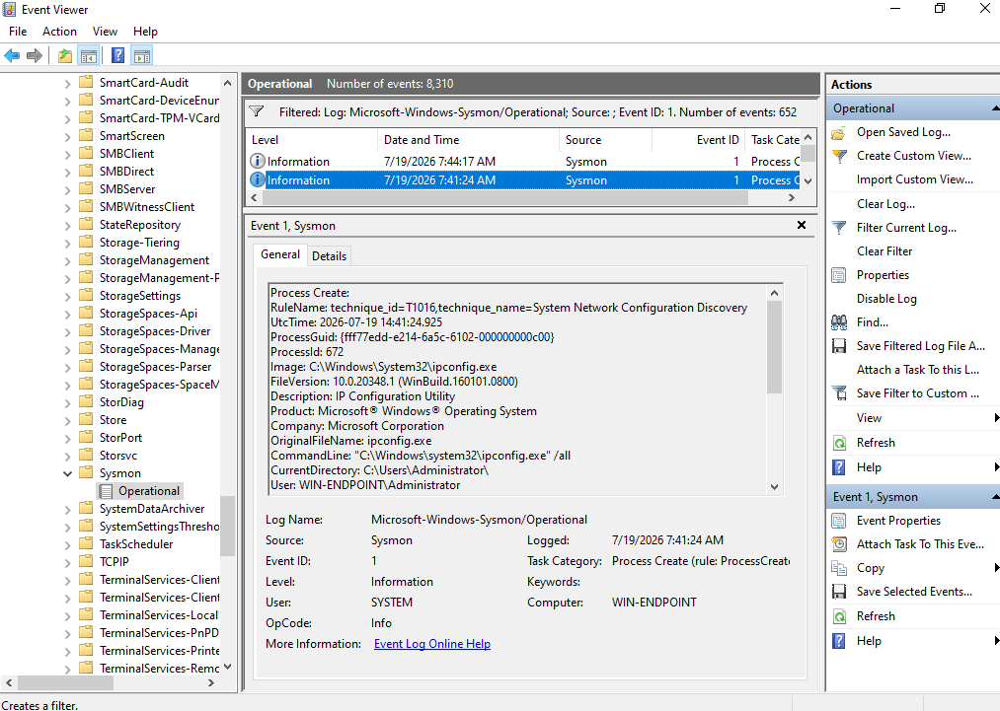](screenshots/03-reconnaissance/05-sysmon-ipconfig-process.png)

[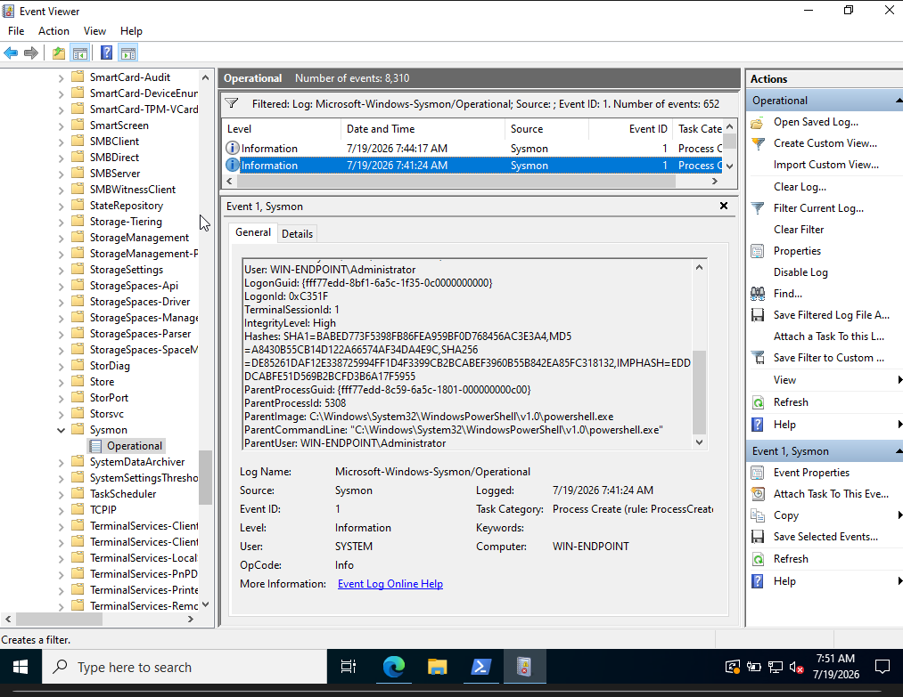](screenshots/03-reconnaissance/06-sysmon-ipconfig-parent.png)

#### Local group discovery

```text
Image: C:\Windows\System32\net.exe
CommandLine: net.exe localgroup administrators
Parent: powershell.exe
Analyst mapping: T1069.001
```

[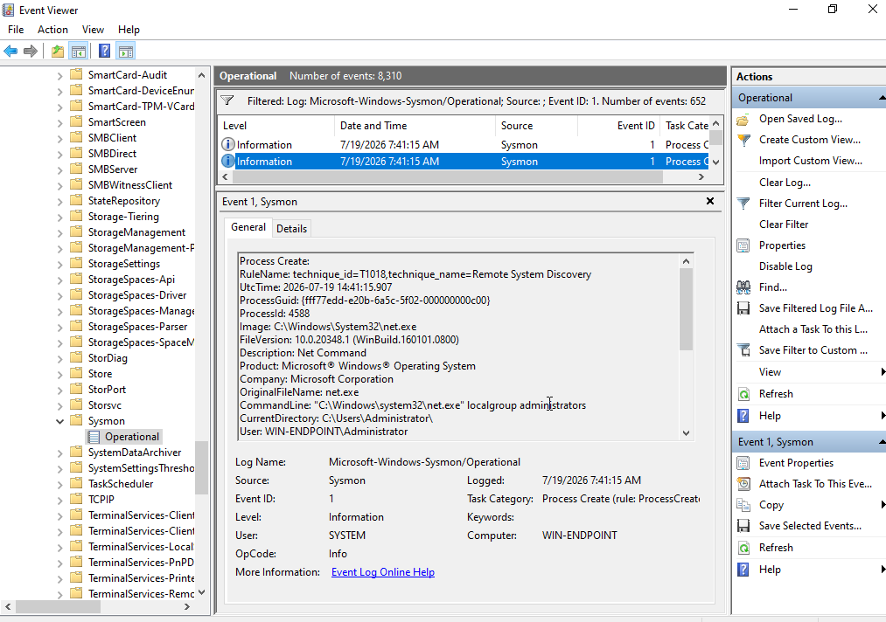](screenshots/03-reconnaissance/07-sysmon-localgroup-process.png)

[](screenshots/03-reconnaissance/08-sysmon-localgroup-parent.png)

#### User and privilege discovery

```text
Image: C:\Windows\System32\whoami.exe
CommandLine: whoami.exe /priv
Parent: powershell.exe
MITRE: T1033
```

[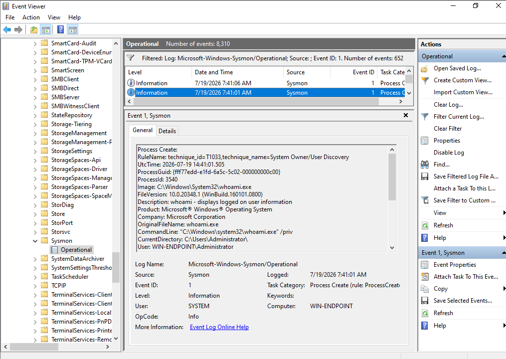](screenshots/03-reconnaissance/09-sysmon-whoami-process.png)

[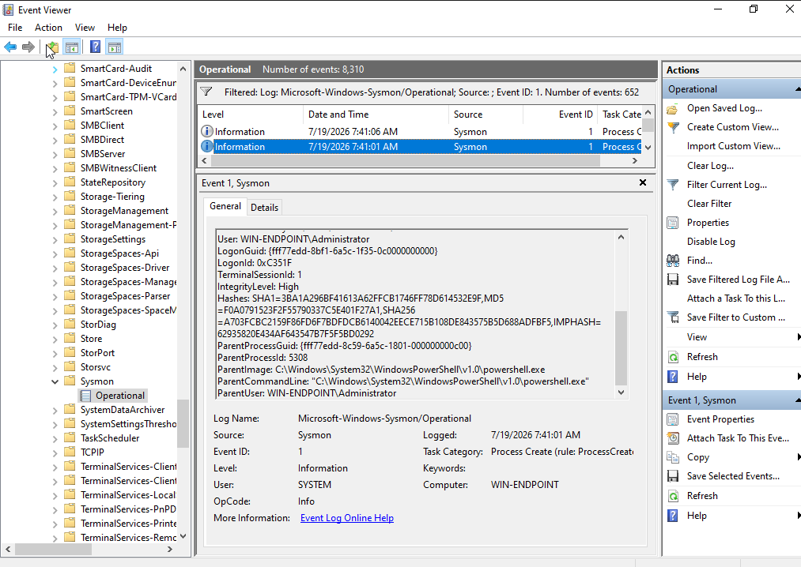](screenshots/03-reconnaissance/10-sysmon-whoami-parent.png)

### 7.4 MITRE ATT&CK Mapping

| Command | Technique | ID |
|---|---|---|
| `whoami /priv` | System Owner/User Discovery | T1033 |
| `net user` | Local Account | T1087.001 |
| `net localgroup administrators` | Local Groups | T1069.001 |
| `ipconfig /all` | System Network Configuration Discovery | T1016 |

**Result:** Passed.

## 8. EDR and SIEM Correlation

The encoded PowerShell event was supported by three data layers:

| Source | Evidence | Analytical Value |
|---|---|---|
| LimaCharlie | `NEW_PROCESS`, command line, user, parent context | Endpoint-level EDR context |
| Sysmon | Event ID 1, process ID, parent process ID | Independent Windows process evidence |
| Wazuh | Rule `92057`, level 12, T1059.001 | Centralized alert and threat-hunting context |

The visible time difference is caused by UTC in LimaCharlie/Sysmon and UTC+7 in the Wazuh dashboard.

**Conclusion:** Matching process identifiers, parent identifiers, image path, command line, user, and timestamps provide high confidence that the records describe the same process execution.

## 9. Endpoint Isolation Test

### 9.1 Connectivity Before Isolation

Before isolation, the Windows endpoint successfully reached `192.168.56.10` through ICMP and HTTP.

[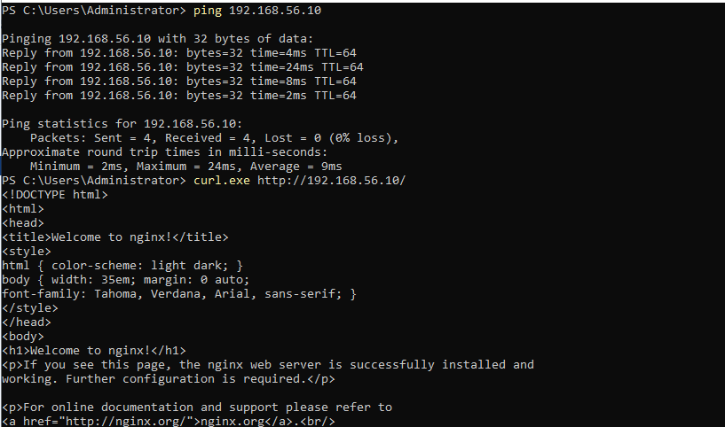](screenshots/04-containment/01-connectivity-before.png)

### 9.2 Isolation Request

The command `segregate_network` was issued through the LimaCharlie console. The screenshot showed `AWAITING` rather than a completed response.

[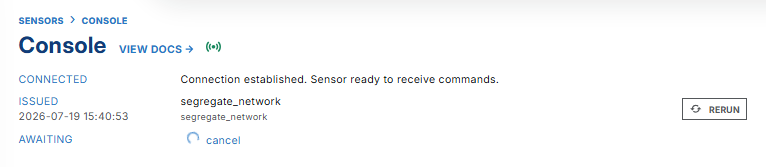](screenshots/04-containment/02-segregate-network-awaiting.png)

### 9.3 Network Effect

After the isolation request:

- ping returned `General failure`;
- `curl.exe` could not connect to TCP port 80.

[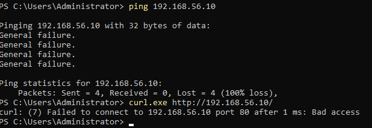](screenshots/04-containment/03-connectivity-blocked.png)

### 9.4 Assessment

| Test | Status |
|---|---|
| Connectivity before isolation | Passed |
| Traffic blocked after request | Passed |
| Console completion confirmation | Partial |
| `rejoin_network` recovery | Pending Evidence |

## 10. Incident Classification

This was an **authorized true-positive detection test using benign commands**.

| Area | Assessment |
|---|---|
| Actual lab impact | Low |
| Malicious payload | None |
| Credential theft | None |
| Persistence | None observed |
| Malicious outbound connection | None observed |
| Detection value | Medium to high in an unexpected production context |

## 11. Analyst Response Recommendations

1. Decode encoded command content safely.
2. Review parent and grandparent processes.
3. Confirm the initiating user and recent authentication events.
4. Search for related network, file, service, task, and persistence activity.
5. Compare activity with approved administration scripts.
6. Isolate the endpoint when malicious activity is confirmed or risk is high.
7. Rejoin the network only after containment and remediation checks pass.
8. Tune exclusions narrowly to known users, scripts, signatures, and managed paths.

## 12. Limitations and Pending Evidence

- No screenshot shows a LimaCharlie custom detection card for encoded PowerShell.
- The screenshot of `segregate_network` remained in `AWAITING` state.
- No screenshot shows `rejoin_network` completing.
- No screenshot shows ping and HTTP connectivity restored after rejoin.
- No dedicated evidence was captured for `nltest /domain_trusts`.
- Tests used safe simulated activity rather than malware.
- No production-scale baseline or false-positive tuning was performed.

These gaps do not invalidate the completed evidence. They remain clearly marked so the report does not claim unsupported results.

## 13. Lessons Learned

- EDR provides process and parent-process context that is difficult to obtain from basic authentication logs alone.
- Sysmon provides strong independent confirmation for endpoint process activity.
- SIEM correlation helps centralize and prioritize endpoint events.
- Native administrative tools require contextual detection rather than simple binary blocking.
- Response evidence must include both containment and recovery.
- `Pending Evidence` is preferable to overstating a result.

## 14. Conclusion

The project successfully demonstrated sensor deployment, endpoint telemetry analysis, Windows reconnaissance detection, Sysmon and Wazuh correlation, and the network-blocking effect of endpoint isolation. The remaining PowerShell custom-alert and recovery evidence is documented as pending and can be added later without restructuring the project.

