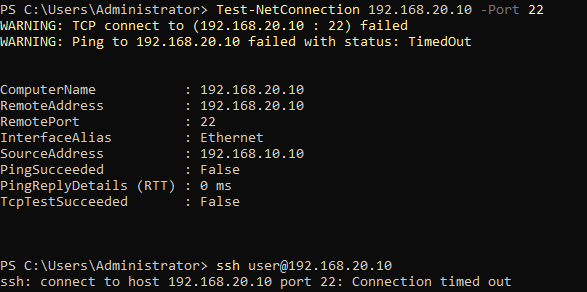

# Blocked Traffic Analysis

## Observation

The USER client at `192.168.10.10` successfully reached the DMZ web service on TCP/80 but failed to connect to TCP/22, TCP/445, and TCP/3389. pfSense logs showed matching denied traffic from the USER interface toward `192.168.20.10`.

## Interpretation

The combination of a failed client connection and a matching firewall deny log is stronger evidence than either alone:

- A failed connection by itself could be caused by the service being stopped, routing failure, or a host firewall.
- A firewall log by itself shows policy action but not the user-visible effect.
- Together, the evidence demonstrates that the intended network control was active.

## Analyst conclusion

This was expected policy enforcement, not a security incident. In a real SOC, repeated access attempts to multiple administrative ports would still justify triage for reconnaissance or lateral-movement behavior.

