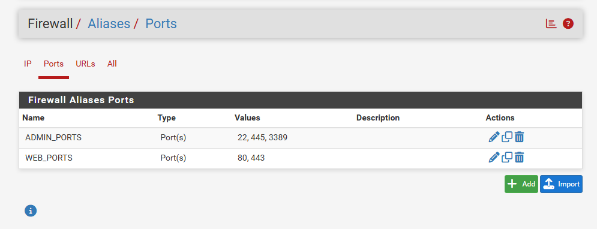

# pfSense Rules and Aliases

## Aliases

| Alias | Type | Value |
|---|---|---|
| `DMZ_WEB_SERVER` | Host | `192.168.20.10` |
| `WEB_PORTS` | Port | `80,443` |
| `ADMIN_PORTS` | Port | `22,445,3389` |

## USER interface order

1. Permit DNS to the approved resolver/pfSense interface.
2. Permit TCP from USER_NET to `DMZ_WEB_SERVER` on `WEB_PORTS`.
3. Block and log TCP from USER_NET to DMZ on `ADMIN_PORTS`.
4. Block and log all remaining USER_NET-to-DMZ traffic.
5. Permit required external web traffic.

## SOC_ADMIN interface order

1. Permit TCP/22 to `DMZ_WEB_SERVER`.
2. Permit TCP/3000 to `DMZ_WEB_SERVER`.
3. Permit TCP/9090 to `DMZ_WEB_SERVER`.
4. Retain a default deny for other unauthorized inter-zone access.

## DMZ interface principles

- Block unsolicited DMZ-to-USER access.
- Permit only the outbound services needed for updates and the lab stack.
- Do not use a permanent `DMZ net -> any` pass rule after troubleshooting is complete.

The screenshots document both the initial build and final restricted state. The final test evidence is authoritative for the report conclusions.
