# Firewall IDS and Infrastructure Monitoring - Screenshot Evidence Index

This page provides a direct path to every screenshot stored in this project. Project READMEs and reports display only the most important evidence so that the documentation remains readable.

**Total screenshot files:** 141

## Evidence Sections

| Section | Screenshots |
|---|---:|
| `grafana` | 12 |
| `pfsense` | 28 |
| `prometheus` | 17 |
| `raw-evidence` | 71 |
| `suricata` | 13 |

## grafana

### 01-grafana-prometheus-datasource.png

[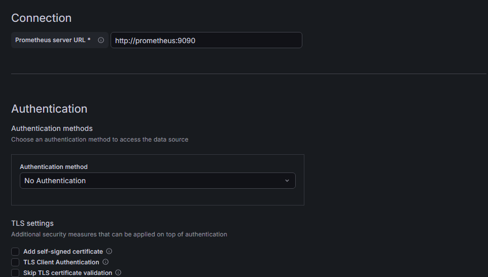](grafana/01-grafana-prometheus-datasource.png)

[Open full-size screenshot](grafana/01-grafana-prometheus-datasource.png)

### 02-grafana-datasource-query-success.png

[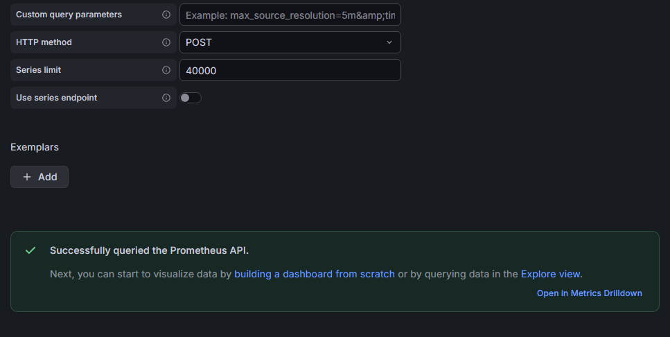](grafana/02-grafana-datasource-query-success.png)

[Open full-size screenshot](grafana/02-grafana-datasource-query-success.png)

### 03-stress-ng-cpu-test-command.png

[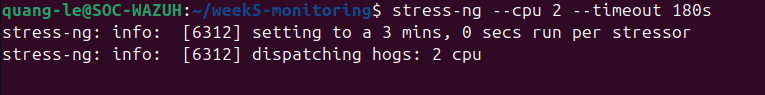](grafana/03-stress-ng-cpu-test-command.png)

[Open full-size screenshot](grafana/03-stress-ng-cpu-test-command.png)

### 04-top-cpu-load-evidence.png

[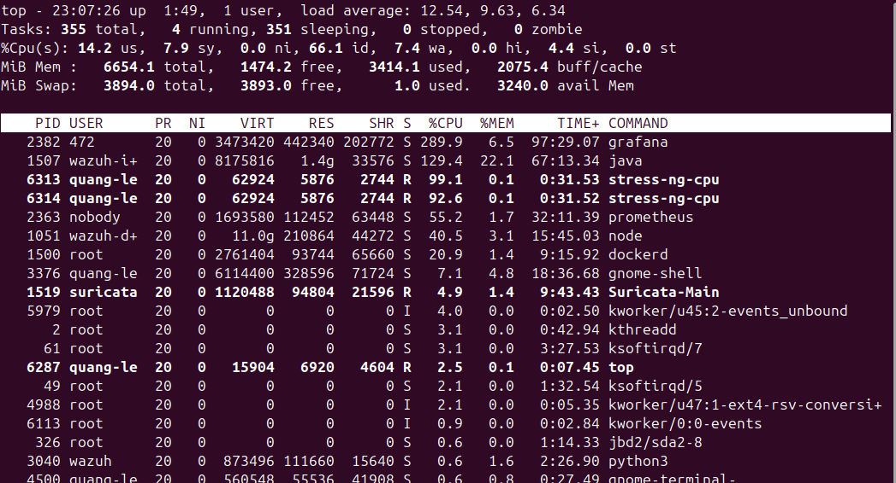](grafana/04-top-cpu-load-evidence.png)

[Open full-size screenshot](grafana/04-top-cpu-load-evidence.png)

### 05-stress-ng-all-cpu-test.png

[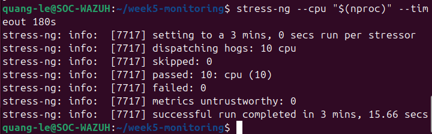](grafana/05-stress-ng-all-cpu-test.png)

[Open full-size screenshot](grafana/05-stress-ng-all-cpu-test.png)

### 06-grafana-cpu-dashboard.png

[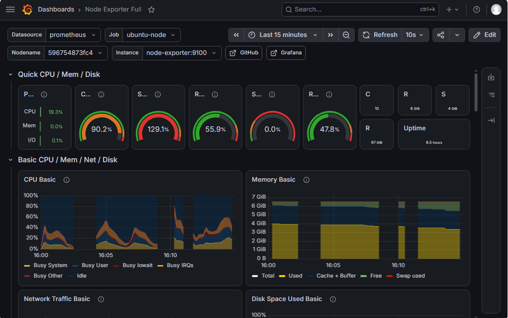](grafana/06-grafana-cpu-dashboard.png)

[Open full-size screenshot](grafana/06-grafana-cpu-dashboard.png)

### 07-grafana-memory-dashboard.png

[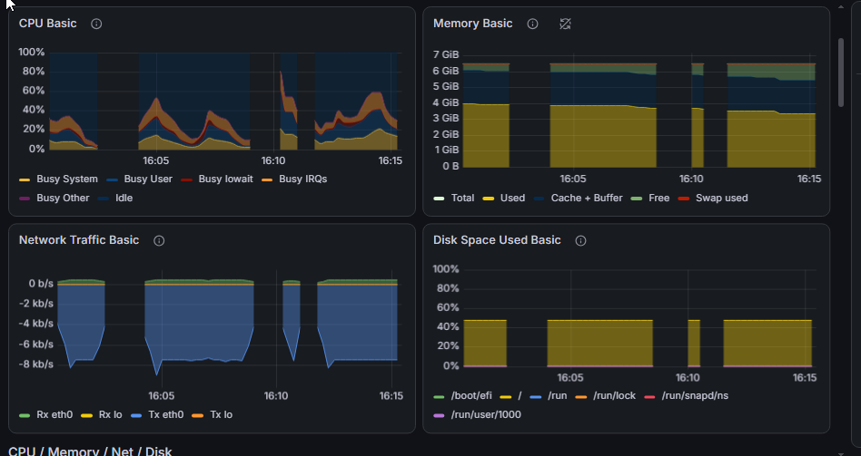](grafana/07-grafana-memory-dashboard.png)

[Open full-size screenshot](grafana/07-grafana-memory-dashboard.png)

### 08-grafana-network-dashboard.png

[Open full-size screenshot](grafana/08-grafana-network-dashboard.png)

### 09-grafana-disk-io-dashboard.png

[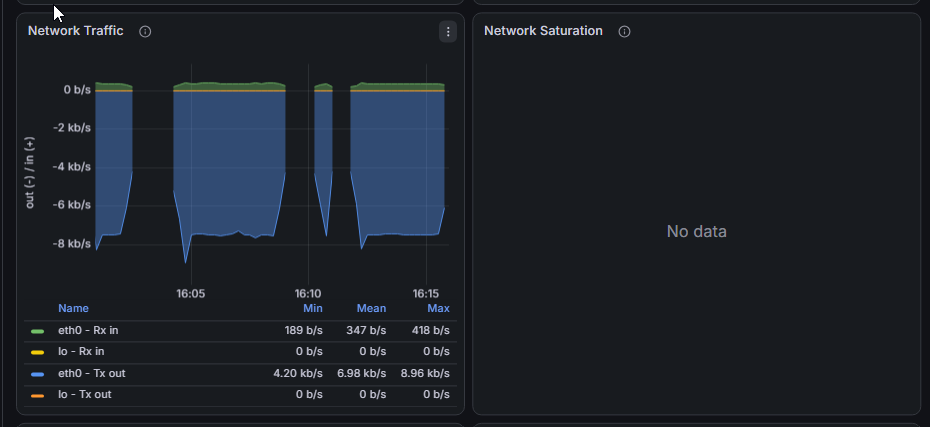](grafana/09-grafana-disk-io-dashboard.png)

[Open full-size screenshot](grafana/09-grafana-disk-io-dashboard.png)

### 10-grafana-filesystem-dashboard.png

[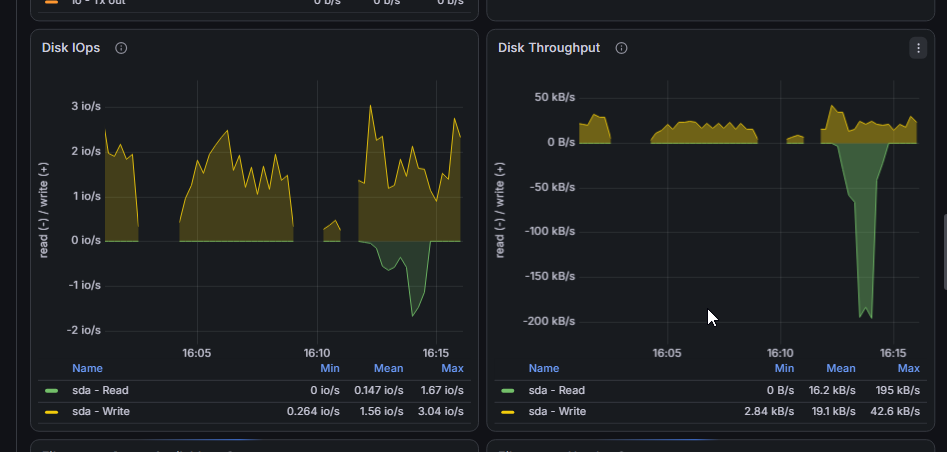](grafana/10-grafana-filesystem-dashboard.png)

[Open full-size screenshot](grafana/10-grafana-filesystem-dashboard.png)

### 11-grafana-disk-utilization-dashboard.png

[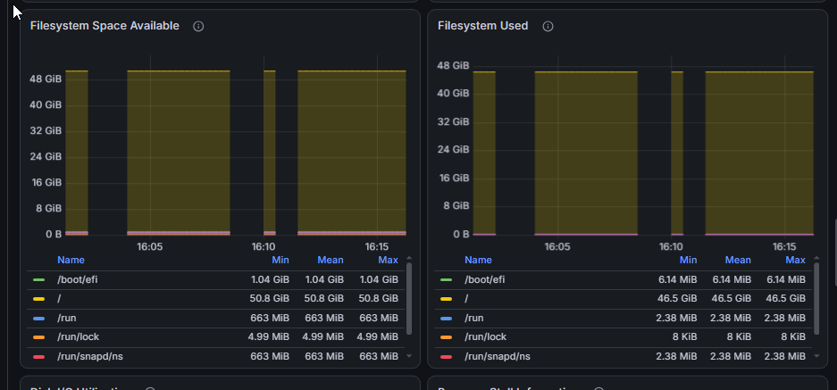](grafana/11-grafana-disk-utilization-dashboard.png)

[Open full-size screenshot](grafana/11-grafana-disk-utilization-dashboard.png)

### 12-grafana-pressure-dashboard.png

[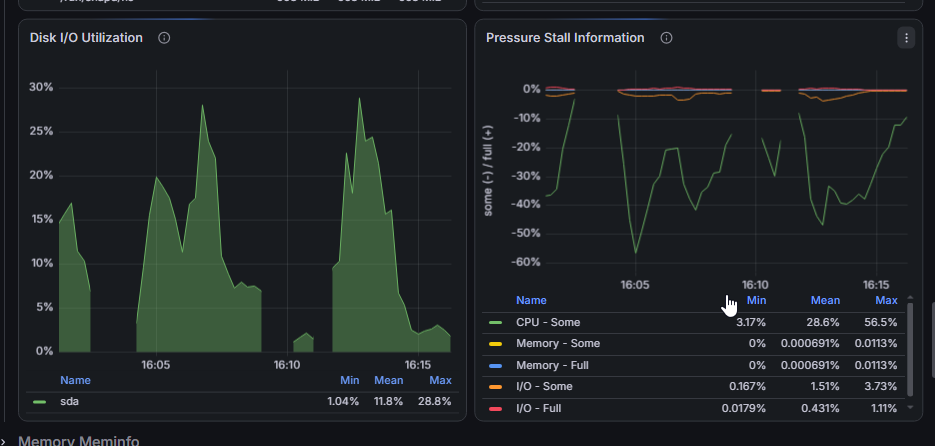](grafana/12-grafana-pressure-dashboard.png)

[Open full-size screenshot](grafana/12-grafana-pressure-dashboard.png)

## pfsense

### 01-windows-test-client-system.png

[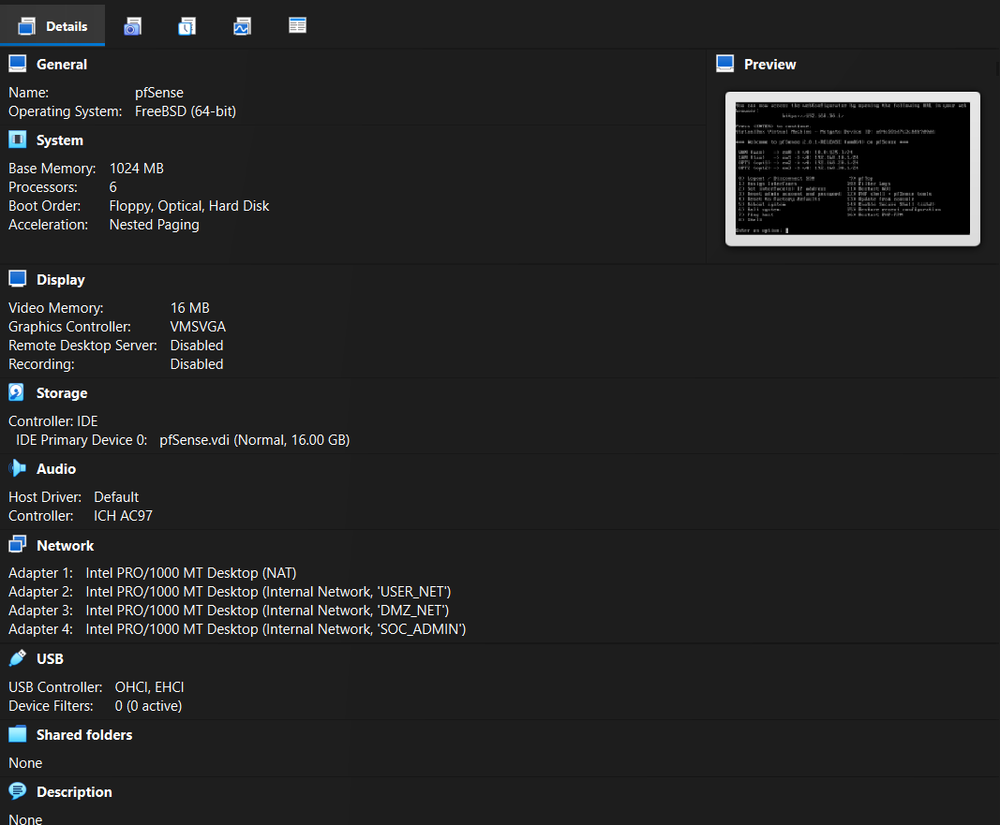](pfsense/01-windows-test-client-system.png)

[Open full-size screenshot](pfsense/01-windows-test-client-system.png)

### 02-user-net-ip-configuration.png

[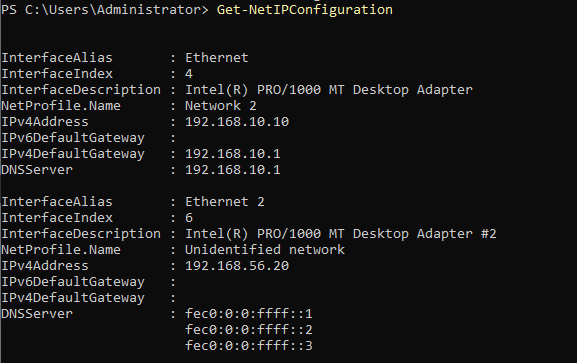](pfsense/02-user-net-ip-configuration.png)

[Open full-size screenshot](pfsense/02-user-net-ip-configuration.png)

### 03-ubuntu-dmz-ip-route.png

[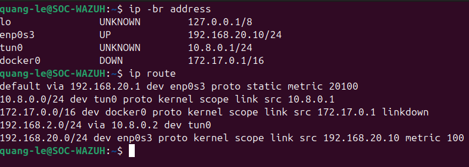](pfsense/03-ubuntu-dmz-ip-route.png)

[Open full-size screenshot](pfsense/03-ubuntu-dmz-ip-route.png)

### 04-pfsense-interface-assignments.png

[Open full-size screenshot](pfsense/04-pfsense-interface-assignments.png)

### 05-pfsense-wan-user-status.png

[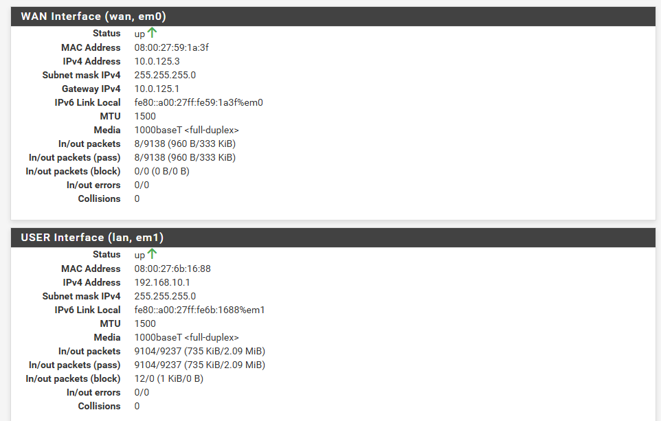](pfsense/05-pfsense-wan-user-status.png)

[Open full-size screenshot](pfsense/05-pfsense-wan-user-status.png)

### 06-pfsense-dmz-socadmin-status.png

[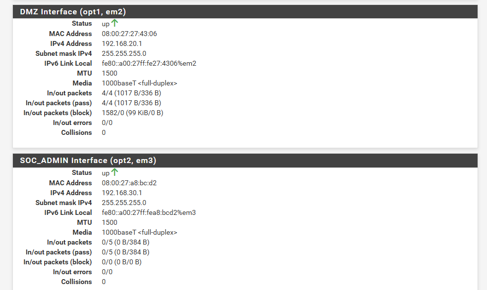](pfsense/06-pfsense-dmz-socadmin-status.png)

[Open full-size screenshot](pfsense/06-pfsense-dmz-socadmin-status.png)

### 07-dmz-web-server-alias.png

[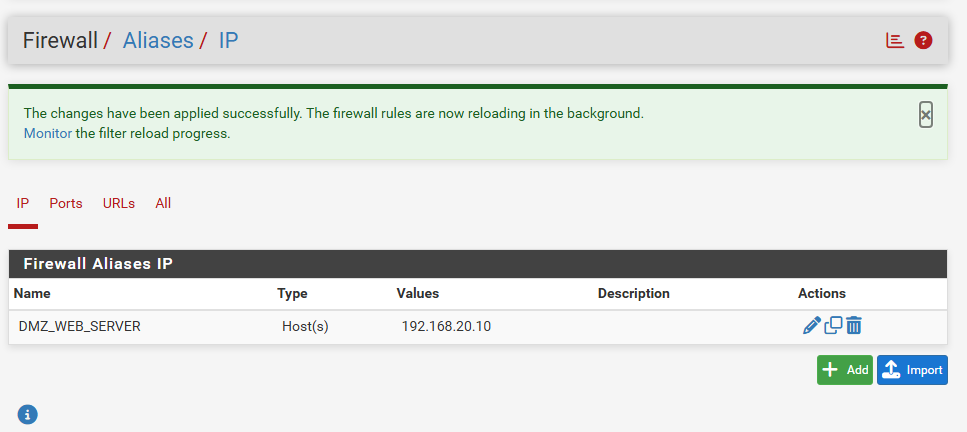](pfsense/07-dmz-web-server-alias.png)

[Open full-size screenshot](pfsense/07-dmz-web-server-alias.png)

### 08-service-port-aliases.png

[Open full-size screenshot](pfsense/08-service-port-aliases.png)

### 09-user-firewall-rules-initial.png

[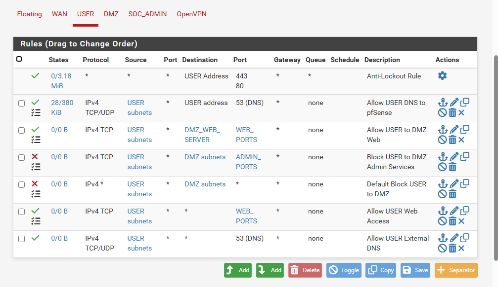](pfsense/09-user-firewall-rules-initial.png)

[Open full-size screenshot](pfsense/09-user-firewall-rules-initial.png)

### 10-dmz-firewall-rules-initial.png

[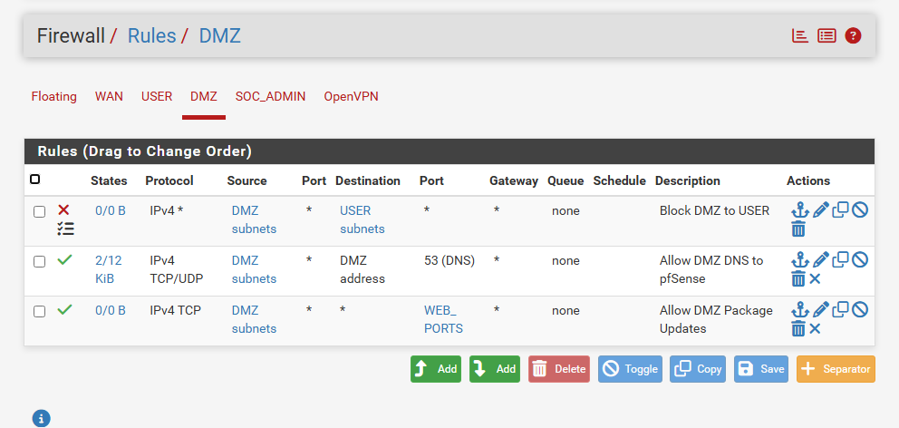](pfsense/10-dmz-firewall-rules-initial.png)

[Open full-size screenshot](pfsense/10-dmz-firewall-rules-initial.png)

### 11-socadmin-firewall-rules-initial.png

[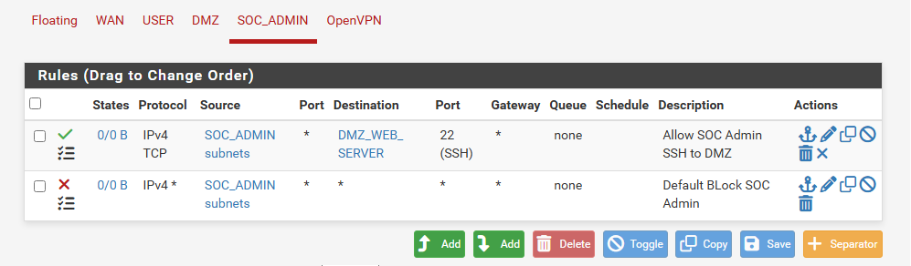](pfsense/11-socadmin-firewall-rules-initial.png)

[Open full-size screenshot](pfsense/11-socadmin-firewall-rules-initial.png)

### 12-user-http-curl-success.png

[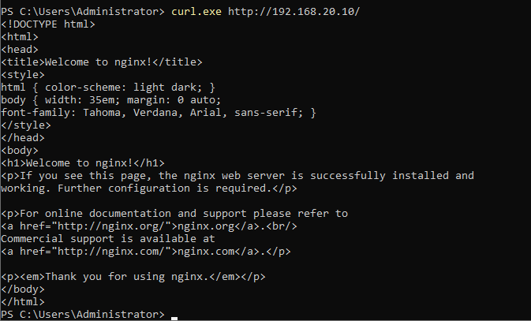](pfsense/12-user-http-curl-success.png)

[Open full-size screenshot](pfsense/12-user-http-curl-success.png)

### 13-user-to-dmz-http-port80-passed.png

[Open full-size screenshot](pfsense/13-user-to-dmz-http-port80-passed.png)

### 14-user-to-dmz-ssh-blocked.png

[Open full-size screenshot](pfsense/14-user-to-dmz-ssh-blocked.png)

### 15-user-to-dmz-smb-blocked.png

[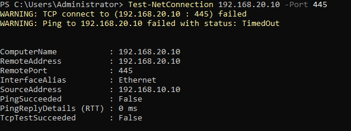](pfsense/15-user-to-dmz-smb-blocked.png)

[Open full-size screenshot](pfsense/15-user-to-dmz-smb-blocked.png)

### 16-user-to-dmz-rdp-blocked.png

[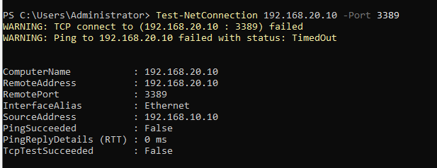](pfsense/16-user-to-dmz-rdp-blocked.png)

[Open full-size screenshot](pfsense/16-user-to-dmz-rdp-blocked.png)

### 17-pfsense-blocked-admin-port-logs.png

[Open full-size screenshot](pfsense/17-pfsense-blocked-admin-port-logs.png)

### 18-socadmin-to-dmz-ssh-passed.png

[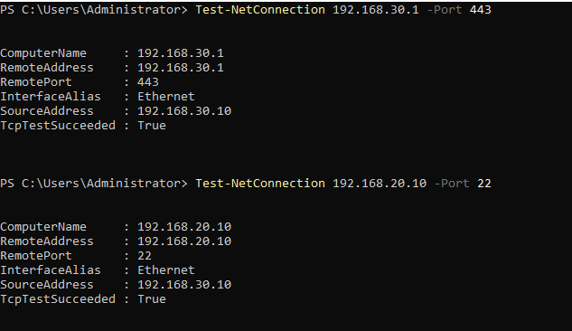](pfsense/18-socadmin-to-dmz-ssh-passed.png)

[Open full-size screenshot](pfsense/18-socadmin-to-dmz-ssh-passed.png)

### 19-socadmin-firewall-rules-final.png

[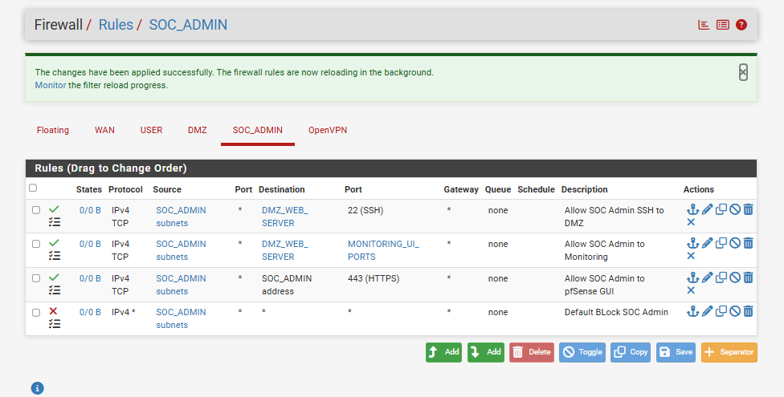](pfsense/19-socadmin-firewall-rules-final.png)

[Open full-size screenshot](pfsense/19-socadmin-firewall-rules-final.png)

### 20-dmz-firewall-rules-final.png

[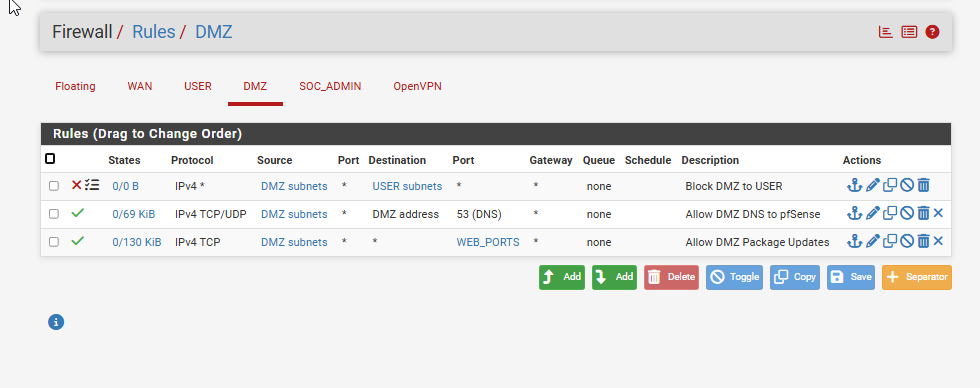](pfsense/20-dmz-firewall-rules-final.png)

[Open full-size screenshot](pfsense/20-dmz-firewall-rules-final.png)

### 21-user-firewall-rules-final.png

[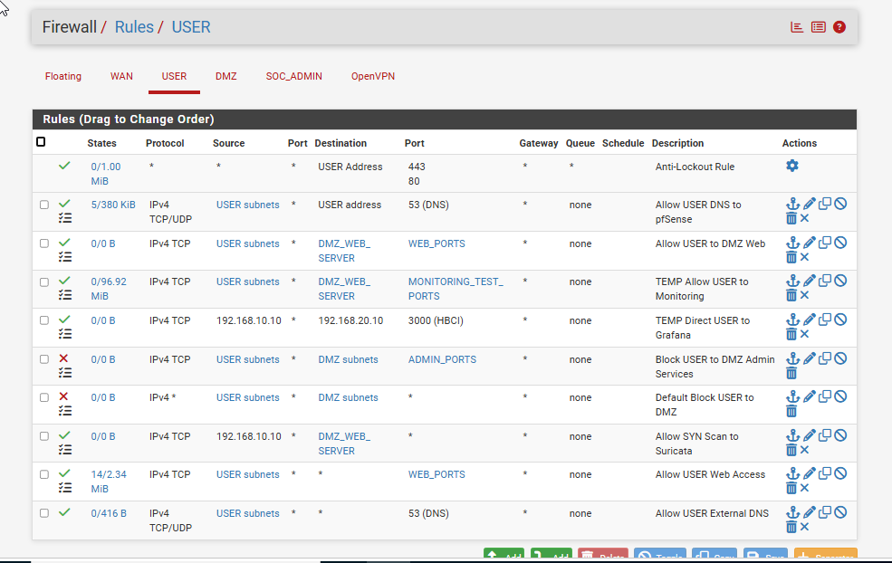](pfsense/21-user-firewall-rules-final.png)

[Open full-size screenshot](pfsense/21-user-firewall-rules-final.png)

### 22-socadmin-to-grafana-passed.png

[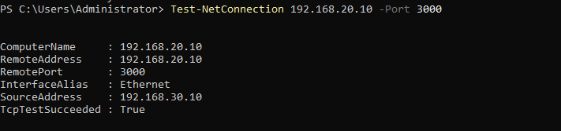](pfsense/22-socadmin-to-grafana-passed.png)

[Open full-size screenshot](pfsense/22-socadmin-to-grafana-passed.png)

### 23-socadmin-to-prometheus-passed.png

[Open full-size screenshot](pfsense/23-socadmin-to-prometheus-passed.png)

### 24-user-to-grafana-blocked.png

[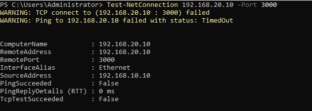](pfsense/24-user-to-grafana-blocked.png)

[Open full-size screenshot](pfsense/24-user-to-grafana-blocked.png)

### 25-user-to-prometheus-blocked.png

[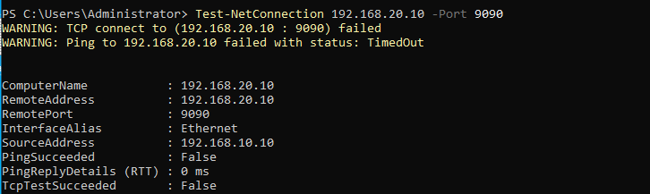](pfsense/25-user-to-prometheus-blocked.png)

[Open full-size screenshot](pfsense/25-user-to-prometheus-blocked.png)

### 26-user-firewall-rules-final.png

[Open full-size screenshot](pfsense/26-user-firewall-rules-final.png)

### 27-pfsense-monitoring-access-logs.png

[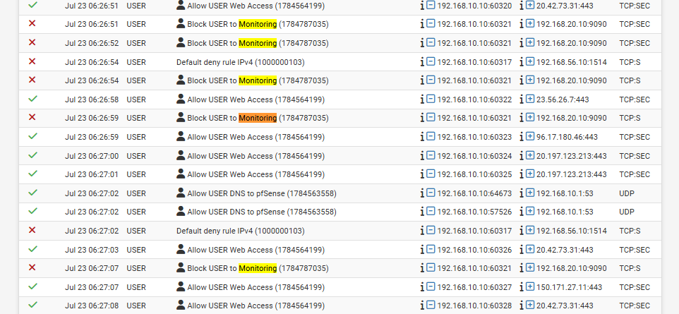](pfsense/27-pfsense-monitoring-access-logs.png)

[Open full-size screenshot](pfsense/27-pfsense-monitoring-access-logs.png)

### 28-pfsense-final-firewall-logs.png

[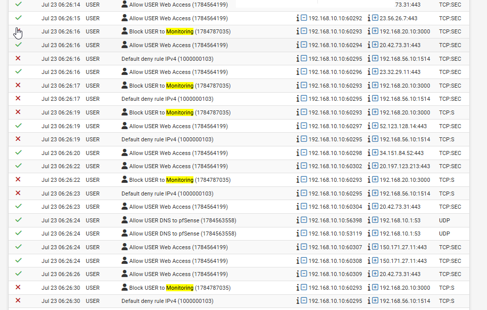](pfsense/28-pfsense-final-firewall-logs.png)

[Open full-size screenshot](pfsense/28-pfsense-final-firewall-logs.png)

## prometheus

### 01-docker-compose-services-up.png

[Open full-size screenshot](prometheus/01-docker-compose-services-up.png)

### 02-prometheus-config-validation.png

[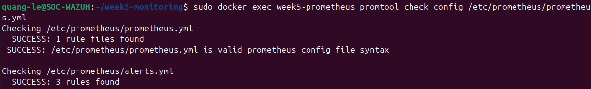](prometheus/02-prometheus-config-validation.png)

[Open full-size screenshot](prometheus/02-prometheus-config-validation.png)

### 03-prometheus-alert-rules-validation.png

[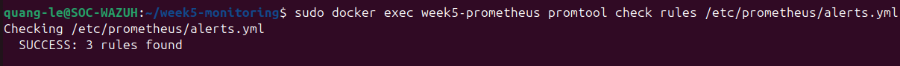](prometheus/03-prometheus-alert-rules-validation.png)

[Open full-size screenshot](prometheus/03-prometheus-alert-rules-validation.png)

### 04-node-exporter-metrics-endpoint.png

[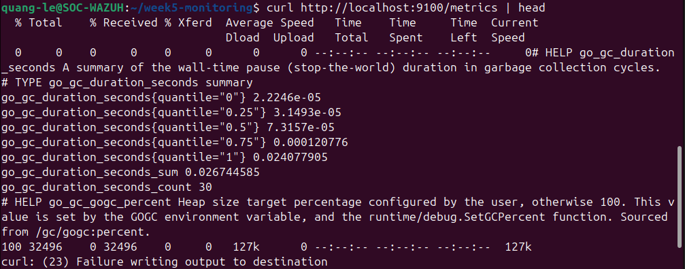](prometheus/04-node-exporter-metrics-endpoint.png)

[Open full-size screenshot](prometheus/04-node-exporter-metrics-endpoint.png)

### 05-prometheus-health-grafana-login.png

[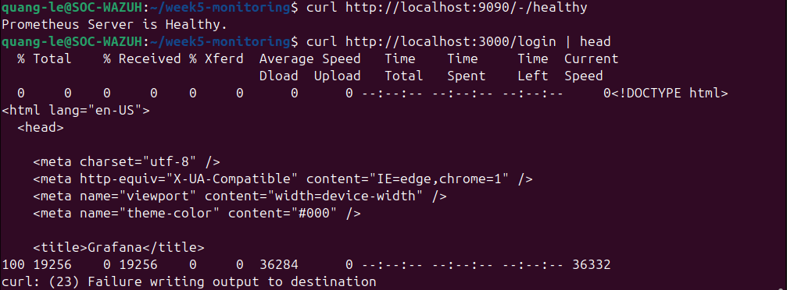](prometheus/05-prometheus-health-grafana-login.png)

[Open full-size screenshot](prometheus/05-prometheus-health-grafana-login.png)

### 06-node-metric-query-cli.png

[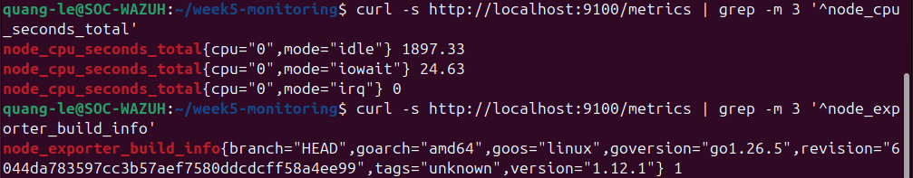](prometheus/06-node-metric-query-cli.png)

[Open full-size screenshot](prometheus/06-node-metric-query-cli.png)

### 07-prometheus-targets-up.png

[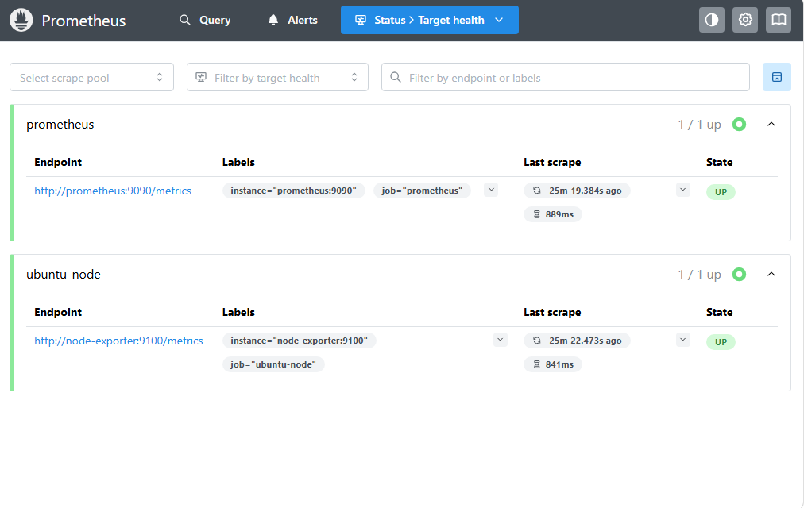](prometheus/07-prometheus-targets-up.png)

[Open full-size screenshot](prometheus/07-prometheus-targets-up.png)

### 08-prometheus-alert-rules-page.png

[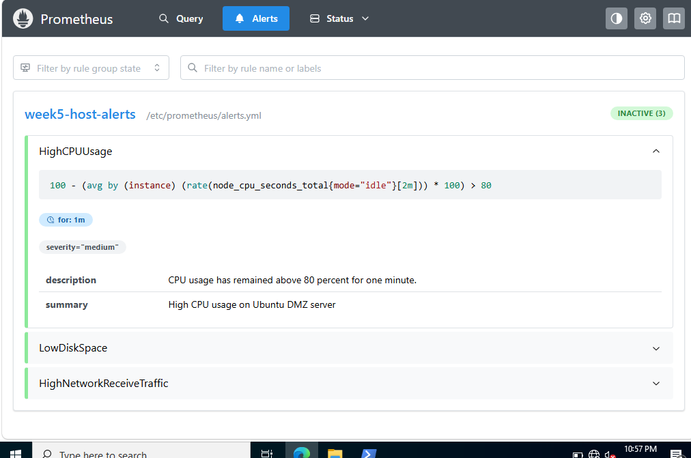](prometheus/08-prometheus-alert-rules-page.png)

[Open full-size screenshot](prometheus/08-prometheus-alert-rules-page.png)

### 09-prometheus-targets-final-up.png

[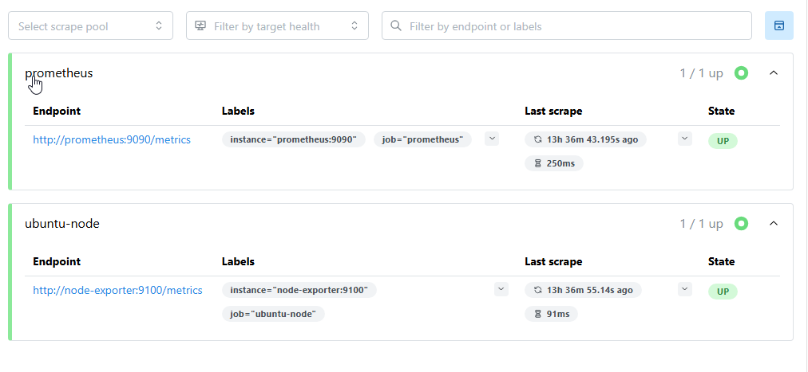](prometheus/09-prometheus-targets-final-up.png)

[Open full-size screenshot](prometheus/09-prometheus-targets-final-up.png)

### 10-host-container-time-alignment.png

[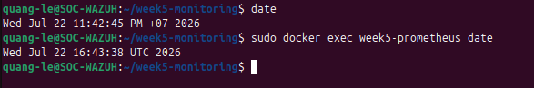](prometheus/10-host-container-time-alignment.png)

[Open full-size screenshot](prometheus/10-host-container-time-alignment.png)

### 11-cpu-query-api-result.png

[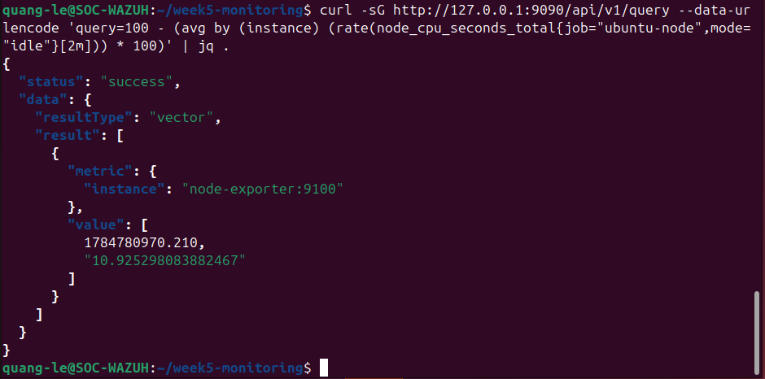](prometheus/11-cpu-query-api-result.png)

[Open full-size screenshot](prometheus/11-cpu-query-api-result.png)

### 12-cpu-promql-result.png

[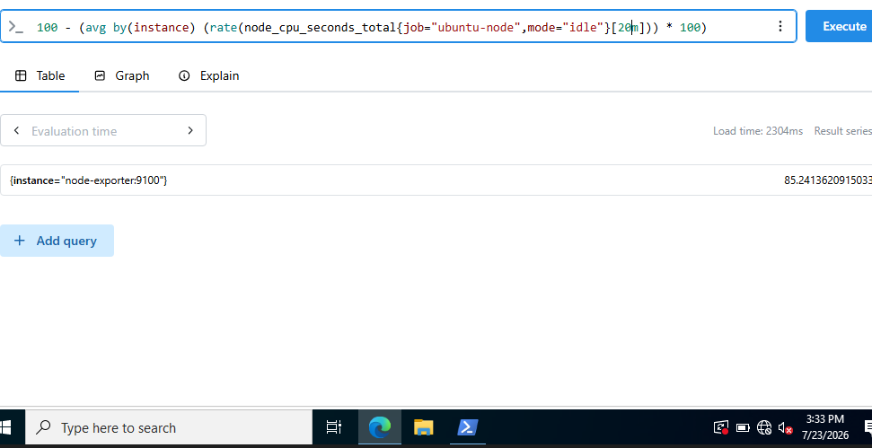](prometheus/12-cpu-promql-result.png)

[Open full-size screenshot](prometheus/12-cpu-promql-result.png)

### 13-memory-promql-result.png

[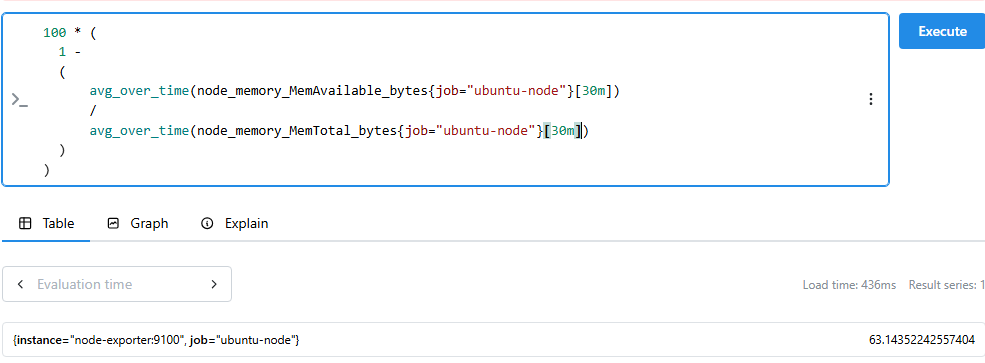](prometheus/13-memory-promql-result.png)

[Open full-size screenshot](prometheus/13-memory-promql-result.png)

### 14-disk-promql-result.png

[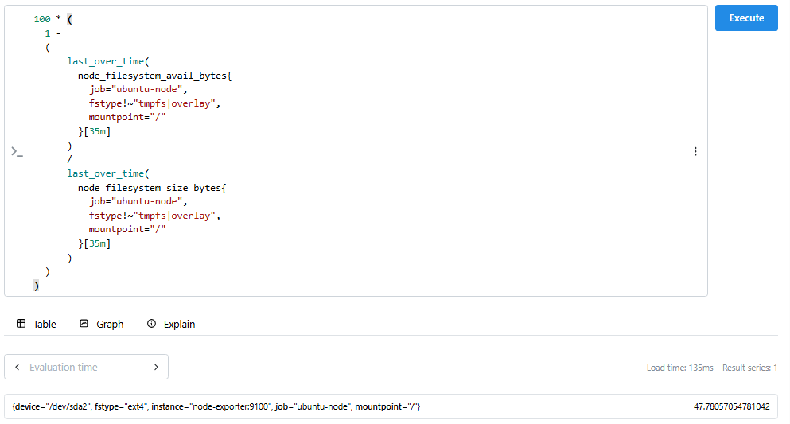](prometheus/14-disk-promql-result.png)

[Open full-size screenshot](prometheus/14-disk-promql-result.png)

### 15-network-rx-promql-result.png

[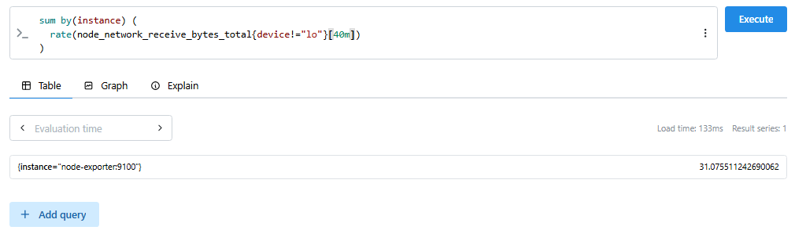](prometheus/15-network-rx-promql-result.png)

[Open full-size screenshot](prometheus/15-network-rx-promql-result.png)

### 16-network-tx-promql-result.png

[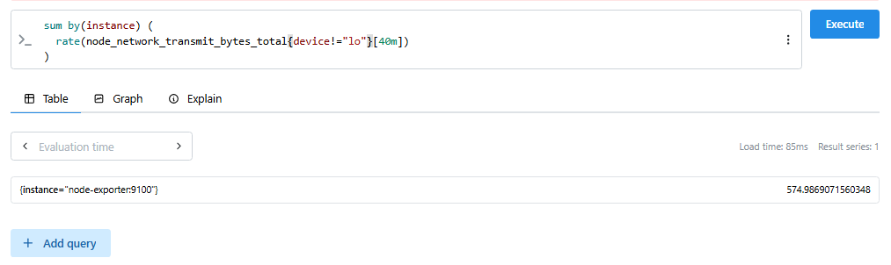](prometheus/16-network-tx-promql-result.png)

[Open full-size screenshot](prometheus/16-network-tx-promql-result.png)

### 17-alert-rules-returned-to-normal.png

[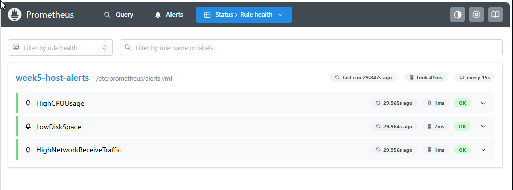](prometheus/17-alert-rules-returned-to-normal.png)

[Open full-size screenshot](prometheus/17-alert-rules-returned-to-normal.png)

## raw-evidence

- [`raw-evidence/Screenshot 2026-07-20 152638.png`](raw-evidence/Screenshot%202026-07-20%20152638.png)
- [`raw-evidence/Screenshot 2026-07-20 152824.png`](raw-evidence/Screenshot%202026-07-20%20152824.png)
- [`raw-evidence/Screenshot 2026-07-20 154153.png`](raw-evidence/Screenshot%202026-07-20%20154153.png)
- [`raw-evidence/Screenshot 2026-07-20 154330.png`](raw-evidence/Screenshot%202026-07-20%20154330.png)
- [`raw-evidence/Screenshot 2026-07-20 154728.png`](raw-evidence/Screenshot%202026-07-20%20154728.png)
- [`raw-evidence/Screenshot 2026-07-20 154740.png`](raw-evidence/Screenshot%202026-07-20%20154740.png)
- [`raw-evidence/Screenshot 2026-07-20 155348.png`](raw-evidence/Screenshot%202026-07-20%20155348.png)
- [`raw-evidence/Screenshot 2026-07-20 155400.png`](raw-evidence/Screenshot%202026-07-20%20155400.png)
- [`raw-evidence/Screenshot 2026-07-20 163155.png`](raw-evidence/Screenshot%202026-07-20%20163155.png)
- [`raw-evidence/Screenshot 2026-07-20 163209.png`](raw-evidence/Screenshot%202026-07-20%20163209.png)
- [`raw-evidence/Screenshot 2026-07-20 163450.png`](raw-evidence/Screenshot%202026-07-20%20163450.png)
- [`raw-evidence/Screenshot 2026-07-20 212934.png`](raw-evidence/Screenshot%202026-07-20%20212934.png)
- [`raw-evidence/Screenshot 2026-07-20 212946.png`](raw-evidence/Screenshot%202026-07-20%20212946.png)
- [`raw-evidence/Screenshot 2026-07-20 213138.png`](raw-evidence/Screenshot%202026-07-20%20213138.png)
- [`raw-evidence/Screenshot 2026-07-20 213248.png`](raw-evidence/Screenshot%202026-07-20%20213248.png)
- [`raw-evidence/Screenshot 2026-07-20 213318.png`](raw-evidence/Screenshot%202026-07-20%20213318.png)
- [`raw-evidence/Screenshot 2026-07-20 213546.png`](raw-evidence/Screenshot%202026-07-20%20213546.png)
- [`raw-evidence/Screenshot 2026-07-20 220707.png`](raw-evidence/Screenshot%202026-07-20%20220707.png)
- [`raw-evidence/Screenshot 2026-07-21 205448.png`](raw-evidence/Screenshot%202026-07-21%20205448.png)
- [`raw-evidence/Screenshot 2026-07-21 205500.png`](raw-evidence/Screenshot%202026-07-21%20205500.png)
- [`raw-evidence/Screenshot 2026-07-21 205919.png`](raw-evidence/Screenshot%202026-07-21%20205919.png)
- [`raw-evidence/Screenshot 2026-07-21 210407.png`](raw-evidence/Screenshot%202026-07-21%20210407.png)
- [`raw-evidence/Screenshot 2026-07-21 210632.png`](raw-evidence/Screenshot%202026-07-21%20210632.png)
- [`raw-evidence/Screenshot 2026-07-21 210754.png`](raw-evidence/Screenshot%202026-07-21%20210754.png)
- [`raw-evidence/Screenshot 2026-07-21 210851.png`](raw-evidence/Screenshot%202026-07-21%20210851.png)
- [`raw-evidence/Screenshot 2026-07-21 215658.png`](raw-evidence/Screenshot%202026-07-21%20215658.png)
- [`raw-evidence/Screenshot 2026-07-21 224102.png`](raw-evidence/Screenshot%202026-07-21%20224102.png)
- [`raw-evidence/Screenshot 2026-07-21 231916.png`](raw-evidence/Screenshot%202026-07-21%20231916.png)
- [`raw-evidence/Screenshot 2026-07-22 102342.png`](raw-evidence/Screenshot%202026-07-22%20102342.png)
- [`raw-evidence/Screenshot 2026-07-22 104450.png`](raw-evidence/Screenshot%202026-07-22%20104450.png)
- [`raw-evidence/Screenshot 2026-07-22 104501.png`](raw-evidence/Screenshot%202026-07-22%20104501.png)
- [`raw-evidence/Screenshot 2026-07-22 104856.png`](raw-evidence/Screenshot%202026-07-22%20104856.png)
- [`raw-evidence/Screenshot 2026-07-22 105247.png`](raw-evidence/Screenshot%202026-07-22%20105247.png)
- [`raw-evidence/Screenshot 2026-07-22 105401.png`](raw-evidence/Screenshot%202026-07-22%20105401.png)
- [`raw-evidence/Screenshot 2026-07-22 160326.png`](raw-evidence/Screenshot%202026-07-22%20160326.png)
- [`raw-evidence/Screenshot 2026-07-22 161905.png`](raw-evidence/Screenshot%202026-07-22%20161905.png)
- [`raw-evidence/Screenshot 2026-07-22 162435.png`](raw-evidence/Screenshot%202026-07-22%20162435.png)
- [`raw-evidence/Screenshot 2026-07-22 162515.png`](raw-evidence/Screenshot%202026-07-22%20162515.png)
- [`raw-evidence/Screenshot 2026-07-22 230718.png`](raw-evidence/Screenshot%202026-07-22%20230718.png)
- [`raw-evidence/Screenshot 2026-07-22 230742.png`](raw-evidence/Screenshot%202026-07-22%20230742.png)
- [`raw-evidence/Screenshot 2026-07-22 231950.png`](raw-evidence/Screenshot%202026-07-22%20231950.png)
- [`raw-evidence/Screenshot 2026-07-22 232049.png`](raw-evidence/Screenshot%202026-07-22%20232049.png)
- [`raw-evidence/Screenshot 2026-07-22 234500.png`](raw-evidence/Screenshot%202026-07-22%20234500.png)
- [`raw-evidence/Screenshot 2026-07-22 234511.png`](raw-evidence/Screenshot%202026-07-22%20234511.png)
- [`raw-evidence/Screenshot 2026-07-23 095539.png`](raw-evidence/Screenshot%202026-07-23%20095539.png)
- [`raw-evidence/Screenshot 2026-07-23 101018.png`](raw-evidence/Screenshot%202026-07-23%20101018.png)
- [`raw-evidence/Screenshot 2026-07-23 113001.png`](raw-evidence/Screenshot%202026-07-23%20113001.png)
- [`raw-evidence/Screenshot 2026-07-23 152230.png`](raw-evidence/Screenshot%202026-07-23%20152230.png)
- [`raw-evidence/Screenshot 2026-07-23 153808.png`](raw-evidence/Screenshot%202026-07-23%20153808.png)
- [`raw-evidence/Screenshot 2026-07-23 154511.png`](raw-evidence/Screenshot%202026-07-23%20154511.png)
- [`raw-evidence/Screenshot 2026-07-23 154632.png`](raw-evidence/Screenshot%202026-07-23%20154632.png)
- [`raw-evidence/Screenshot 2026-07-23 154836.png`](raw-evidence/Screenshot%202026-07-23%20154836.png)
- [`raw-evidence/Screenshot 2026-07-23 161500.png`](raw-evidence/Screenshot%202026-07-23%20161500.png)
- [`raw-evidence/Screenshot 2026-07-23 161510.png`](raw-evidence/Screenshot%202026-07-23%20161510.png)
- [`raw-evidence/Screenshot 2026-07-23 161539.png`](raw-evidence/Screenshot%202026-07-23%20161539.png)
- [`raw-evidence/Screenshot 2026-07-23 161557.png`](raw-evidence/Screenshot%202026-07-23%20161557.png)
- [`raw-evidence/Screenshot 2026-07-23 161608.png`](raw-evidence/Screenshot%202026-07-23%20161608.png)
- [`raw-evidence/Screenshot 2026-07-23 161615.png`](raw-evidence/Screenshot%202026-07-23%20161615.png)
- [`raw-evidence/Screenshot 2026-07-23 161623.png`](raw-evidence/Screenshot%202026-07-23%20161623.png)
- [`raw-evidence/Screenshot 2026-07-23 161632.png`](raw-evidence/Screenshot%202026-07-23%20161632.png)
- [`raw-evidence/Screenshot 2026-07-23 161856.png`](raw-evidence/Screenshot%202026-07-23%20161856.png)
- [`raw-evidence/Screenshot 2026-07-23 171420.png`](raw-evidence/Screenshot%202026-07-23%20171420.png)
- [`raw-evidence/Screenshot 2026-07-23 171429.png`](raw-evidence/Screenshot%202026-07-23%20171429.png)
- [`raw-evidence/Screenshot 2026-07-23 171439.png`](raw-evidence/Screenshot%202026-07-23%20171439.png)
- [`raw-evidence/Screenshot 2026-07-23 172802.png`](raw-evidence/Screenshot%202026-07-23%20172802.png)
- [`raw-evidence/Screenshot 2026-07-23 173017.png`](raw-evidence/Screenshot%202026-07-23%20173017.png)
- [`raw-evidence/Screenshot 2026-07-23 201156.png`](raw-evidence/Screenshot%202026-07-23%20201156.png)
- [`raw-evidence/Screenshot 2026-07-23 201203.png`](raw-evidence/Screenshot%202026-07-23%20201203.png)
- [`raw-evidence/Screenshot 2026-07-23 202322.png`](raw-evidence/Screenshot%202026-07-23%20202322.png)
- [`raw-evidence/Screenshot 2026-07-23 202338.png`](raw-evidence/Screenshot%202026-07-23%20202338.png)
- [`raw-evidence/Screenshot 2026-07-23 202359.png`](raw-evidence/Screenshot%202026-07-23%20202359.png)

## suricata

### 01-suricata-version-and-features.png

[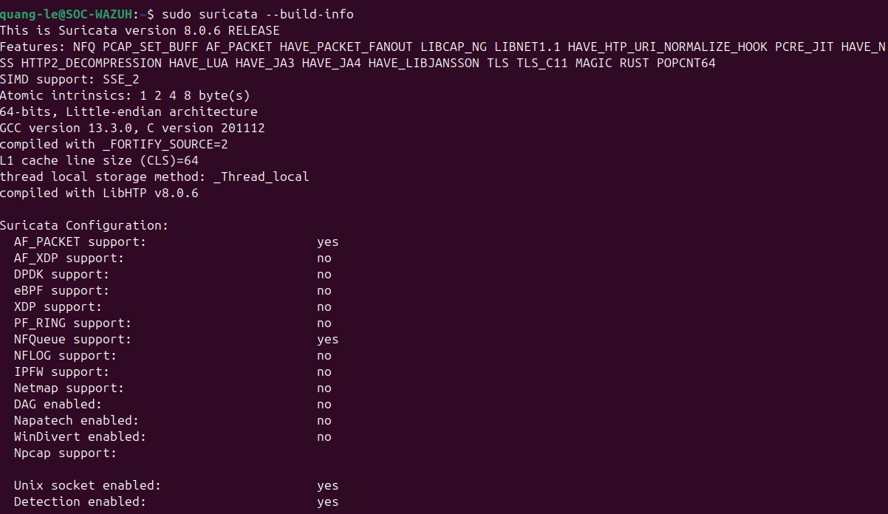](suricata/01-suricata-version-and-features.png)

[Open full-size screenshot](suricata/01-suricata-version-and-features.png)

### 02-suricata-initial-interface-error.png

[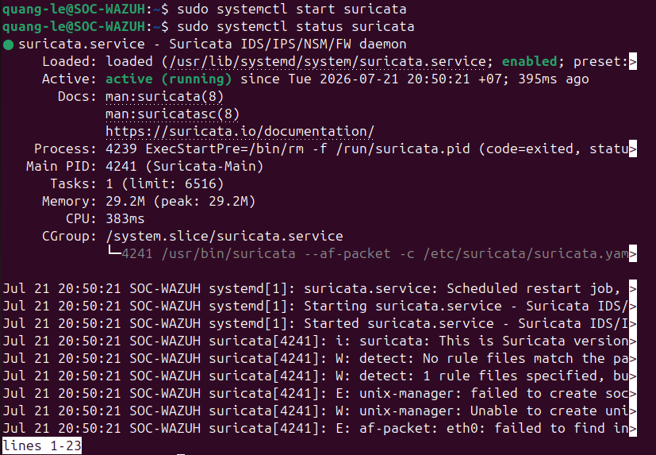](suricata/02-suricata-initial-interface-error.png)

[Open full-size screenshot](suricata/02-suricata-initial-interface-error.png)

### 03-ubuntu-interface-verification.png

[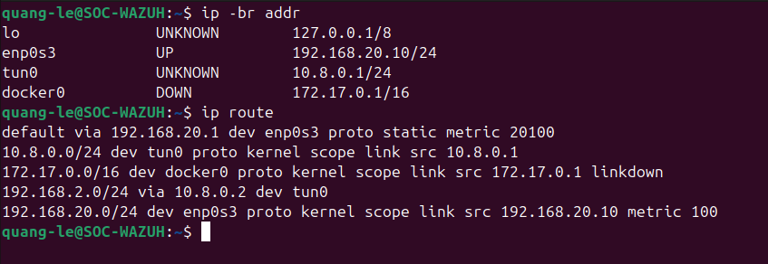](suricata/03-ubuntu-interface-verification.png)

[Open full-size screenshot](suricata/03-ubuntu-interface-verification.png)

### 04-suricata-home-net-configuration.png

[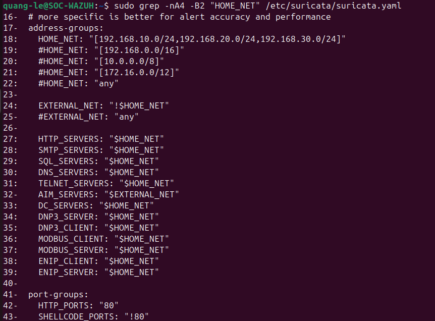](suricata/04-suricata-home-net-configuration.png)

[Open full-size screenshot](suricata/04-suricata-home-net-configuration.png)

### 05-suricata-af-packet-configuration.png

[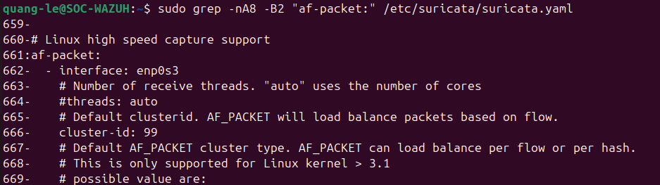](suricata/05-suricata-af-packet-configuration.png)

[Open full-size screenshot](suricata/05-suricata-af-packet-configuration.png)

### 06-suricata-config-validation.png

[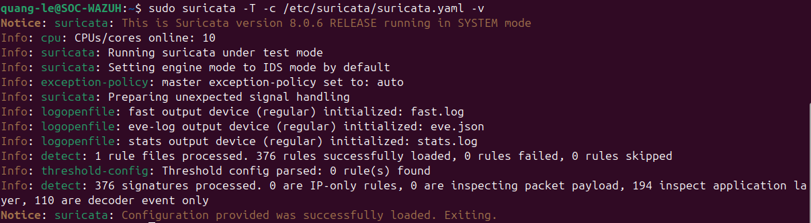](suricata/06-suricata-config-validation.png)

[Open full-size screenshot](suricata/06-suricata-config-validation.png)

### 07-suricata-service-active.png

[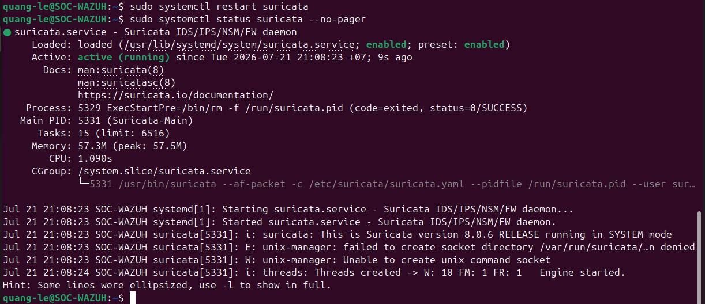](suricata/07-suricata-service-active.png)

[Open full-size screenshot](suricata/07-suricata-service-active.png)

### 08-safe-web-attack-test-requests.png

[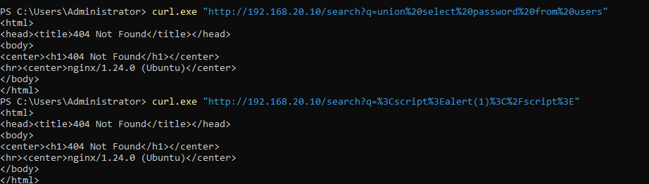](suricata/08-safe-web-attack-test-requests.png)

[Open full-size screenshot](suricata/08-safe-web-attack-test-requests.png)

### 09-suricata-fast-log-alerts.png

[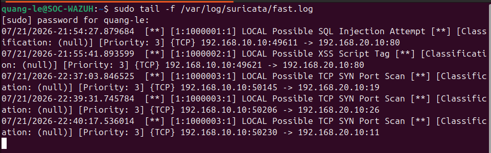](suricata/09-suricata-fast-log-alerts.png)

[Open full-size screenshot](suricata/09-suricata-fast-log-alerts.png)

### 10-suricata-eve-json-alert-analysis.png

[Open full-size screenshot](suricata/10-suricata-eve-json-alert-analysis.png)

### 11-local-rules-editor.png

[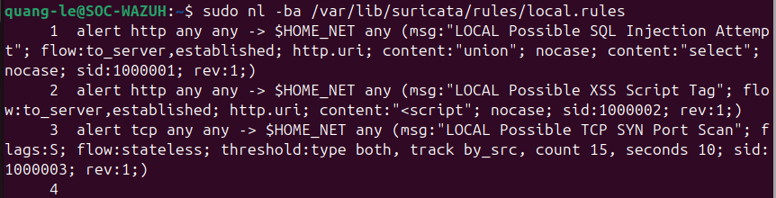](suricata/11-local-rules-editor.png)

[Open full-size screenshot](suricata/11-local-rules-editor.png)

### 12-local-rules-final.png

[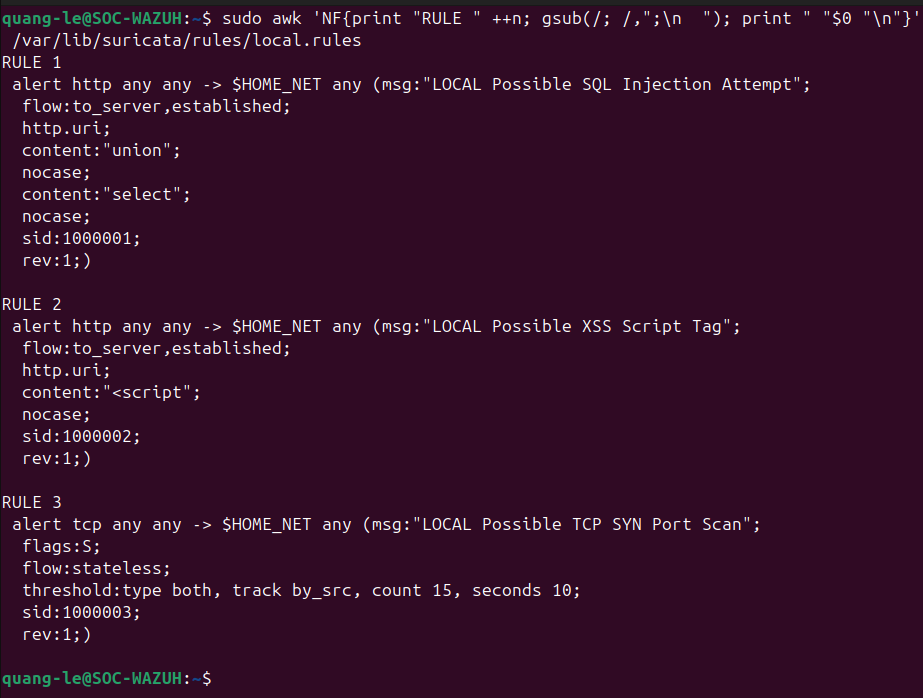](suricata/12-local-rules-final.png)

[Open full-size screenshot](suricata/12-local-rules-final.png)

### 13-nginx-access-log-test-traffic.png

[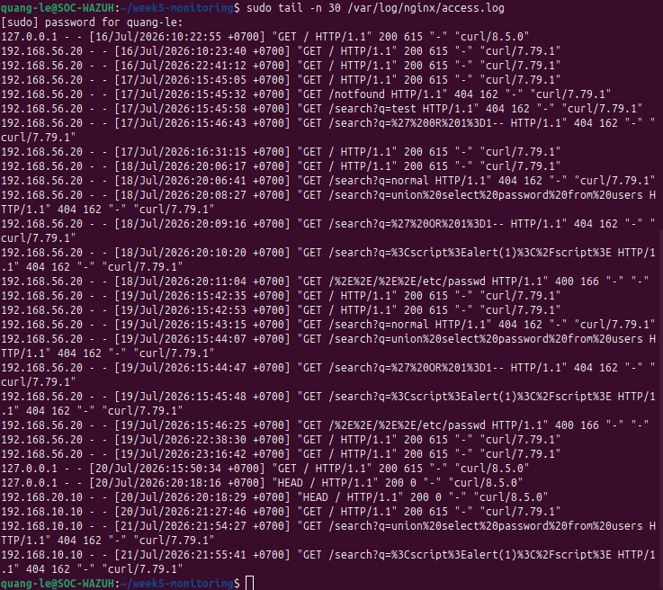](suricata/13-nginx-access-log-test-traffic.png)

[Open full-size screenshot](suricata/13-nginx-access-log-test-traffic.png)
