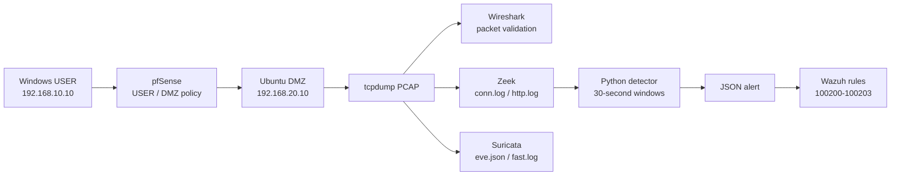
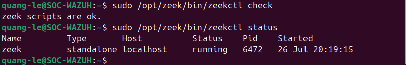
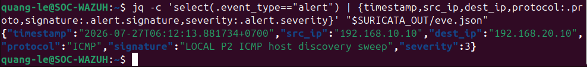
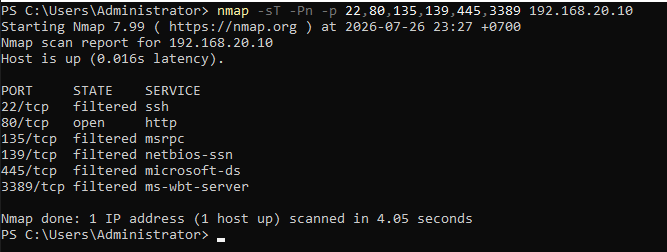
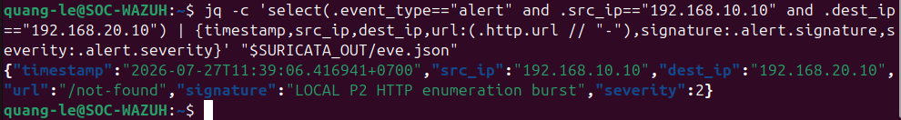
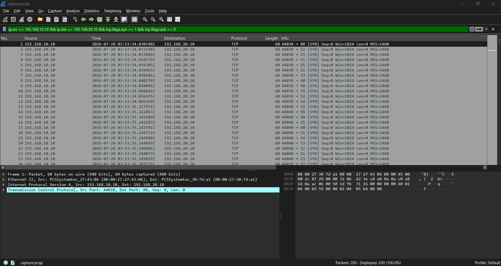
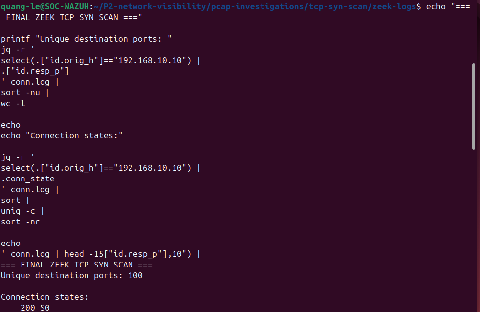
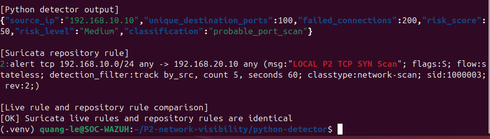
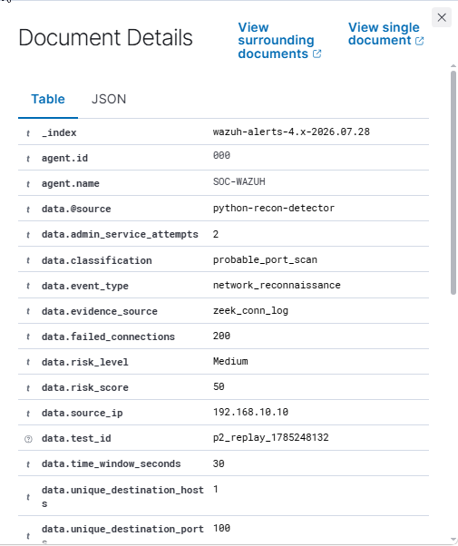

# Zeek-Suricata Network Threat Hunting and Reconnaissance Detection

## Overview

This project extends the existing pfSense and Suricata network-security lab with **Zeek metadata, reproducible PCAP datasets, Wireshark validation, a Python behavioral detector, risk scoring, and Wazuh alert ingestion**.

The project answers one operational question:

> How can a SOC analyst identify reconnaissance when an individual packet may look harmless, but the aggregate behavior of one source becomes suspicious?

The lab uses controlled traffic from `192.168.10.10` toward the DMZ and correlates five evidence layers:



## Key Results

| Scenario | Packet / metadata result | Detector result | Suricata / Wazuh result |
|---|---|---|---|
| Baseline web | 37 packets; 4 successful Zeek connections; normal URIs | Score `0`, Low | No detector alert |
| ICMP sweep | 12 packets; 6 destination hosts | Base `25` Low; tuned `35` Medium | Suricata SID `1000004` |
| Administrative service probing | 18 packets; 6 ports; 12 failed connections; 6 admin-port attempts | Base `35` Medium; tuned `55` Medium | Zeek/Python/firewall correlation; no dedicated Suricata signature required |
| HTTP path probing | 86 packets; 9 unique URIs | Base `20` Low; tuned `35` Medium | Suricata SID `1000006` |
| Final TCP SYN scan | 200 packets; 100 unique destination ports; 200 Zeek `S0` records | Base `50` Medium; tuned `80` Critical | Suricata SID `1000003` rev `2`; Wazuh rule `100201`, level `7` |

The final TCP SYN dataset is the strongest end-to-end validation. The same activity is visible in the packet capture, Wireshark, Zeek, Suricata, Python output, and Wazuh.

## What I Built

- A repeatable threat-hunting workflow for baseline traffic, ICMP sweeps, TCP SYN scans, service probing, and HTTP enumeration.
- Offline packet analysis using `tcpdump`, Wireshark, Zeek, and Suricata.
- Zeek JSON logs and reusable queries for connection, port, host, and HTTP analysis.
- A Python reconnaissance detector that groups events by source IP and time window, calculates risk scores, and classifies suspicious behavior.
- Wazuh rules and queries for centralized reconnaissance alert investigation.
- Validation tests, evidence logs, and an incident report based on controlled lab traffic.

## What I Learned

- Normal network behavior must be understood before reconnaissance can be identified reliably.
- A single packet rarely proves malicious activity; useful detections require aggregation across ports, hosts, connection states, and time windows.
- PCAP, Zeek, Suricata, and Wazuh provide different levels of evidence and should be correlated.
- Signature-based alerts detect known patterns, while behavioral scoring can identify broader reconnaissance activity.
- Detection thresholds must be tuned to reduce false positives from legitimate scanning, monitoring, and troubleshooting.
- A detection alert indicates activity that requires investigation, not automatic proof of compromise.


## Evidence Highlights

[](screenshots/00-setup/P2-SETUP-05-zeek-service-running.png)

[](screenshots/02-icmp-sweep/P2-ICMP-05-suricata-alert.png)

[](screenshots/03-service-probing/P2-SVC-01-nmap-service-probing.png)

[](screenshots/04-http-path-probing/P2-HTTP-05-suricata-alert.png)

[](screenshots/07-tcp-syn-scan/P2-SYN-01-wireshark-syn-packets.png)

[](screenshots/07-tcp-syn-scan/P2-SYN-03-zeek-conn-log.png)

[](screenshots/07-tcp-syn-scan/P2-SYN-05-python-risk-score.png)

[](screenshots/07-tcp-syn-scan/P2-SYN-06-wazuh-alert.png)

## Repository Contents

| Path | Purpose |
|---|---|
| [`report.md`](report.md) | Full technical report and findings |
| [`validation-summary.md`](validation-summary.md) | Scenario-by-scenario validation status |
| [`QA-SUMMARY.md`](QA-SUMMARY.md) | Pre-package integrity and quality checks |
| [`troubleshooting.md`](troubleshooting.md) | Real implementation failures and fixes |
| [`zeek/`](zeek/) | Zeek JSON configuration, setup, logs, and hunts |
| [`suricata/`](suricata/) | Reconnaissance signatures and EVE analysis |
| [`python-detector/`](python-detector/) | Parser, scoring engine, configuration, tests, and outputs |
| [`wazuh-integration/`](wazuh-integration/) | JSON schema, logcollector configuration, custom rules, queries |
| [`pcap-investigations/`](pcap-investigations/) | Five reproducible datasets with PCAP, hashes, logs, and findings |
| [`detections/`](detections/) | Detection logic, tuning, comparison, and false-positive analysis |
| [`incident-reports/`](incident-reports/) | SOC-style final reconnaissance report |
| [`screenshots/evidence-index.md`](screenshots/evidence-index.md) | Evidence inventory and mapping |

## Quick Reproduction

Create the Python environment:

```bash
cd python-detector
python3 -m venv .venv
source .venv/bin/activate
pip install -r requirements.txt
```

Run the final TCP SYN dataset with the validated base profile:

```bash
TZ=Asia/Ho_Chi_Minh python3 detect_recon.py \
  --conn ../pcap-investigations/tcp-syn-scan/zeek-logs/conn.log \
  --config config.yaml \
  --output /tmp/tcp-syn-alerts.json
cat /tmp/tcp-syn-alerts.json | jq .
```

Expected core values:

```json
{
  "source_ip": "192.168.10.10",
  "unique_destination_ports": 100,
  "failed_connections": 200,
  "risk_score": 50,
  "risk_level": "Medium",
  "classification": "probable_port_scan"
}
```

Run the automated tests:

```bash
python3 -m unittest discover -s tests -v
```

## Safety and Scope

All traffic was generated inside an isolated VirtualBox lab against systems owned and controlled by the project author. The captures are small, contain no real credentials, and are retained only to make the analysis reproducible. Suricata was used in **IDS/offline-analysis mode**, not as an inline IPS.

## Limitations

- The dataset contains one primary source and a small number of lab targets.
- The detector uses fixed 30-second tumbling windows rather than overlapping or session-aware windows.
- The final SYN PCAP contains TCP control packets only; Zeek correctly warns that the trace appears pre-filtered.
- HTTP PCAP analysis contains checksum-offload noise; custom-signature filtering is required.
- The tuning profile increases sensitivity but can raise the final SYN scan from Medium to Critical.
- Wazuh alerting was validated; automatic containment was intentionally not implemented in this case.

## Status

**Task completed.** The final TCP SYN scenario has evidence across PCAP, Wireshark, Zeek, Suricata, Python, and Wazuh. 
