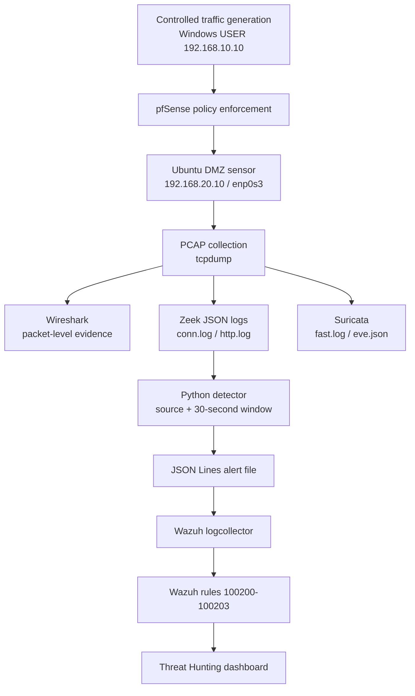

# Architecture

## Detection Pipeline

## Design Rationale

- **PCAP** provides the ground truth needed to validate flags, ports, timing, and packet counts.
- **Zeek** converts packets into compact connection and HTTP metadata suitable for behavioral analysis.
- **Suricata** provides deterministic signature-based alerts for selected reconnaissance patterns.
- **Python** aggregates events across a time window and scores behavior that may not match one signature.
- **Wazuh** centralizes the generated alert and exposes it to the analyst through a SIEM workflow.

## Trust Boundaries

| Boundary | Control |
|---|---|
| USER to DMZ | pfSense policy and logged allow/block decisions |
| DMZ host | Ubuntu UFW and service configuration |
| Sensor data | SHA-256 manifests for retained PCAPs |
| Detection output | JSON schema plus Wazuh parent/child rules |
| Public repository | No credentials, VM disks, `.venv`, `__pycache__`, or obsolete PCAPs |
