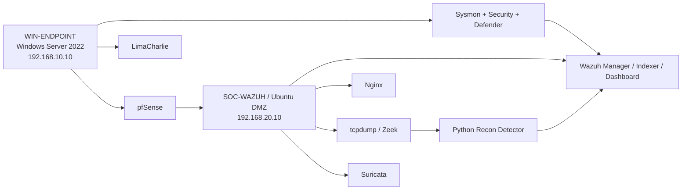

# Lab Architecture

## Evidence Flow

1. Safe commands run on `WIN-ENDPOINT`.
2. Windows Security, Sysmon, Defender, and LimaCharlie record endpoint activity.
3. Wazuh receives event-channel and custom JSON data.
4. pfSense records network policy decisions.
5. Nginx records controlled HTTP requests.
6. tcpdump captures selected traffic for offline Zeek analysis.
7. Suricata provides signature and stream-alert context.
8. Python aggregates Zeek logs and produces reconnaissance JSON.
9. Wazuh presents the resulting alerts for analyst triage.
