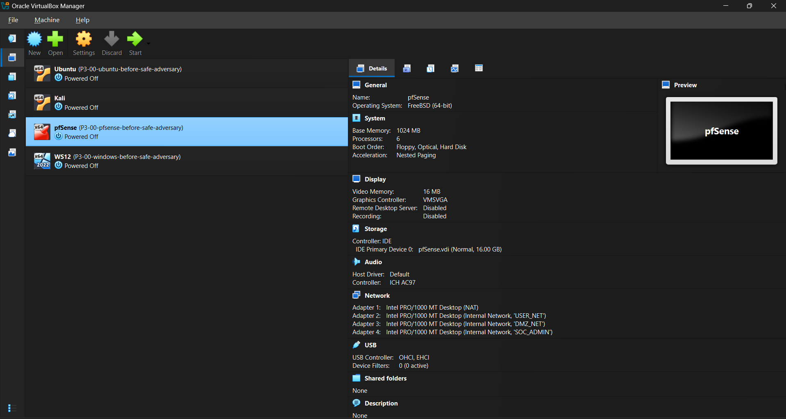
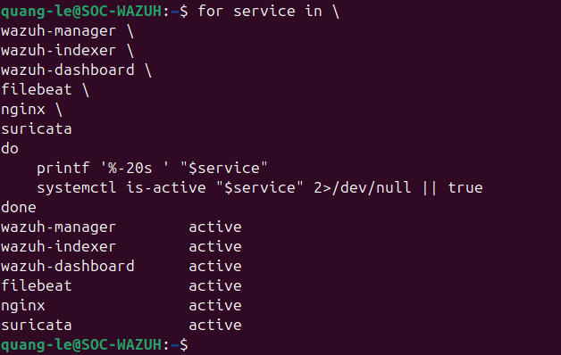
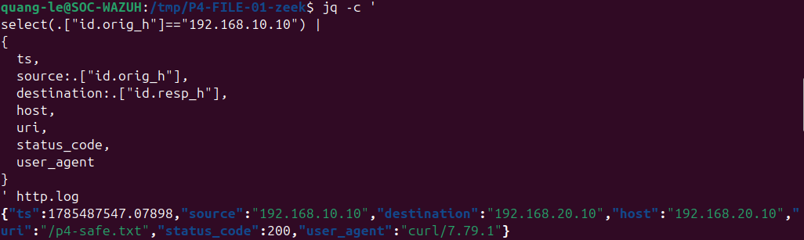
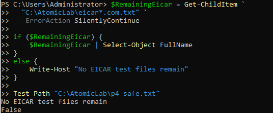

# Safe Adversary Emulation and ATT&CK-Aligned Detection Testing Report

## 1. Executive Summary

This project created a safe and repeatable adversary-emulation workflow for validating endpoint, SIEM, network, web, IDS, firewall, and antivirus visibility inside an isolated VirtualBox lab. The work did not use real malware. Every test was constrained to authorized virtual machines, supported by snapshots, mapped to expected telemetry, and followed by cleanup validation.

Eight test cases were completed. Seven were validated against their minimum evidence requirements. One network test was classified as partial because Zeek, pfSense, Python, and Wazuh evidence were confirmed, but the isolated Suricata output did not prove a current matching alert and the live EVE file contained historical and management-traffic noise.

The project produced 164 screenshots, an evidence manifest with SHA-256 hashes, expected-versus-actual telemetry matrices, ATT&CK coverage, test execution records, a capability matrix, and detailed troubleshooting notes.

## 2. Objectives

- Build a safe test catalog that can be repeated without real malware.
- Validate ATT&CK-aligned endpoint and network telemetry.
- Correlate the same controlled activity across multiple security layers.
- Distinguish telemetry availability from alert coverage.
- Record false positives, collection instability, and limitations.
- Prove cleanup and service recovery after testing.
- Prepare reusable test cases for the next purple-team project.

## 3. Scope and Safety

Authorized source: `WIN-ENDPOINT` (`192.168.10.10`). Authorized target: `SOC-WAZUH` / Ubuntu DMZ (`192.168.20.10`). Testing was limited to owned VirtualBox VMs and internal lab networks. No real credentials, public systems, persistence, exfiltration, destructive actions, or real malware were used.

The EICAR standard antivirus test was used only to validate Defender detection and quarantine. The EICAR contents are not stored in this repository.

## 4. Environment and Readiness

Pre-test evidence confirmed:

- Wazuh agent and Sysmon running on WIN-ENDPOINT.
- Microsoft Defender and real-time protection enabled.
- Wazuh collection configured for Sysmon and Defender Operational channels.
- LimaCharlie sensor online.
- Wazuh manager, indexer, dashboard, filebeat, Nginx, and Suricata active on Ubuntu.
- Suricata configuration valid.
- Nginx listening on 80/443.
- HTTP from USER_NET to the DMZ allowed.
- SSH from the USER role to the DMZ denied as expected.
- Atomic Red Team selected techniques available.

## 5. Test Results

### 5.1 P4-EXEC-01 — Benign Encoded PowerShell

A harmless PowerShell payload was encoded and executed to validate command-line visibility. Sysmon and LimaCharlie recorded the process. Wazuh rule `92057` fired at level 12 and mapped the event to `T1059.001`.

**Result:** Validated.

### 5.2 P4-DISC-01 — System Information Discovery

Controlled system information commands produced endpoint process telemetry and centralized events. The test validated visibility for `T1082` without creating a persistent artifact.

**Result:** Validated.

### 5.3 P4-DISC-02 — Network Configuration and Connection Discovery

Selected Atomic Red Team and Windows-native commands generated network configuration and connection telemetry. Wazuh custom rule `100140` fired at level 8 and mapped the activity to `T1016`.

**Result:** Validated.

### 5.4 P4-DISC-03 — Account and Policy Discovery

A benign account-policy query was captured as command-shell activity. Wazuh rule `92032` displayed mappings to `T1087` and `T1059.003`.

**Result:** Validated for the expected Sysmon/Wazuh evidence. LimaCharlie was not separately required or claimed for this test.

### 5.5 P4-AUTH-01 — Controlled Failed Authentication

A temporary local account named `P4-LabUser` was created. Repeated wrong-password attempts were generated against the local IPC share. Windows authentication events and multiple Wazuh failures were recorded. A controlled success path was reviewed before the network session and account were removed.

**Result:** Validated.

### 5.6 P4-FILE-01 — Controlled HTTP File Transfer

A harmless `p4-safe.txt` file was created under the Nginx web root and downloaded with `curl.exe` to `C:\AtomicLab`. The client calculated a SHA-256 hash. Sysmon Event ID 11 recorded file creation. Wazuh custom rule `100150` fired at level 8 and mapped the activity to `T1105`. Nginx, Zeek `conn.log`, and Zeek `http.log` confirmed the transfer.

Both server and client copies were removed.

**Result:** Validated.

### 5.7 P4-NET-01 — Controlled Service Probing and Detector Replay

This test had two explicitly separated stages.

**Stage A — New low-volume capture:** tcpdump captured traffic between `192.168.10.10` and `192.168.20.10`. Zeek produced relevant service records for HTTP and HTTPS. pfSense logs showed expected allow and block decisions. The capture also contained background Wazuh management traffic on 1514, demonstrating why source, port, and time filtering are required.

**Stage B — Reused full-scan regression dataset:** the validated Phase 1 dataset was replayed through the Python detector. The JSON contained 100 unique destination ports, 200 failed connections, a score of 50, a Medium risk level, and classification `probable_port_scan`. Wazuh rule `100201` fired at level 7.

The isolated Suricata EVE output did not contain a matching alert for the low-volume probe. The live EVE file contained historical stream alerts and local scan-rule events involving Wazuh port 1514. Those events were not treated as proof of the current test. This exposed a real attribution and tuning issue.

**Result:** Partial. Zeek, pfSense, Python, and Wazuh passed; Suricata run-specific attribution remains open.

### 5.8 P4-EICAR-01 — Antivirus Detection and Quarantine

Microsoft Defender was confirmed enabled before the test. The EICAR standard test file was generated inside `C:\AtomicLab`. Defender Event ID `1116` identified `Virus:DOS/EICAR_Test_File` with Severe severity. Event ID `1117` recorded successful quarantine and “No additional actions required.” A timestamped retest produced the same detection/remediation pair.

Wazuh rule `62123` generated a level 12 Defender detection alert, and rule `62124` recorded the remediation action.

**Result:** Validated.

## 6. Detection and Telemetry Summary

| Test | Main evidence | Detection result | Status |
|---|---|---|---|
| P4-EXEC-01 | Sysmon, LimaCharlie, Wazuh 92057 | High-severity encoded-PowerShell detection | Validated |
| P4-DISC-01 | Endpoint and Wazuh events | Discovery telemetry available | Validated |
| P4-DISC-02 | Sysmon, LimaCharlie, Wazuh 100140 | T1016 custom detection | Validated |
| P4-DISC-03 | Sysmon, Wazuh 92032 | Account-discovery mapping | Validated |
| P4-AUTH-01 | Security log, Wazuh | Repeated authentication failures | Validated |
| P4-FILE-01 | Sysmon 11, Wazuh 100150, Nginx, Zeek | T1105 controlled transfer | Validated |
| P4-NET-01 | pfSense, Zeek, Python, Wazuh 100201 | Recon behavior detected; IDS attribution partial | Partial |
| P4-EICAR-01 | Defender 1116/1117, Wazuh 62123/62124 | Detection and quarantine | Validated |

## 7. Findings and Gaps

### Finding 1 — Cross-Layer Coverage Is Strongest When Evidence Is Correlated

Endpoint execution and file-transfer tests produced process, SIEM, and application/network evidence. No single source provided the entire story.

### Finding 2 — Discovery Coverage Exists Across Built-In and Custom Rules

Wazuh built-in rule `92032` and custom rule `100140` provided different levels of discovery coverage. This supports a future review of severity and duplicate-alert handling.

### Finding 3 — Wazuh Agent Startup Can Affect Evidence Completeness

The agent reported 90% buffer use, full/flooded warnings, and possible event loss while startup modules ran. The buffer later recovered below 70%. High-value tests should wait until the queue is healthy.

### Finding 4 — Defender Event Collection Was Temporarily Unstable

The Wazuh agent reported Defender event subscription error `15007` and formatting error `15030`. Local Defender logs remained available, and later Wazuh events proved that detection/remediation events were eventually collected. This is a reliability issue, not a reason to discard local evidence.

### Finding 5 — Suricata Evidence Requires Run-Specific Isolation

A direct EVE query failed on a malformed line. Defensive `fromjson?` parsing fixed the query. More importantly, the live file contained historical alerts and scan signatures involving Wazuh management traffic. Without time and run isolation, those records could be misreported as current test evidence.

### Finding 6 — The Existing SYN Rule Needs Tuning

Local scan SID `1000003` appeared against TCP 1514 management traffic. Production-quality tuning should suppress known Wazuh communication and aggregate true multi-port behavior rather than repeated packets in one service flow.

### Finding 7 — Replay Testing Is Useful When Labeled Honestly

The 100-port/200-failure result came from a prior validated dataset replayed through the current detector and Wazuh pipeline. The report separates that replay from the newly captured low-volume service probe.

## 8. Cleanup and Recovery Validation

Final checks confirmed:

- Defender remained enabled.
- Wazuh agent remained running.
- `P4-LabUser` was absent.
- EICAR and `p4-safe.txt` were absent from the endpoint.
- The server-side web artifact was removed.
- HTTP connectivity still succeeded.
- Wazuh, Nginx, and Suricata services were active.
- Suricata configuration validation succeeded.

## 9. Limitations

- This project did not execute real malware or destructive behavior.
- EICAR validates antivirus handling only.
- No containment action was executed in this phase; the existing LimaCharlie isolation workflow will be reused in the purple-team phase.
- Some LimaCharlie coverage was not separately proven for every discovery test.
- Suricata attribution for P4-NET-01 is partial.
- Wazuh buffering warnings mean a small collection gap cannot be ruled out during affected periods.
- The repository contains screenshots and documentation, not raw VM disks or unrestricted PCAP collections.

## 10. Recommendations

1. Add a pre-test health gate that checks Wazuh buffer state, agent connectivity, service listeners, time synchronization, and available disk space.
2. Rotate or copy Suricata EVE output into a run-specific file before each test.
3. Tune SID 1000003 to exclude Wazuh management traffic and require genuine multi-port behavior.
4. Add dedicated detection logic for selected discovery commands where only low-severity built-in rules exist.
5. Convert the test catalog into an automated execution record with test IDs and exact start/end timestamps.
6. Reuse these tests in the next purple-team incident and measure alert latency, containment, recovery, rule tuning, and retest results.

## 11. Conclusion

The phase achieved its primary goal: a controlled, evidence-backed adversary-emulation catalog that can generate and validate telemetry across the existing SOC lab. The strongest outcome is not the number of alerts; it is the repeatable workflow that links authorization, execution, telemetry, detection, investigation, cleanup, troubleshooting, and honest gap analysis.
