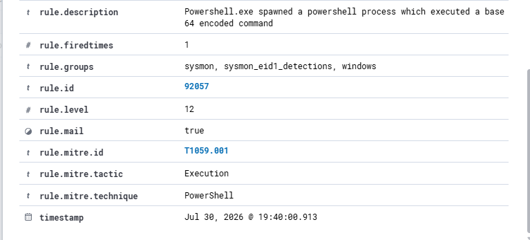
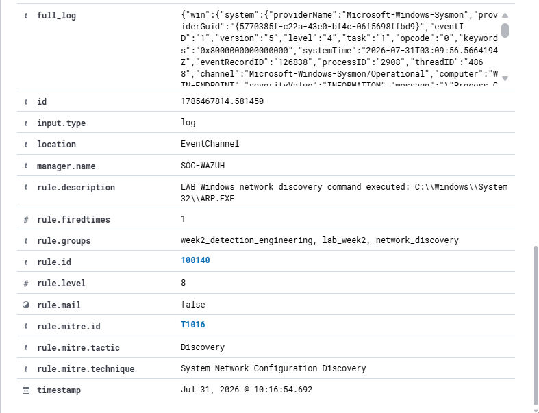
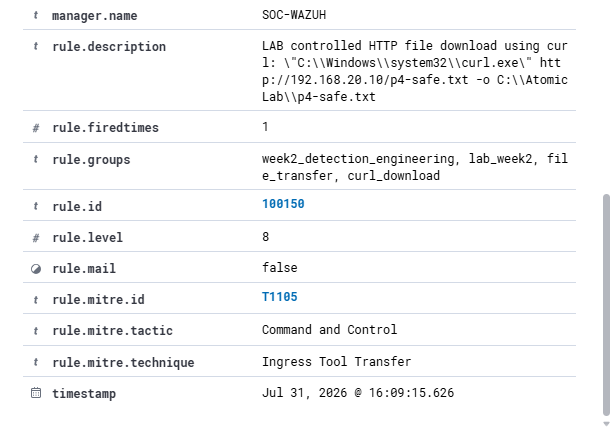
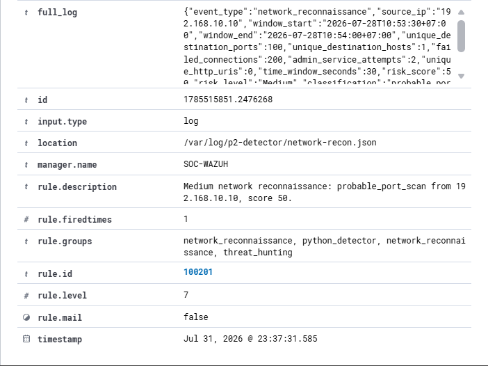
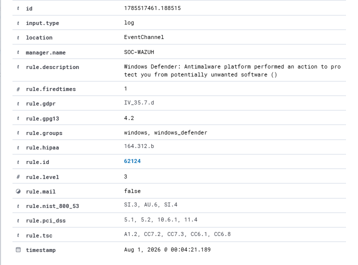

# Phase 2 Safe Test Catalog

This catalog documents eight controlled adversary-emulation and security-control validation tests performed inside the isolated VirtualBox SOC lab. Each test is designed to answer four questions:

1. Can the activity be executed safely and repeatedly?
2. Which endpoint, network, application, and SIEM telemetry is produced?
3. Does a detection exist, and what context does it preserve?
4. Can the environment be returned to a known-good state afterward?

The tests do not use real malware, public targets, real credentials, persistence, destructive actions, or uncontrolled scanning. Every test has a dedicated objective, prerequisites, expected telemetry, ATT&CK interpretation, cleanup procedure, and an evidence gallery with links to the original screenshots.

## How to Review the Catalog

- Start with the [test index](test-index.md) for scope and status.
- Open a test README for the execution narrative, observed result, limitations, and image gallery.
- Use the companion documents when reproducing or reviewing a specific control.
- Use the [complete screenshot index](../screenshots/evidence-index.md) for all 164 screenshots.
- Use the [evidence manifest](../screenshots/evidence-manifest.csv) for filenames and SHA-256 hashes.
- Cross-check final status in the [capability matrix](../test-results/capability-matrix.md) and [execution log](../test-results/test-execution-log.csv).

## Test Groups

| Group | Tests | Main validation purpose |
|---|---|---|
| Endpoint execution | P4-EXEC-01 | Process, command-line, EDR, and Wazuh visibility |
| Discovery | P4-DISC-01, P4-DISC-02, P4-DISC-03 | System, network, connection, and password-policy discovery telemetry |
| Authentication | P4-AUTH-01 | Failed-logon evidence and cleanup |
| File and web activity | P4-FILE-01 | Cross-layer file-transfer correlation |
| Network validation | P4-NET-01 | Firewall, capture, Zeek, detector, Wazuh, and IDS attribution |
| Antivirus validation | P4-EICAR-01 | Defender detection, quarantine, and Wazuh ingestion |

## Evidence Handling Notes

- Image thumbnails link to the full-resolution PNG files.
- Each test also links to its complete screenshot folder.
- The authentication screenshot that exposed the temporary password is intentionally not embedded here.
- The screenshot that displayed the literal EICAR test string is intentionally not embedded here.
- Historical or noisy Suricata records are documented as tuning evidence, not presented as proof of a current alert.
- `P4-NET-01` remains `Partial` until a fresh run-specific Suricata alert is attributable to the controlled probe.

## Representative Evidence

