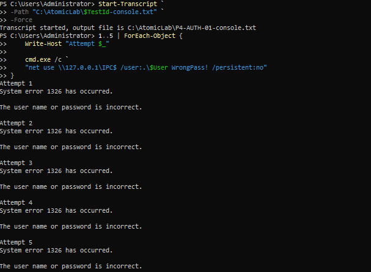
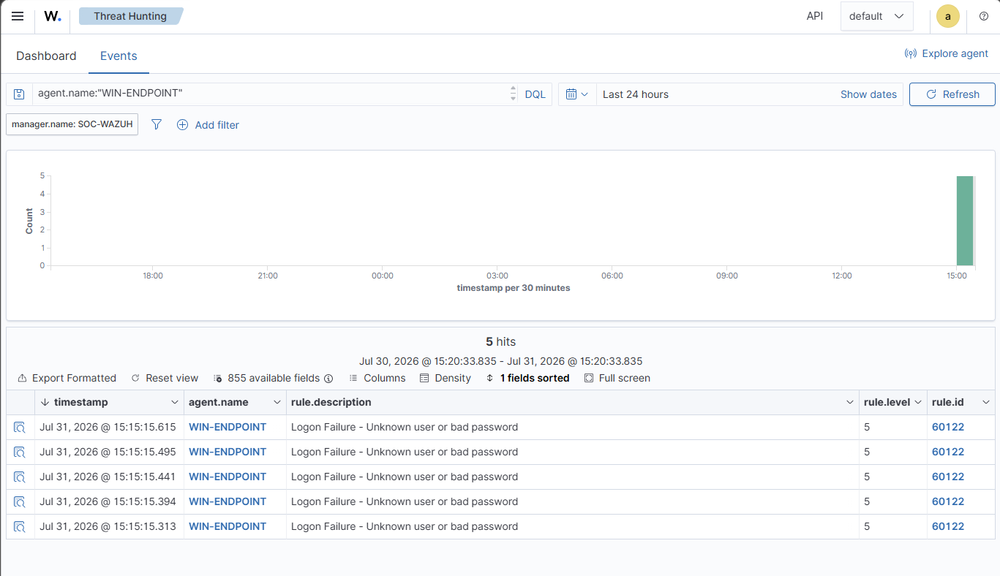
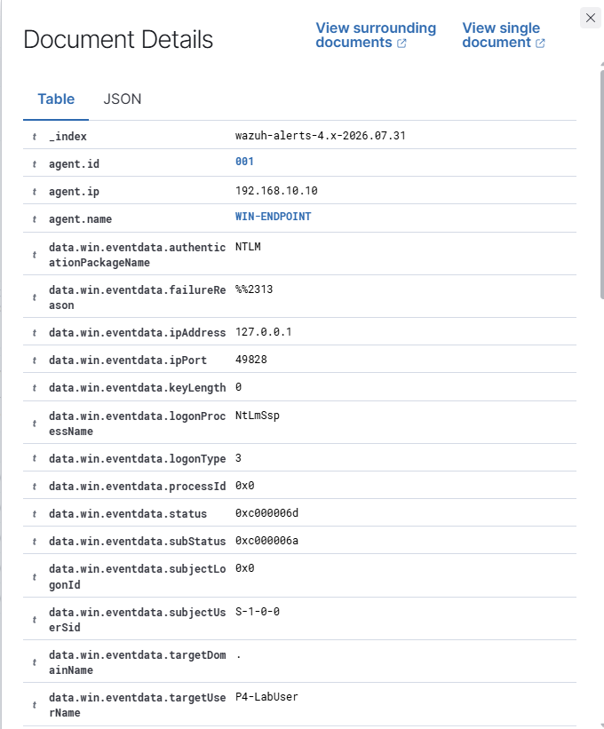
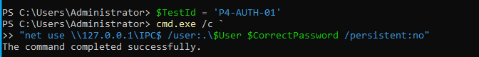
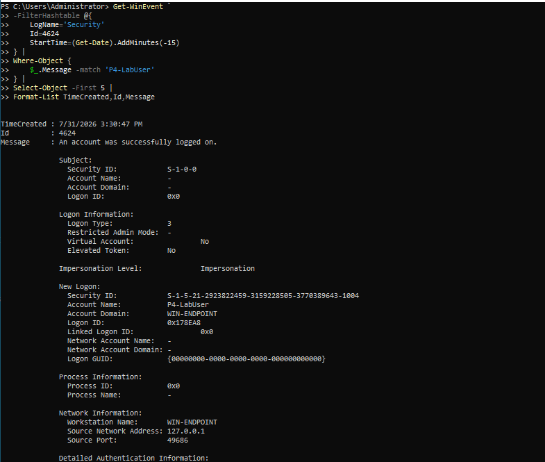
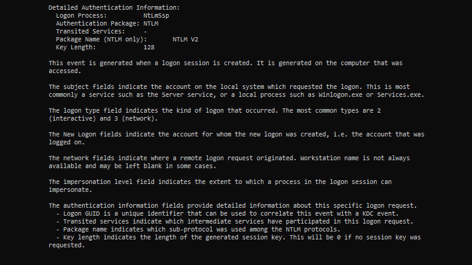
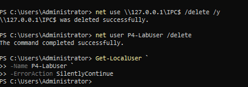

# P4-AUTH-01 — Controlled Failed Authentication

| Field | Value |
|---|---|
| Test ID | `P4-AUTH-01` |
| Category | Authentication |
| Status | **Validated** |
| Execution window | 2026-07-31 15:12–15:34 |
| Authorized source | WIN-ENDPOINT (`192.168.10.10`) |
| Authorized target | Local IPC share (`127.0.0.1`) |
| ATT&CK/control focus | T1110.001 — Password Guessing (controlled validation) |
| Primary telemetry | Windows Security log and Wazuh authentication events |
| Detection result | Repeated failed-logon events and centralized investigation |

## Test Documentation

- [Objective](objective.md)
- [Prerequisites](prerequisites.md)
- [Expected telemetry](expected-telemetry.md)
- [ATT&CK mapping](mitre-mapping.md)
- [Cleanup procedure](cleanup.md)
- [Return to the test catalog](../../test-index.md)

## Why This Test Matters

Repeated authentication failures are a core SOC detection scenario. They may indicate password guessing, user error, stale credentials, or a misconfigured service. This test creates a temporary lab account and sends a small, controlled number of wrong-password attempts to the local IPC share so that Windows and Wazuh telemetry can be verified without targeting another host.

A controlled success path was reviewed to distinguish failure from successful authentication. The temporary session and account were then removed. The catalog deliberately does not embed the screenshot that exposed the temporary password.

## Safety Boundary

- Use a temporary account created only for this test.
- Target `127.0.0.1` rather than a remote production system.
- Use a small fixed number of attempts; do not create an uncontrolled brute-force loop.
- Do not reuse a real password or account.
- Remove the IPC session and temporary account immediately after evidence collection.
- Do not publish screenshots containing the temporary password.

## Execution Summary

1. Create `P4-LabUser` with a temporary lab-only password.
2. Record the start time and verify Windows Security logging and Wazuh ingestion.
3. Generate a limited sequence of incorrect `net use` authentication attempts to `\\127.0.0.1\IPC$`.
4. Review local Windows Security events and Wazuh failures.
5. Perform one controlled successful authentication to confirm the account path and compare event outcomes.
6. Delete the network session.
7. Remove `P4-LabUser` and verify that the account is absent.

### Safe Reproduction Pattern

```powershell
1..5 | ForEach-Object {
    cmd /c 'net use \\127.0.0.1\IPC$ /user:.\P4-LabUser <WRONG-LAB-PASSWORD>'
}
net use \\127.0.0.1\IPC$ /delete
```

Use placeholders in public documentation. Never commit the real temporary password.

## Expected Telemetry

| Source | Expected evidence |
|---|---|
| Windows Security | Failed logon events with target account, logon type/context, status, and source information. |
| Wazuh | Multiple centralized failed-authentication events for `P4-LabUser`. |
| Success comparison | A controlled successful event that can be distinguished from the failures. |
| Cleanup | Network session removed and temporary user absent. |

## Observed Result

The wrong-password sequence produced repeated authentication failures visible in Wazuh. Expanded event views retained account and failure details. A controlled successful authentication and native Windows event were also reviewed. The final cleanup evidence confirmed removal of the IPC session and temporary user.

The behavior is documented as controlled `T1110.001` validation, not as a real attack. The number of attempts was intentionally limited.

## Validation Criteria

- [x] Repeated failures are visible in Windows Security and/or Wazuh.
- [x] Events identify the temporary lab account.
- [x] A success event can be differentiated from failures.
- [x] The session is deleted.
- [x] `P4-LabUser` is removed and verified absent.
- [x] No public documentation exposes the temporary password.

## Limitations and Follow-Up

- Local IPC authentication is not identical to remote domain password guessing.
- Threshold-based brute-force rules may require different event counts or time windows.
- NAT, workstation-name, and loopback fields may differ from a real remote source.
- Future retests should measure threshold, alert latency, and account-lockout behavior in a dedicated domain lab.

## Evidence Gallery

[Open the complete screenshot folder](../../../screenshots/04-authentication/)

### Controlled wrong-password attempt sequence

[](../../../screenshots/04-authentication/P4-AUTH-002.png)

### Repeated failed-authentication events in Wazuh

[](../../../screenshots/04-authentication/P4-AUTH-005.png)

### Expanded Wazuh failure details

[](../../../screenshots/04-authentication/P4-AUTH-006.png)

### Controlled successful authentication path

[](../../../screenshots/04-authentication/P4-AUTH-009.png)

### Windows Security authentication event

[](../../../screenshots/04-authentication/P4-AUTH-010.png)

### Expanded native authentication evidence

[](../../../screenshots/04-authentication/P4-AUTH-011.png)

### Session and temporary-account cleanup

[](../../../screenshots/04-authentication/P4-AUTH-012.png)

## Related Project Documentation

- [Rules of engagement](../../../rules-of-engagement.md)
- [Authorized assets](../../../authorized-assets.md)
- [Prohibited actions](../../../prohibited-actions.md)
- [Snapshot and recovery procedure](../../../snapshot-and-recovery.md)
- [Cleanup checklist](../../../cleanup-checklist.md)
- [Expected telemetry model](../../../telemetry/expected-telemetry.md)
- [Actual telemetry summary](../../../telemetry/actual-telemetry.md)
- [Capability matrix](../../../test-results/capability-matrix.md)
- [Test execution log](../../../test-results/test-execution-log.csv)
- [Complete evidence index](../../../screenshots/evidence-index.md)
