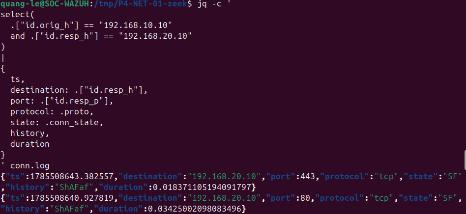
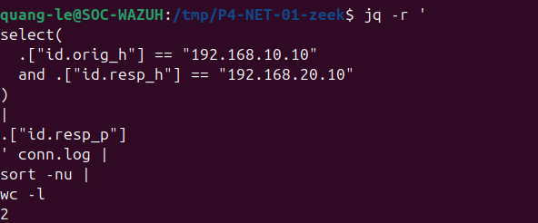
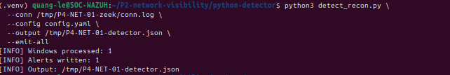
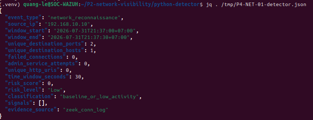
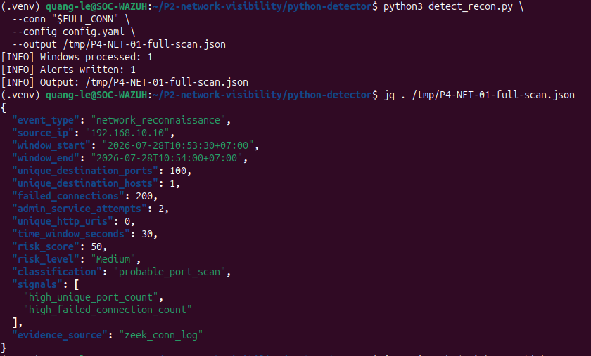
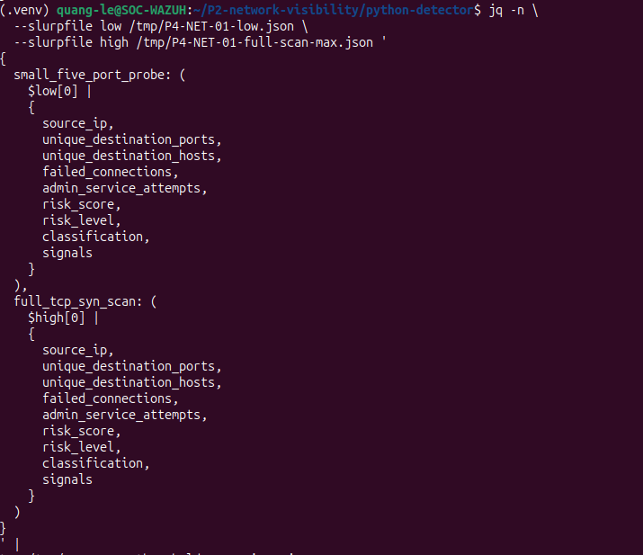
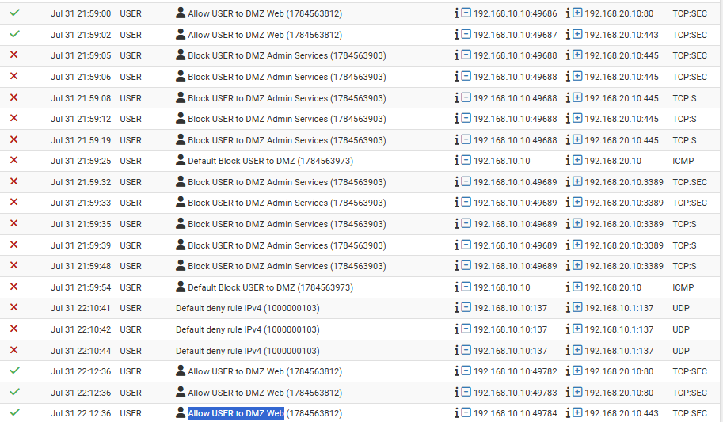
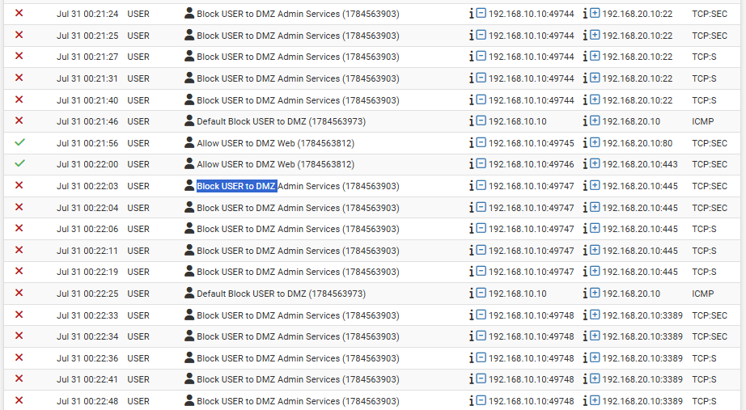
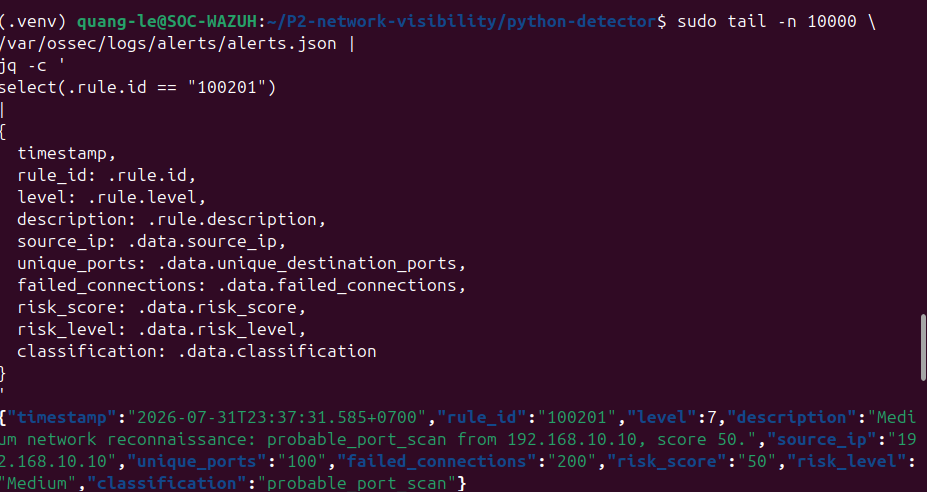

# P4-NET-01 — Controlled Service Probing and Detector Replay

| Field | Value |
|---|---|
| Test ID | `P4-NET-01` |
| Category | Network validation |
| Status | **Partial** |
| Execution window | 2026-07-31 21:29–23:43 |
| Authorized source | WIN-ENDPOINT (`192.168.10.10`) |
| Authorized target | Ubuntu DMZ (`192.168.20.10`) |
| ATT&CK/control focus | T1046 — Network Service Discovery |
| Primary telemetry | pfSense, packet capture, Zeek, Python detector, Wazuh, Suricata review |
| Detection result | Python result and Wazuh rule `100201`; run-specific Suricata attribution incomplete |

## Test Documentation

- [Objective](objective.md)
- [Prerequisites](prerequisites.md)
- [Expected telemetry](expected-telemetry.md)
- [ATT&CK mapping](mitre-mapping.md)
- [Cleanup procedure](cleanup.md)
- [Return to the test catalog](../../test-index.md)

## Why This Test Matters

Network reconnaissance is best validated through multiple layers: firewall decisions, packet capture, protocol metadata, behavior analytics, and SIEM ingestion. This test intentionally separates a new low-volume probe from a replayed full-scan regression dataset so the evidence cannot be misrepresented.

Stage A proves current capture, Zeek, and pfSense visibility for a small set of authorized service checks. Stage B proves that the existing Python detector and Wazuh integration still detect the previously validated full-scan dataset. The test remains `Partial` because isolated Suricata output did not prove a current matching alert.

## Safety Boundary

- Probe only the authorized DMZ host and a small predefined service list.
- Do not scan public addresses or the full local network.
- Use a defined start/end time and a dedicated capture/output directory.
- Separate new-run evidence from replay evidence.
- Do not claim historical EVE records as current alerts.
- Exclude or account for Wazuh management traffic on TCP 1514.

## Execution Summary

1. Create a run-specific evidence directory and record timestamps.
2. Start a packet capture filtered to the authorized source and target.
3. Perform a small number of service checks against approved ports.
4. Stop the capture and calculate a hash when the PCAP is retained.
5. Process the capture with Zeek and inspect relevant service records.
6. Review pfSense allow/block logs for the same time window.
7. Run the Python detector on the new low-volume data and record the low-activity result.
8. Replay the previously validated full-scan dataset through the detector.
9. Verify the replay JSON and Wazuh rule `100201`.
10. Query a run-specific Suricata output; document the absence of a matching current alert and any historical/noisy records separately.

### Safe Reproduction Pattern

```powershell
Test-NetConnection 192.168.20.10 -Port 80
Test-NetConnection 192.168.20.10 -Port 443
Test-NetConnection 192.168.20.10 -Port 22
```

This represents a bounded service check, not a broad scan. The exact recorded run is documented by the screenshots and execution log.

## Expected Telemetry

| Source | Expected evidence |
|---|---|
| pfSense | Allow decisions for approved web services and block decisions for restricted administrative services. |
| Packet capture | Traffic limited to the authorized source/target and test window. |
| Zeek | Connection records showing destination services and connection states. |
| Python detector | Low-volume run below scan threshold; replay dataset produces high unique-port and failed-connection counts. |
| Wazuh | Ingestion of structured detector output and rule `100201` for the replay. |
| Suricata | A current alert only if the isolated traffic matches an enabled rule; otherwise a documented coverage gap. |

## Observed Result

**Stage A — New low-volume capture:** Zeek and pfSense confirmed the authorized service checks. The Python detector processed the new data and produced a low-activity result rather than a port-scan classification. Background Wazuh management traffic on TCP 1514 was also visible, demonstrating the need for source, port, and time filtering.

**Stage B — Replayed validated dataset:** the detector produced 100 unique destination ports, 200 failed connections, score 50, risk `Medium`, and classification `probable_port_scan`. Wazuh rule `100201` fired at level 7.

The isolated Suricata output did not contain a matching current alert. The live EVE file included historical stream records and local scan-rule activity involving TCP 1514. Those records were treated as noise/tuning evidence, not proof of the current probe.

## Validation Criteria

- [x] New low-volume traffic is visible in Zeek and pfSense.
- [x] The low-volume run is not falsely presented as a full scan.
- [x] The replay dataset produces the documented detector values.
- [x] Wazuh rule `100201` is visible for the replay output.
- [x] Historical and run-specific Suricata records are clearly separated.
- [ ] A fresh run-specific Suricata alert is attributable to the controlled probe using isolated output.

## Limitations and Follow-Up

- Stage B is a replay, not a newly executed 100-port scan.
- The low-volume probe may not meet Suricata scan thresholds.
- Live EVE data contains historical and management-traffic noise.
- Local SID `1000003` requires tuning to exclude known Wazuh traffic and aggregate genuine multi-port behavior.
- Future retest should rotate EVE, use exact timestamps, and keep a dedicated rule/output directory.

## Evidence Gallery

[Open the complete screenshot folder](../../../screenshots/06-network-validation/)

### Zeek connection records for the current capture

[](../../../screenshots/06-network-validation/P4-NET-001.png)

### Destination-port count from the low-volume data

[](../../../screenshots/06-network-validation/P4-NET-003.png)

### Python detector processing of the new run

[](../../../screenshots/06-network-validation/P4-NET-005.png)

### Low-activity detector result

[](../../../screenshots/06-network-validation/P4-NET-006.png)

### Replayed full-scan detector result

[](../../../screenshots/06-network-validation/P4-NET-009.png)

### Base and tuned threshold comparison

[](../../../screenshots/06-network-validation/P4-NET-011.png)

### pfSense policy evidence

[](../../../screenshots/06-network-validation/P4-NET-013.png)

### pfSense allow and block validation

[](../../../screenshots/06-network-validation/P4-NET-014.png)

### Wazuh rule 100201 alert for replay output

[](../../../screenshots/06-network-validation/P4-NET-018.png)

### Structured Wazuh alert query

[](../../../screenshots/06-network-validation/P4-NET-019.png)

## Related Project Documentation

- [Rules of engagement](../../../rules-of-engagement.md)
- [Authorized assets](../../../authorized-assets.md)
- [Prohibited actions](../../../prohibited-actions.md)
- [Snapshot and recovery procedure](../../../snapshot-and-recovery.md)
- [Cleanup checklist](../../../cleanup-checklist.md)
- [Expected telemetry model](../../../telemetry/expected-telemetry.md)
- [Actual telemetry summary](../../../telemetry/actual-telemetry.md)
- [Capability matrix](../../../test-results/capability-matrix.md)
- [Test execution log](../../../test-results/test-execution-log.csv)
- [Complete evidence index](../../../screenshots/evidence-index.md)
