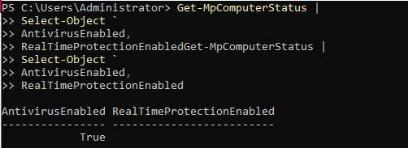
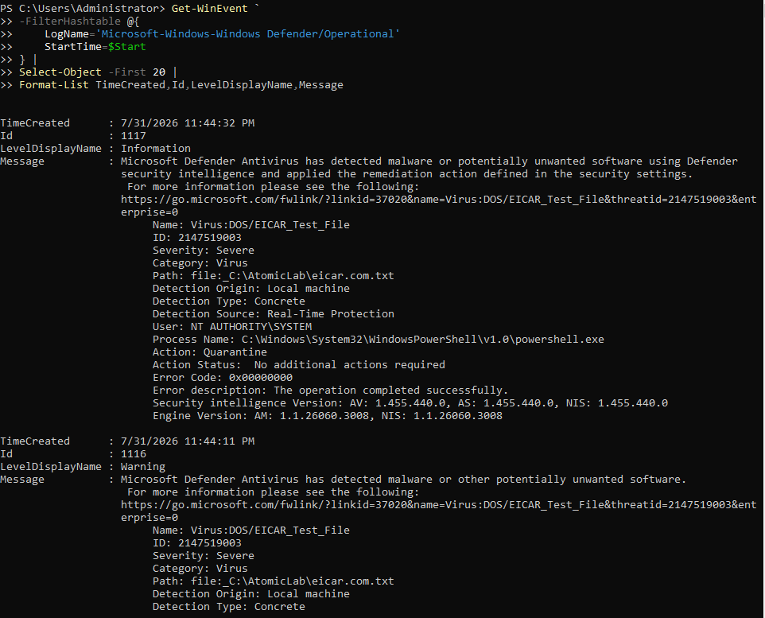
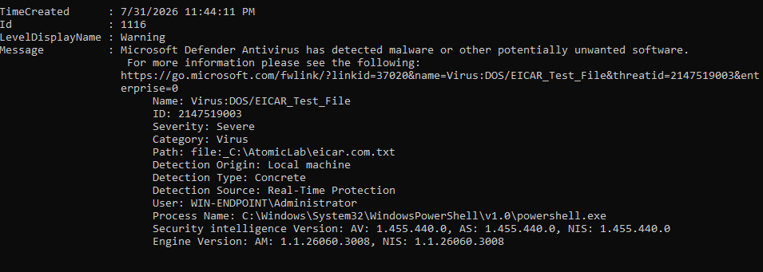
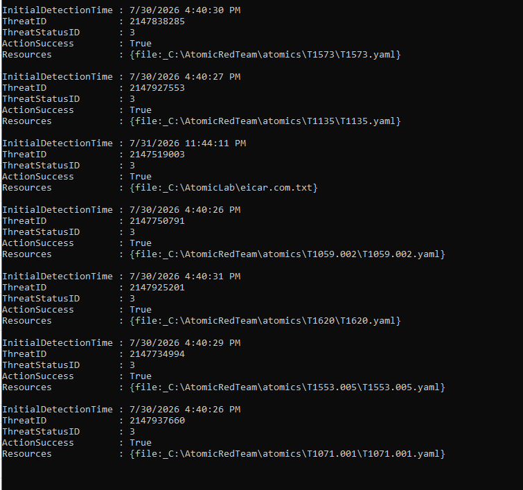
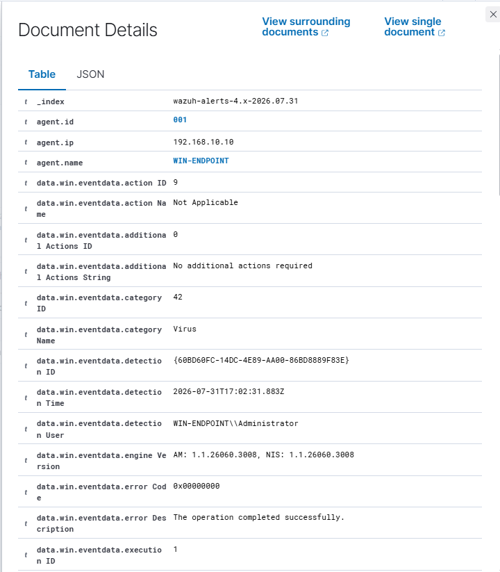
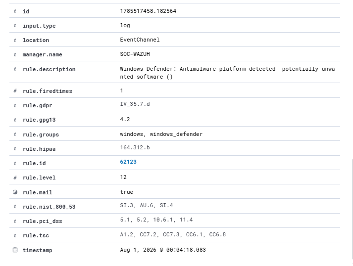
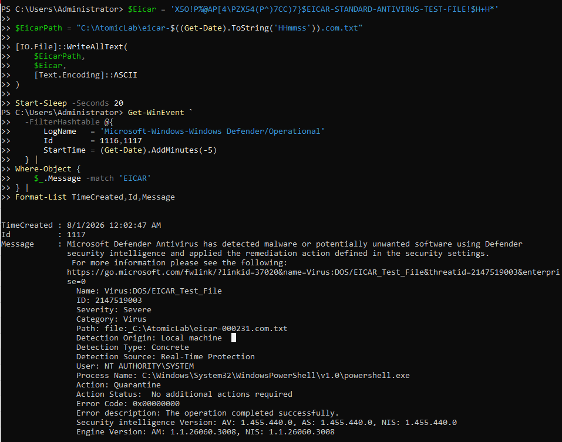
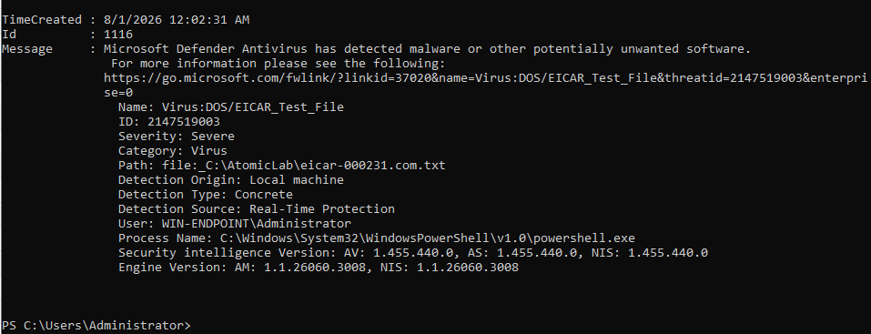
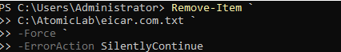

# P4-EICAR-01 — Microsoft Defender EICAR Detection and Quarantine

| Field | Value |
|---|---|
| Test ID | `P4-EICAR-01` |
| Category | Antivirus validation |
| Status | **Validated** |
| Execution window | 2026-07-31 23:44 and 23:57 retest |
| Authorized source | WIN-ENDPOINT (`192.168.10.10`) |
| Authorized target | Local endpoint protection |
| ATT&CK/control focus | Defensive control validation; no malware technique claimed |
| Primary telemetry | Microsoft Defender Operational log and Wazuh |
| Detection result | Defender Event IDs `1116`/`1117`; Wazuh rules `62123`/`62124` |

## Test Documentation

- [Objective](objective.md)
- [Prerequisites](prerequisites.md)
- [Expected telemetry](expected-telemetry.md)
- [ATT&CK mapping](mitre-mapping.md)
- [Cleanup procedure](cleanup.md)
- [Return to the test catalog](../../test-index.md)

## Why This Test Matters

EICAR is a standardized antivirus test artifact used to verify that endpoint protection detects and remediates a known harmless test pattern. It validates control operation and event collection; it does not simulate real malware behavior, execution chains, persistence, or command and control.

Defender was verified enabled before testing. Detection and quarantine were confirmed locally and in Wazuh, then repeated with timestamps. The repository does not reproduce or embed the EICAR literal in this expanded catalog.

## Safety Boundary

- Use only the EICAR standard antivirus test in the isolated Windows VM.
- Do not disable Defender or real-time protection.
- Do not substitute real malware.
- Create the artifact only in the designated temporary lab directory.
- Do not publish the literal EICAR string in documentation or screenshots.
- Verify quarantine and file absence after each run.

## Execution Summary

1. Confirm Defender and real-time protection are enabled.
2. Record the test start time and verify the Defender Operational log is accessible.
3. Create the EICAR test artifact in the designated lab directory using an approved local procedure; do not store the literal in the repository.
4. Review local Defender Event ID 1116 for detection details.
5. Review Event ID 1117 for remediation/quarantine outcome.
6. Search Wazuh for rule `62123` and the associated Defender detection event.
7. Search Wazuh for rule `62124` and remediation evidence.
8. Repeat once with a clearly recorded timestamp to confirm consistency.
9. Verify the test artifact is absent and Defender remains enabled.

### Safe Reproduction Pattern

The literal EICAR test string is intentionally omitted. Use the official EICAR procedure only inside the authorized isolated VM, then document detection and quarantine rather than retaining the artifact.

## Expected Telemetry

| Source | Expected evidence |
|---|---|
| Microsoft Defender | Event ID 1116 identifying `Virus:DOS/EICAR_Test_File` and severity information. |
| Remediation | Event ID 1117 showing quarantine/remediation and no further action required. |
| Wazuh | Rule `62123` for detection and rule `62124` for remediation. |
| Cleanup | Artifact absent; Defender and real-time protection still enabled. |

## Observed Result

Defender Event ID `1116` identified `Virus:DOS/EICAR_Test_File` with Severe severity. Event ID `1117` recorded successful quarantine/remediation. Wazuh rule `62123` generated a level 12 detection alert and rule `62124` recorded the remediation event. A timestamped retest produced the same detection/remediation sequence.

The result validates antivirus operation and SIEM collection only. It must not be generalized as proof of behavior-based malware detection.

## Validation Criteria

- [x] Defender is enabled before execution.
- [x] Local Event ID 1116 is present.
- [x] Local Event ID 1117 confirms remediation/quarantine.
- [x] Wazuh rules `62123` and `62124` are present.
- [x] The timestamped retest is consistent.
- [x] The artifact is absent and Defender remains enabled.
- [x] No evidence link exposes the literal test string.

## Limitations and Follow-Up

- EICAR validates signature/control handling, not real malware behavior.
- The test does not validate EDR containment or incident response automation.
- Temporary Wazuh Defender-channel subscription/formatting errors may affect collection timing; local events remain authoritative.
- Future tests should measure alert latency and verify collection health before execution.

## Evidence Gallery

[Open the complete screenshot folder](../../../screenshots/07-eicar-validation/)

### Microsoft Defender enabled before testing

### Local Defender event query

### Defender Event ID 1116 detection

### Local remediation record

### Defender event ingested by Wazuh

### Wazuh rule 62123 detection alert

### Wazuh rule 62124 remediation alert

### Timestamped validation retest

### Defender Event ID 1117 successful quarantine

### Final artifact-removal verification

## Related Project Documentation

- [Rules of engagement](../../../rules-of-engagement.md)
- [Authorized assets](../../../authorized-assets.md)
- [Prohibited actions](../../../prohibited-actions.md)
- [Snapshot and recovery procedure](../../../snapshot-and-recovery.md)
- [Cleanup checklist](../../../cleanup-checklist.md)
- [Expected telemetry model](../../../telemetry/expected-telemetry.md)
- [Actual telemetry summary](../../../telemetry/actual-telemetry.md)
- [Capability matrix](../../../test-results/capability-matrix.md)
- [Test execution log](../../../test-results/test-execution-log.csv)
- [Complete evidence index](../../../screenshots/evidence-index.md)
