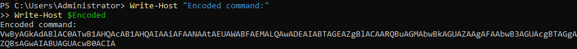
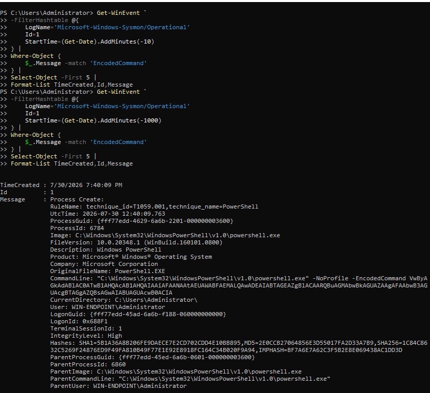
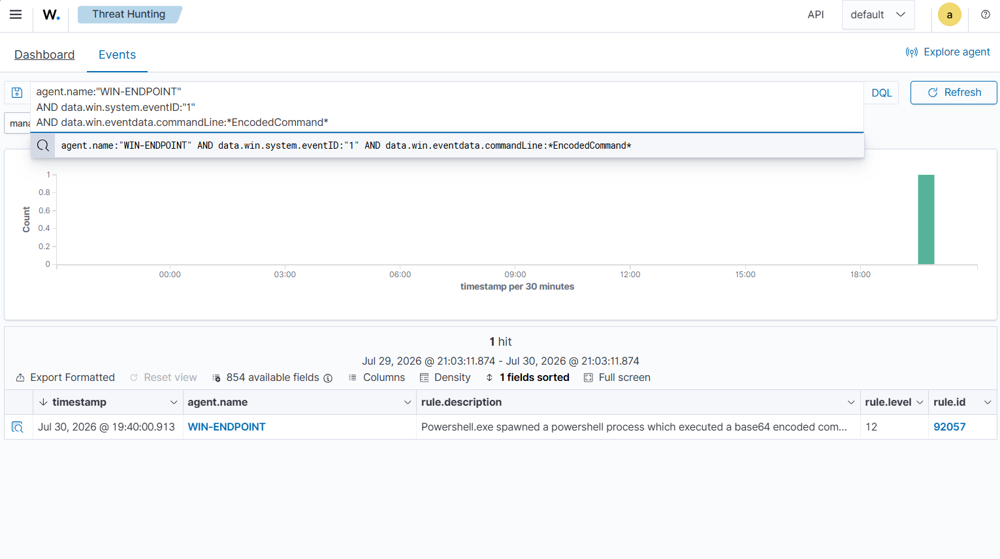
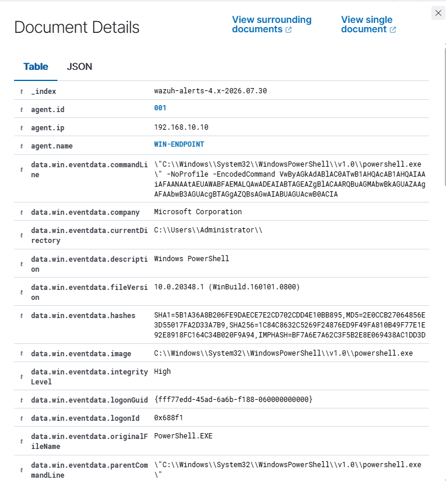
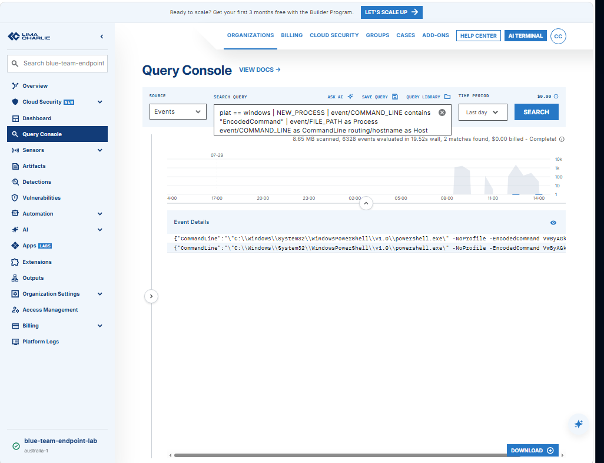

# P4-EXEC-01 — Benign Encoded PowerShell Execution

| Field | Value |
|---|---|
| Test ID | `P4-EXEC-01` |
| Category | Endpoint execution |
| Status | **Validated** |
| Execution window | 2026-07-30 evening |
| Authorized source | WIN-ENDPOINT (`192.168.10.10`) |
| Authorized target | Local Windows endpoint |
| ATT&CK/control focus | T1059.001 — PowerShell |
| Primary telemetry | Sysmon process creation, LimaCharlie process telemetry, Wazuh event ingestion |
| Detection result | Wazuh rule `92057`, level 12 |

## Test Documentation

- [Objective](objective.md)
- [Prerequisites](prerequisites.md)
- [Expected telemetry](expected-telemetry.md)
- [ATT&CK mapping](mitre-mapping.md)
- [Cleanup procedure](cleanup.md)
- [Return to the test catalog](../../test-index.md)

## Why This Test Matters

Encoded PowerShell is common in both legitimate automation and malicious execution chains. The encoding itself is not proof of compromise, but it is a high-value analytic signal when combined with process ancestry, command-line content, user context, and follow-on behavior. This test validates whether the lab preserves the complete command line and whether the SIEM and EDR expose enough context for an analyst to distinguish a harmless laboratory action from suspicious execution.

The activity used a benign output-only payload. It did not download content, create persistence, change security settings, or execute malware.

## Safety Boundary

- Run only inside the authorized Windows VM.
- Use an output-only PowerShell payload.
- Do not include download cradles, credential access, persistence, or defense evasion.
- Confirm Sysmon, Wazuh agent, Microsoft Defender, and LimaCharlie are healthy before execution.
- Record the start time so endpoint and SIEM events can be correlated.

## Execution Summary

1. Create a harmless plaintext command that only writes a laboratory marker to the console.
2. Encode the plaintext as UTF-16LE Base64, which matches the PowerShell `-EncodedCommand` format.
3. Execute a new `powershell.exe` process with `-NoProfile -EncodedCommand`.
4. Review local process telemetry and the LimaCharlie timeline for the spawned process and complete command line.
5. Search Wazuh for the endpoint, process name, encoded-command indicator, and the corresponding rule.
6. Record the rule ID, severity, command line, timestamp, and ATT&CK mapping.

### Safe Reproduction Pattern

```powershell
$PlainText = 'Write-Output "P4-EXEC-01 benign validation"'
$Encoded = [Convert]::ToBase64String(
    [Text.Encoding]::Unicode.GetBytes($PlainText)
)
powershell.exe -NoProfile -EncodedCommand $Encoded
```

This is a safe reproduction example added for repeatability. The evidence screenshots remain the source of truth for the recorded run.

## Expected Telemetry

| Source | Expected evidence |
|---|---|
| Windows/Sysmon | A new `powershell.exe` process with the full encoded command line and parent-process context. |
| LimaCharlie | A process event or timeline entry showing the executable, command line, user, and sensor. |
| Wazuh | A centralized process event and an encoded-PowerShell detection. |
| Analyst context | No network connection, dropped payload, persistence, or follow-on malicious behavior. |

## Observed Result

Sysmon and LimaCharlie retained the process and command-line context. Wazuh rule `92057` fired at level 12 and displayed ATT&CK mapping `T1059.001`. The Wazuh search and expanded alert view allowed the execution timestamp, endpoint, process, and rule metadata to be correlated.

The test demonstrated that encoded PowerShell is visible across endpoint telemetry and centralized detection. It did not demonstrate malicious intent; the analyst must still evaluate the decoded content and surrounding behavior.

## Validation Criteria

- [x] The process event includes `powershell.exe` and the encoded-command argument.
- [x] At least one EDR or local endpoint source retains the command line.
- [x] Wazuh ingests the event and rule `92057` is visible.
- [x] The event is mapped to `T1059.001`.
- [x] No persistent artifact or unexpected child process remains after the test.

## Limitations and Follow-Up

- This validates visibility for one benign encoded payload, not all PowerShell tradecraft.
- Base64 encoding is an indicator, not a conviction; administrative scripts may use it legitimately.
- The test does not measure alert latency or automated response.
- Future retests should add command decoding and parent-child baselining to reduce false positives.

## Evidence Gallery

[Open the complete screenshot folder](../../../screenshots/02-endpoint-execution/)

### Benign payload preparation and encoding

[](../../../screenshots/02-endpoint-execution/P4-EXEC-001.png)

### Endpoint process and command-line evidence

[](../../../screenshots/02-endpoint-execution/P4-EXEC-002.png)

### LimaCharlie process timeline

[](../../../screenshots/02-endpoint-execution/P4-EXEC-003.png)

### Expanded LimaCharlie event context

[](../../../screenshots/02-endpoint-execution/P4-EXEC-004.png)

### Wazuh rule 92057 encoded-PowerShell alert

[](../../../screenshots/02-endpoint-execution/P4-EXEC-007.png)

### Wazuh query and matching events

[](../../../screenshots/02-endpoint-execution/P4-EXEC-008.png)

## Related Project Documentation

- [Rules of engagement](../../../rules-of-engagement.md)
- [Authorized assets](../../../authorized-assets.md)
- [Prohibited actions](../../../prohibited-actions.md)
- [Snapshot and recovery procedure](../../../snapshot-and-recovery.md)
- [Cleanup checklist](../../../cleanup-checklist.md)
- [Expected telemetry model](../../../telemetry/expected-telemetry.md)
- [Actual telemetry summary](../../../telemetry/actual-telemetry.md)
- [Capability matrix](../../../test-results/capability-matrix.md)
- [Test execution log](../../../test-results/test-execution-log.csv)
- [Complete evidence index](../../../screenshots/evidence-index.md)
