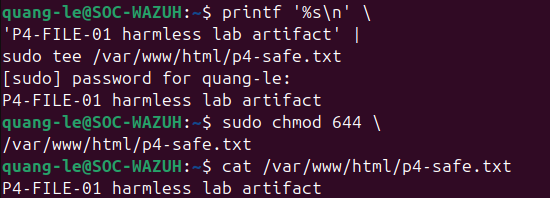
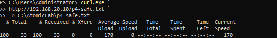
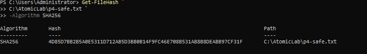
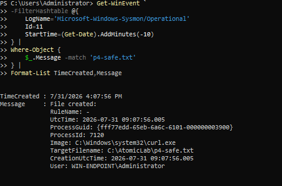
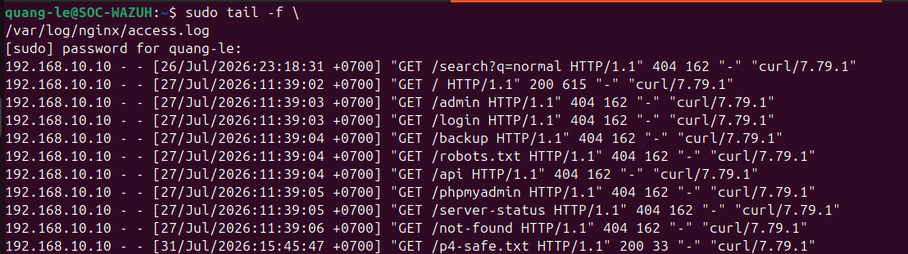
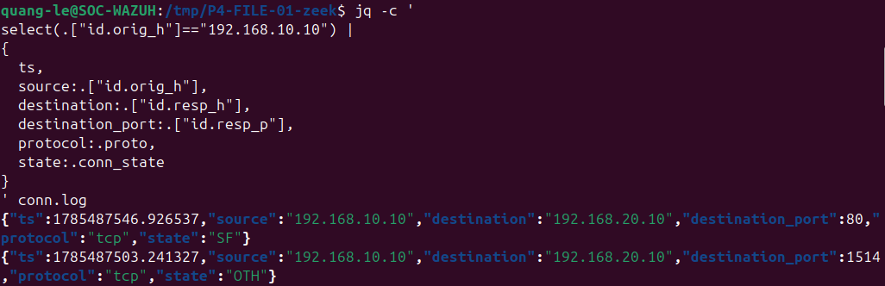
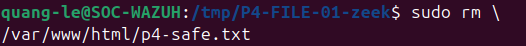
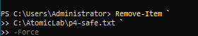

# P4-FILE-01 — Controlled HTTP File Transfer and File Creation

| Field | Value |
|---|---|
| Test ID | `P4-FILE-01` |
| Category | File and network activity |
| Status | **Validated** |
| Execution window | 2026-07-31 16:12 onward |
| Authorized source | WIN-ENDPOINT (`192.168.10.10`) |
| Authorized target | Ubuntu DMZ Nginx (`192.168.20.10:80`) |
| ATT&CK/control focus | T1105 — Ingress Tool Transfer (harmless laboratory artifact) |
| Primary telemetry | Sysmon Event ID 11, Wazuh, Nginx access log, Zeek conn.log/http.log |
| Detection result | Wazuh custom rule `100150`, level 8 |

## Test Documentation

- [Objective](objective.md)
- [Prerequisites](prerequisites.md)
- [Expected telemetry](expected-telemetry.md)
- [ATT&CK mapping](mitre-mapping.md)
- [Cleanup procedure](cleanup.md)
- [Return to the test catalog](../../test-index.md)

## Why This Test Matters

File transfer is a cross-layer scenario: the endpoint creates a process and file, the web server records a request, network sensors observe the connection, and the SIEM may generate a detection. This makes it an effective test of telemetry correlation.

The transferred object was a harmless text file named `p4-safe.txt`. The test did not transfer malware, scripts, credentials, or sensitive data. SHA-256 was calculated to prove artifact identity, and both server and client copies were deleted after validation.

## Safety Boundary

- Host only a harmless text marker in the lab Nginx web root.
- Restrict the transfer to the internal DMZ address.
- Do not use executable content or real sensitive data.
- Calculate a hash for identity and chain-of-evidence purposes.
- Delete both copies after the test.

## Execution Summary

1. Create `/var/www/html/p4-safe.txt` on the authorized Ubuntu server.
2. Verify Nginx can serve the file over the permitted HTTP path.
3. Download the file from WIN-ENDPOINT with `curl.exe` into `C:\AtomicLab`.
4. Calculate SHA-256 on the downloaded file.
5. Review the process event and Sysmon Event ID 11 file-creation evidence.
6. Search Wazuh for custom rule `100150`.
7. Review Nginx access logs and Zeek `conn.log`/`http.log` for the same source, destination, URI, and time.
8. Remove the server and endpoint copies and verify absence.

### Safe Reproduction Pattern

```powershell
New-Item -ItemType Directory -Force C:\AtomicLab | Out-Null
curl.exe http://192.168.20.10/p4-safe.txt -o C:\AtomicLab\p4-safe.txt
Get-FileHash C:\AtomicLab\p4-safe.txt -Algorithm SHA256
```

## Expected Telemetry

| Source | Expected evidence |
|---|---|
| Endpoint process | `curl.exe` command line with internal HTTP URL and output path. |
| Sysmon | Event ID 11 or equivalent file-creation telemetry for `C:\AtomicLab\p4-safe.txt`. |
| Wazuh | Centralized process/file telemetry and custom rule `100150`. |
| Nginx | Access-log request for `/p4-safe.txt` from `192.168.10.10`. |
| Zeek | Connection metadata and HTTP URI/host information. |
| Cleanup | Both client and server files absent. |

## Observed Result

The file was served by Nginx and downloaded with `curl.exe`. The endpoint calculated SHA-256, Sysmon Event ID 11 recorded file creation, and Wazuh custom rule `100150` fired at level 8 with `T1105`. Nginx, Zeek `conn.log`, and Zeek `http.log` provided matching server/network evidence.

Historical or noisy Suricata records were reviewed separately and were not treated as proof of this transfer. The strongest run-specific evidence is the endpoint, Wazuh, Nginx, and Zeek correlation.

## Validation Criteria

- [x] The internal HTTP request succeeds.
- [x] The downloaded file hash is recorded.
- [x] Sysmon file-creation evidence is visible.
- [x] Wazuh rule `100150` is present at level 8.
- [x] Nginx and Zeek record the same transfer.
- [x] Both copies are removed after testing.

## Limitations and Follow-Up

- A harmless text transfer does not reproduce executable payload behavior.
- HTTP is unencrypted; an HTTPS retest would change network visibility.
- Suricata did not provide clean run-specific proof for this file transfer.
- Future tests should add filename, MIME type, user agent, hash allowlisting, and alert-latency measurements.

## Evidence Gallery

[Open the complete screenshot folder](../../../screenshots/05-file-transfer/)

### Harmless file prepared in the Nginx web root

[](../../../screenshots/05-file-transfer/P4-FILE-001.png)

### curl.exe download to the endpoint

[](../../../screenshots/05-file-transfer/P4-FILE-002.png)

### SHA-256 verification of the downloaded file

[](../../../screenshots/05-file-transfer/P4-FILE-003.png)

### Sysmon Event ID 11 file-creation evidence

[](../../../screenshots/05-file-transfer/P4-FILE-005.png)

### Wazuh custom rule 100150 detection

[](../../../screenshots/05-file-transfer/P4-FILE-013.png)

### Nginx access-log request

[](../../../screenshots/05-file-transfer/P4-FILE-014.png)

### Zeek connection metadata

[](../../../screenshots/05-file-transfer/P4-FILE-015.png)

### Zeek HTTP URI evidence

[](../../../screenshots/05-file-transfer/P4-FILE-016.png)

### Server-side artifact removal

[](../../../screenshots/05-file-transfer/P4-FILE-019.png)

### Endpoint artifact removal

[](../../../screenshots/05-file-transfer/P4-FILE-020.png)

## Related Project Documentation

- [Rules of engagement](../../../rules-of-engagement.md)
- [Authorized assets](../../../authorized-assets.md)
- [Prohibited actions](../../../prohibited-actions.md)
- [Snapshot and recovery procedure](../../../snapshot-and-recovery.md)
- [Cleanup checklist](../../../cleanup-checklist.md)
- [Expected telemetry model](../../../telemetry/expected-telemetry.md)
- [Actual telemetry summary](../../../telemetry/actual-telemetry.md)
- [Capability matrix](../../../test-results/capability-matrix.md)
- [Test execution log](../../../test-results/test-execution-log.csv)
- [Complete evidence index](../../../screenshots/evidence-index.md)
