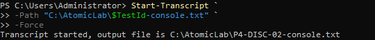
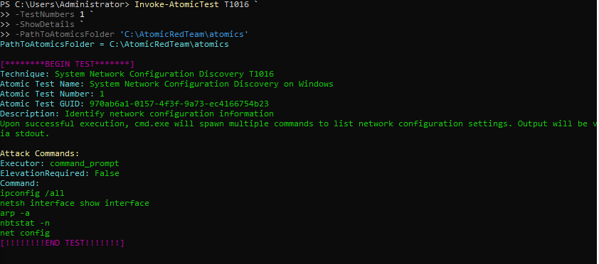
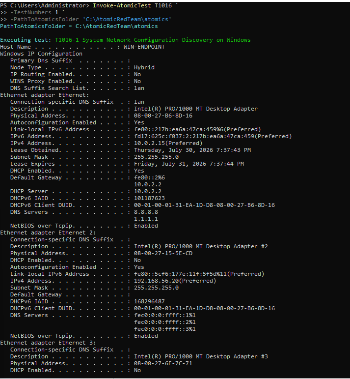
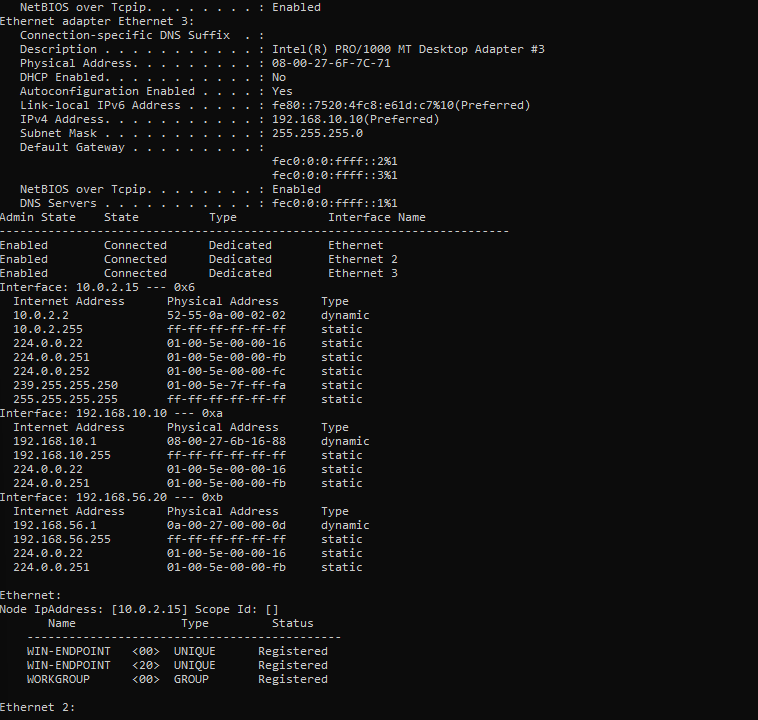
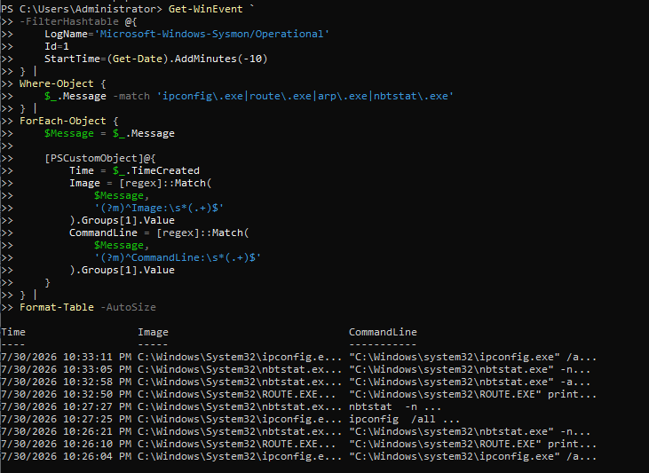
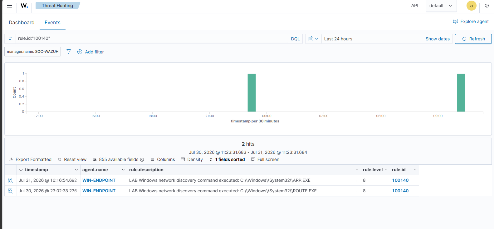

# P4-DISC-02 — Network Configuration and Connection Discovery

| Field | Value |
|---|---|
| Test ID | `P4-DISC-02` |
| Category | Discovery |
| Status | **Validated** |
| Execution window | 2026-07-30 to 2026-07-31 |
| Authorized source | WIN-ENDPOINT (`192.168.10.10`) |
| Authorized target | Local Windows endpoint |
| ATT&CK/control focus | T1016 — System Network Configuration Discovery; T1049 — System Network Connections Discovery; T1059.001/T1059.003 — command interpreters |
| Primary telemetry | Sysmon, LimaCharlie, Wazuh, PowerShell transcript and native output |
| Detection result | Wazuh custom rule `100140`, level 8 |

## Test Documentation

- [Objective](objective.md)
- [Prerequisites](prerequisites.md)
- [Expected telemetry](expected-telemetry.md)
- [ATT&CK mapping](mitre-mapping.md)
- [Cleanup procedure](cleanup.md)
- [Return to the test catalog](../../test-index.md)

## Why This Test Matters

Network discovery helps an attacker understand interfaces, routes, neighbors, listening services, and active connections before lateral movement or command-and-control actions. The same commands are also used routinely by administrators, so useful detection depends on context and aggregation rather than one command in isolation.

This test combines selected Atomic Red Team coverage with Windows-native commands such as `ipconfig`, `route print`, `arp -a`, `netstat`, and `Get-NetTCPConnection`. The test therefore validates both network-configuration discovery and connection discovery.

## Safety Boundary

- Run discovery only on WIN-ENDPOINT.
- Do not scan external addresses or expand the activity into lateral movement.
- Use read-only commands and selected Atomic tests that have been reviewed in advance.
- Record Atomic test IDs and command lines before execution.
- Keep Defender and monitoring controls enabled.

## Execution Summary

1. Confirm the selected Atomic Red Team test definition and prerequisites.
2. Run the reviewed T1016-aligned Atomic test or execute the equivalent native commands.
3. Collect interface, route, ARP, and active-connection output.
4. Review Sysmon process creation and local PowerShell transcript evidence.
5. Review the LimaCharlie process timeline for repeated discovery activity.
6. Search Wazuh for custom rule `100140` and expand the matching event.
7. Compare configuration-oriented commands with connection-oriented commands and document both ATT&CK mappings.

### Safe Reproduction Pattern

```powershell
ipconfig /all
route print
arp -a
netstat -ano
Get-NetTCPConnection | Select-Object -First 20
```

These commands are read-only. Run them only on the authorized endpoint and avoid adding remote enumeration or scanning.

## Expected Telemetry

| Source | Expected evidence |
|---|---|
| Windows/Sysmon | Process creation for native utilities and PowerShell, including command lines and parents. |
| PowerShell | Script-block or transcript evidence for PowerShell-based discovery where enabled. |
| LimaCharlie | Repeated discovery processes in the endpoint timeline. |
| Wazuh | Centralized events and custom rule `100140` for network-discovery indicators. |
| Analyst mapping | Configuration commands mapped to `T1016`; active-connection commands also mapped to `T1049`. |

## Observed Result

The selected discovery actions generated local command output, Sysmon process events, LimaCharlie timeline records, and Wazuh events. Wazuh custom rule `100140` fired at level 8 and displayed `T1016`. The evidence also contains active-connection discovery through `netstat` and `Get-NetTCPConnection`; analyst documentation therefore includes `T1049` even though the observed Wazuh rule primarily reported `T1016`.

The combined evidence shows why ATT&CK mapping should be reviewed at the command level rather than copied mechanically from one tool field.

## Validation Criteria

- [x] Interface and route discovery output is captured.
- [x] At least one active-connection discovery command is captured.
- [x] Sysmon or endpoint process telemetry contains the executed command lines.
- [x] LimaCharlie shows the relevant process activity when the sensor is available.
- [x] Wazuh rule `100140` is present at level 8.
- [x] Analyst documentation distinguishes `T1016` from `T1049`.

## Limitations and Follow-Up

- The commands are common during troubleshooting and require contextual detection.
- The custom rule may not distinguish every configuration command from connection discovery.
- This test does not perform host discovery or port scanning.
- Future tuning should correlate command sequences, parent process, user role, and time window.

## Evidence Gallery

[Open the complete screenshot folder](../../../screenshots/03-discovery/)

### PowerShell transcript and discovery sequence

[](../../../screenshots/03-discovery/P4-DISC-006.png)

### Atomic Red Team T1016 execution

[](../../../screenshots/03-discovery/P4-DISC-007.png)

### Network configuration output

[](../../../screenshots/03-discovery/P4-DISC-009.png)

### Route and interface evidence

[](../../../screenshots/03-discovery/P4-DISC-010.png)

### Local Sysmon process query

[](../../../screenshots/03-discovery/P4-DISC-016.png)

### LimaCharlie discovery timeline

[](../../../screenshots/03-discovery/P4-DISC-035.png)

### Wazuh custom rule 100140 alert

[](../../../screenshots/03-discovery/P4-DISC-038.png)

### Expanded Wazuh rule metadata

[](../../../screenshots/03-discovery/P4-DISC-046.png)

## Related Project Documentation

- [Rules of engagement](../../../rules-of-engagement.md)
- [Authorized assets](../../../authorized-assets.md)
- [Prohibited actions](../../../prohibited-actions.md)
- [Snapshot and recovery procedure](../../../snapshot-and-recovery.md)
- [Cleanup checklist](../../../cleanup-checklist.md)
- [Expected telemetry model](../../../telemetry/expected-telemetry.md)
- [Actual telemetry summary](../../../telemetry/actual-telemetry.md)
- [Capability matrix](../../../test-results/capability-matrix.md)
- [Test execution log](../../../test-results/test-execution-log.csv)
- [Complete evidence index](../../../screenshots/evidence-index.md)
