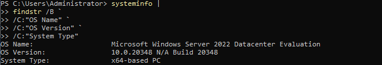
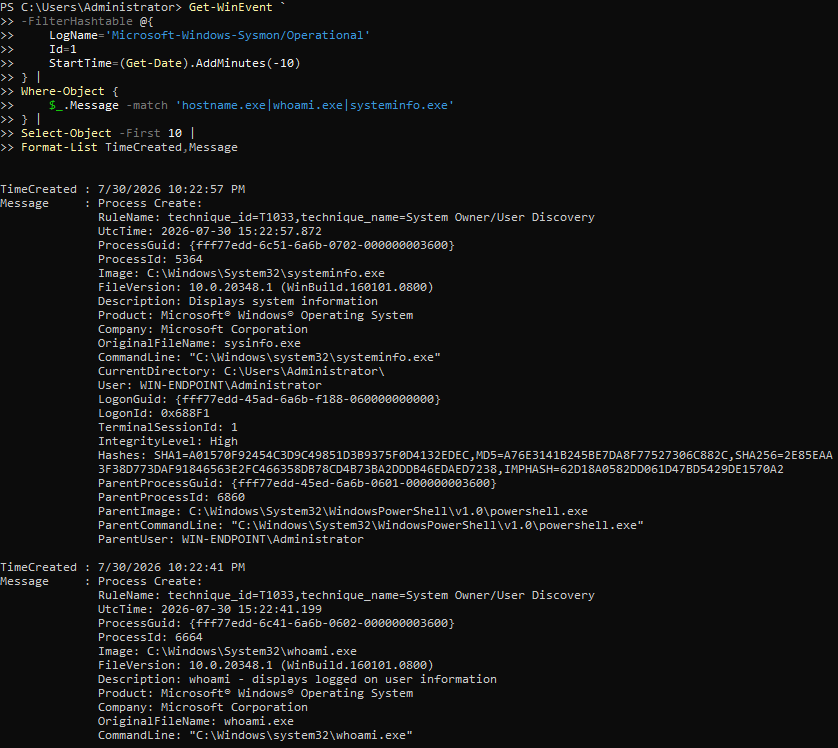
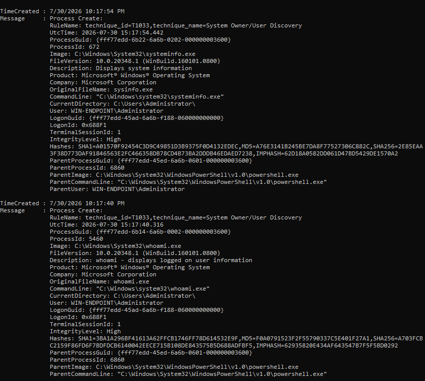
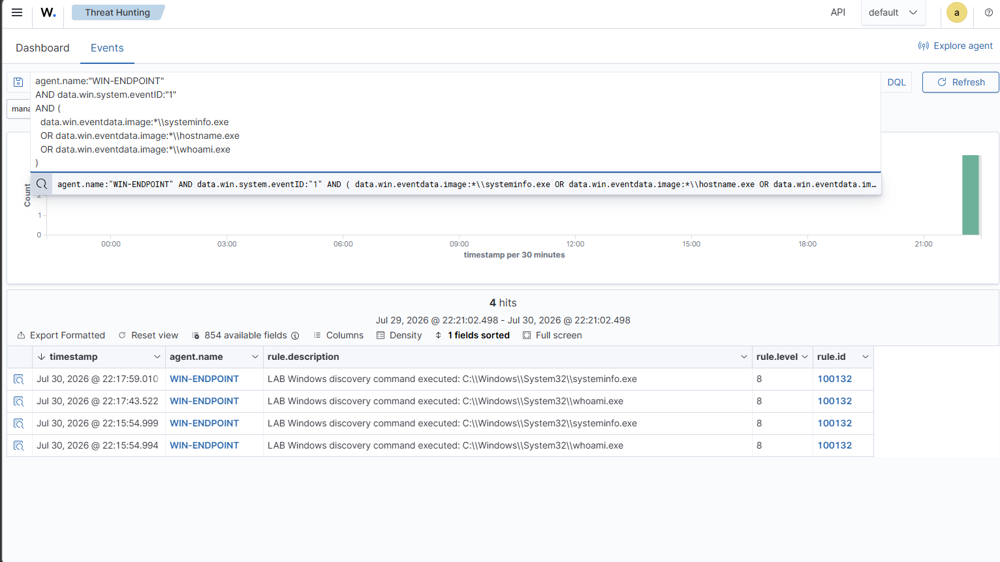
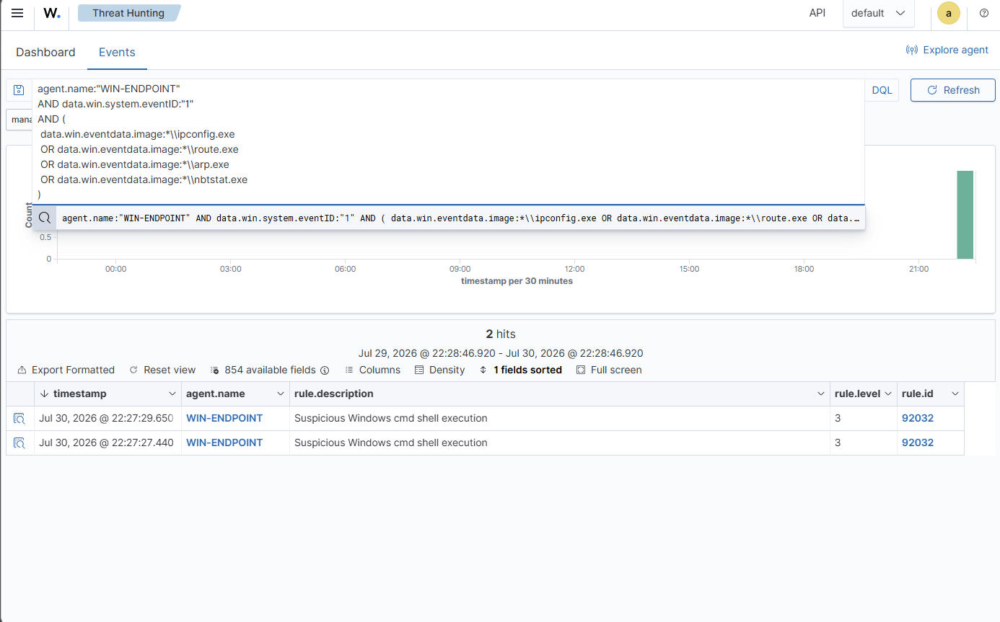

# P4-DISC-01 — System Information Discovery

| Field | Value |
|---|---|
| Test ID | `P4-DISC-01` |
| Category | Discovery |
| Status | **Validated** |
| Execution window | 2026-07-30 evening |
| Authorized source | WIN-ENDPOINT (`192.168.10.10`) |
| Authorized target | Local Windows endpoint |
| ATT&CK/control focus | T1082 — System Information Discovery |
| Primary telemetry | Process creation, command line, endpoint and Wazuh events |
| Detection result | Searchable discovery telemetry |

## Test Documentation

- [Objective](objective.md)
- [Prerequisites](prerequisites.md)
- [Expected telemetry](expected-telemetry.md)
- [ATT&CK mapping](mitre-mapping.md)
- [Cleanup procedure](cleanup.md)
- [Return to the test catalog](../../test-index.md)

## Why This Test Matters

Attackers and administrators both collect operating-system, hostname, hardware, hotfix, domain, and boot information. This information helps an attacker choose payloads and later actions, while defenders use the same telemetry to identify reconnaissance that appears early in an intrusion chain.

This test uses the native `systeminfo` utility. It is non-destructive, produces no persistent artifact, and creates a clear process event suitable for validating discovery telemetry.

## Safety Boundary

- Use only native read-only discovery commands.
- Do not query remote systems or domains outside the lab.
- Do not redirect output to a persistent public artifact unless required for evidence.
- Record the exact command and execution time.

## Execution Summary

1. Run `systeminfo` from the authorized Windows endpoint.
2. Capture the local console output to prove the command completed.
3. Search endpoint telemetry for the process name and command line.
4. Search Wazuh for the endpoint and execution window.
5. Compare the observed event with the expected `T1082` behavior.

### Safe Reproduction Pattern

```powershell
systeminfo
```

## Expected Telemetry

| Source | Expected evidence |
|---|---|
| Windows/Sysmon | Process creation for `systeminfo.exe`, including the parent process and user. |
| LimaCharlie | A process timeline record for the discovery command when the sensor is healthy. |
| Wazuh | Centralized process telemetry searchable by host, executable, command line, and time. |
| Artifacts | Console output only; no required persistent file or configuration change. |

## Observed Result

The `systeminfo` command completed and returned operating-system and host details. Supporting endpoint and centralized views recorded the execution. The evidence establishes that the discovery action can be reconstructed from the command output and associated process telemetry.

This test was validated on telemetry availability rather than a dedicated high-severity alert. That distinction is intentional: telemetry collection is a prerequisite for future analytic development, even where no specific rule currently escalates the event.

## Validation Criteria

- [x] The command completes on WIN-ENDPOINT.
- [x] A process event records `systeminfo.exe`.
- [x] The event is searchable centrally in the expected time window.
- [x] No persistent artifact is created.
- [x] The analyst can explain why the behavior maps to `T1082`.

## Limitations and Follow-Up

- `systeminfo` is frequently legitimate and should not be alerted on without context.
- A single discovery command does not prove malicious reconnaissance.
- Future analytics should correlate multiple discovery commands, unusual parent processes, or execution by unexpected users.

## Evidence Gallery

[Open the complete screenshot folder](../../../screenshots/03-discovery/)

### Native systeminfo command output

[](../../../screenshots/03-discovery/P4-DISC-001.png)

### System information execution evidence

[](../../../screenshots/03-discovery/P4-DISC-002.png)

### Additional discovery output

[](../../../screenshots/03-discovery/P4-DISC-003.png)

### Centralized telemetry for the discovery action

[](../../../screenshots/03-discovery/P4-DISC-004.png)

### Supporting Wazuh discovery evidence

[](../../../screenshots/03-discovery/P4-DISC-005.png)

## Related Project Documentation

- [Rules of engagement](../../../rules-of-engagement.md)
- [Authorized assets](../../../authorized-assets.md)
- [Prohibited actions](../../../prohibited-actions.md)
- [Snapshot and recovery procedure](../../../snapshot-and-recovery.md)
- [Cleanup checklist](../../../cleanup-checklist.md)
- [Expected telemetry model](../../../telemetry/expected-telemetry.md)
- [Actual telemetry summary](../../../telemetry/actual-telemetry.md)
- [Capability matrix](../../../test-results/capability-matrix.md)
- [Test execution log](../../../test-results/test-execution-log.csv)
- [Complete evidence index](../../../screenshots/evidence-index.md)
