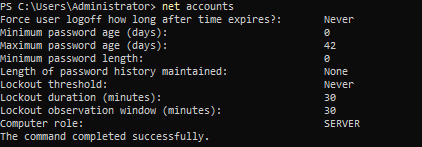
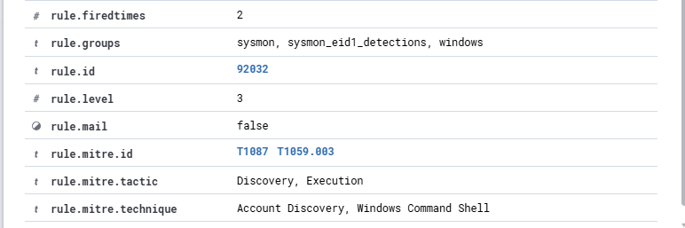
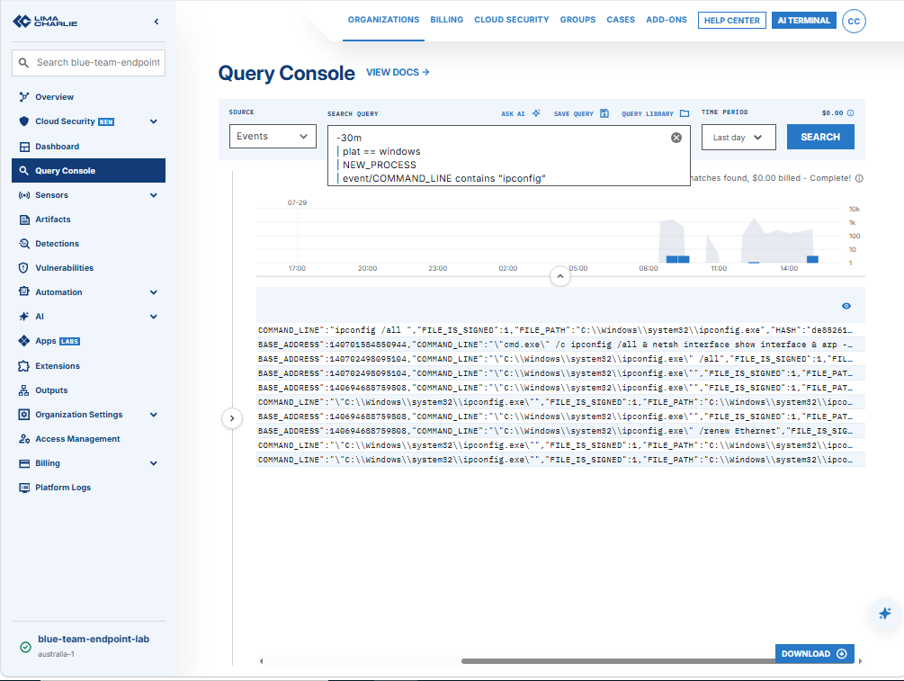
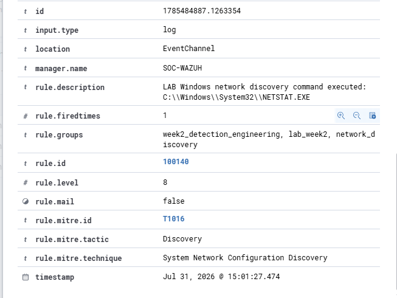

# P4-DISC-03 — Password Policy and Account Context Discovery

| Field | Value |
|---|---|
| Test ID | `P4-DISC-03` |
| Category | Discovery |
| Status | **Validated** |
| Execution window | 2026-07-30 evening |
| Authorized source | WIN-ENDPOINT (`192.168.10.10`) |
| Authorized target | Local Windows endpoint |
| ATT&CK/control focus | Analyst mapping: T1201 — Password Policy Discovery; observed Wazuh metadata: T1087 and T1059.003 |
| Primary telemetry | Sysmon process creation and Wazuh events |
| Detection result | Wazuh rule `92032` |

## Test Documentation

- [Objective](objective.md)
- [Prerequisites](prerequisites.md)
- [Expected telemetry](expected-telemetry.md)
- [ATT&CK mapping](mitre-mapping.md)
- [Cleanup procedure](cleanup.md)
- [Return to the test catalog](../../test-index.md)

## Why This Test Matters

Password-policy discovery can reveal minimum password length, lockout behavior, password age, and related controls that influence later credential attacks. The native `net accounts` command is a low-risk way to validate whether policy discovery appears in endpoint and SIEM telemetry.

This test also documents an important analytic lesson: the observed Wazuh rule displayed `T1087` and `T1059.003`, while analyst review identifies `T1201` as the more precise primary mapping for `net accounts`. The repository preserves both the tool-reported metadata and the reviewed interpretation.

## Safety Boundary

- Run `net accounts` only on the local authorized endpoint.
- Do not change account or password policy.
- Do not enumerate external domain accounts.
- Record the command and timestamp and preserve only necessary evidence.

## Execution Summary

1. Execute the read-only `net accounts` command.
2. Capture the returned local policy information.
3. Search Sysmon/process telemetry for `net.exe` or the relevant command shell.
4. Search Wazuh for rule `92032` in the execution window.
5. Record the ATT&CK IDs reported by Wazuh.
6. Document the analyst-reviewed mapping to `T1201` separately from tool metadata.

### Safe Reproduction Pattern

```powershell
net accounts
```

## Expected Telemetry

| Source | Expected evidence |
|---|---|
| Windows/Sysmon | Process creation for `net.exe`/`net1.exe` and the command line. |
| Wazuh | A centralized command-shell event and rule `92032` when its conditions match. |
| Tool mapping | Observed metadata may display `T1087` and `T1059.003`. |
| Analyst mapping | `T1201` is the primary behavior mapping for password-policy discovery through `net accounts`. |

## Observed Result

The endpoint returned local account-policy information. Wazuh rule `92032` was visible and displayed ATT&CK mappings `T1087` and `T1059.003`. The test is validated because the command and centralized event were captured.

For portfolio accuracy, the catalog treats `T1201 — Password Policy Discovery` as the primary analyst mapping. The Wazuh-provided IDs are retained as observed detection metadata rather than silently rewritten.

## Validation Criteria

- [x] `net accounts` completes without modifying policy.
- [x] The process and command line are recorded.
- [x] Wazuh rule `92032` is visible in the expected time window.
- [x] The test record preserves both observed and analyst-reviewed ATT&CK mappings.
- [x] No account or policy setting changes.

## Limitations and Follow-Up

- Built-in SIEM mappings may be broader than the exact command behavior.
- `net accounts` is legitimate administrative activity and should be correlated with user role and surrounding actions.
- This test does not enumerate credentials or attempt password attacks.

## Evidence Gallery

[Open the complete screenshot folder](../../../screenshots/03-discovery/)

### Local net accounts policy output

[](../../../screenshots/03-discovery/P4-DISC-048.png)

### Wazuh rule 92032 with tool-provided ATT&CK mapping

[](../../../screenshots/03-discovery/P4-DISC-021.png)

### Wazuh query for discovery activity

[](../../../screenshots/03-discovery/P4-DISC-031.png)

### Expanded discovery rule metadata

[](../../../screenshots/03-discovery/P4-DISC-046.png)

## Related Project Documentation

- [Rules of engagement](../../../rules-of-engagement.md)
- [Authorized assets](../../../authorized-assets.md)
- [Prohibited actions](../../../prohibited-actions.md)
- [Snapshot and recovery procedure](../../../snapshot-and-recovery.md)
- [Cleanup checklist](../../../cleanup-checklist.md)
- [Expected telemetry model](../../../telemetry/expected-telemetry.md)
- [Actual telemetry summary](../../../telemetry/actual-telemetry.md)
- [Capability matrix](../../../test-results/capability-matrix.md)
- [Test execution log](../../../test-results/test-execution-log.csv)
- [Complete evidence index](../../../screenshots/evidence-index.md)
