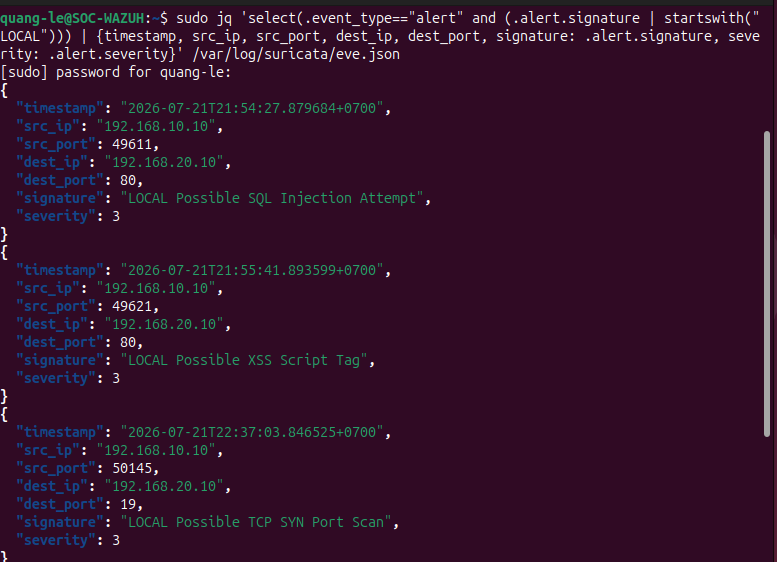

# Suricata IDS Lab

## Objective

Deploy Suricata on the Ubuntu DMZ server, correct its capture-interface configuration, validate the engine, generate safe test traffic, and investigate structured alerts.

## Final status

- Suricata configuration test: passed.
- Service state: active.
- SQL injection signature: alerted.
- XSS signature: alerted.
- TCP SYN scan signature: alerted.
- EVE JSON investigation: completed.
- Inline IPS: not implemented.

See [setup](setup.md), [alert analysis](eve-json-analysis.md), [validation](validation-tests.md), and [troubleshooting](troubleshooting.md).
