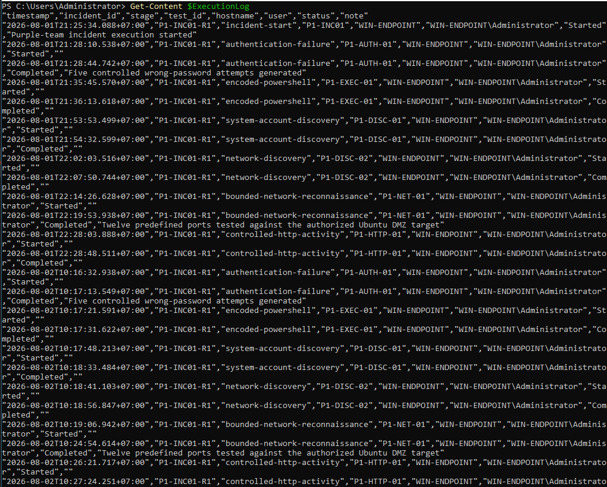

# SOC Detection Validation and Incident Response

## Overview

This project validates a complete SOC investigation workflow by reusing the safe test catalog, endpoint telemetry, network telemetry, SIEM detections, EDR response, and segmented lab infrastructure developed in earlier projects.

The controlled incident `P1-INC01-R1` was executed from `WIN-ENDPOINT` (`192.168.10.10`) against the authorized Ubuntu DMZ target (`192.168.20.10`) on **August 1–2, 2026**. It generated authentication failures, encoded PowerShell, system and network discovery, a bounded twelve-port service probe, a benign HTTP file transfer, and a SQL-injection-like request. The activity was investigated across Windows Security, Sysmon, Wazuh, LimaCharlie, Nginx, Zeek, Suricata, the Python reconnaissance detector, pfSense, and PCAP metadata.

## What I Built

* A repeatable incident-validation workflow covering baseline, controlled execution, triage, containment, recovery, gap analysis, tuning, and retest.
* An incident-specific test set that maps reusable Project 6 tests to `P1-INC01-R1` execution steps.
* A timestamped execution record for the initial run and the retest.
* Cross-layer correlation across endpoint, application, network, SIEM, and EDR evidence.
* Wazuh validation for encoded PowerShell, system discovery, network discovery, controlled file transfer, and SQLi-like activity.
* LimaCharlie isolation and recovery validation while preserving sensor connectivity.
* A detection-coverage matrix that distinguishes passed, partial, gap, and not-observed outcomes.
* PCAP integrity documentation for the final recapture, including `capinfos` metadata and SHA-256 verification.
* Troubleshooting records for Wazuh event-buffer pressure, missing/empty PCAP attempts, timestamp ordering, Suricata noise, and incomplete behavioral network attribution.

## What I Learned

* A successful alert is only one part of an incident workflow; the analyst must also establish scope, preserve evidence, contain safely, recover services, and retest.
* Cross-layer correlation is necessary because endpoint, network, application, SIEM, and EDR tools expose different parts of the same activity.
* A low behavioral score does not prove that reconnaissance did not occur when the input capture is incomplete or the observed port diversity is too small.
* Isolation should be validated from both perspectives: normal connectivity must stop while the EDR management channel remains available.
* PCAP metadata and hashes are required to prove which capture was analyzed, especially after a missing or empty capture has been replaced.
* Partial and negative results are useful findings when they are documented without overstating detection coverage.

## Outcome Summary

| Area | Result | Evidence-backed conclusion |
|---|---|---|
| Baseline health | Passed | Wazuh, Sysmon, Defender, LimaCharlie, Nginx, Suricata, and supporting services were checked before execution. |
| Authentication failures | Passed | Five controlled failures produced Windows Security Event ID 4625 evidence. |
| Encoded PowerShell | Passed | Sysmon, Wazuh rule `92057`, and LimaCharlie recorded the execution. |
| System/account discovery | Passed | Command output and Wazuh rule `100132` were observed. |
| Network discovery | Passed | Native discovery commands and Wazuh rule `100140` were observed. |
| Bounded service probe | Partial | The transcript proves twelve ports were tested, but the initial Zeek/Python input did not preserve the full port diversity. |
| HTTP file transfer | Passed | Curl, Nginx, Zeek HTTP, and Wazuh rule `100154` correlated. |
| SQLi-like request | Passed | Nginx and Wazuh rule `100130` recorded the controlled request. |
| Endpoint containment | Passed | LimaCharlie isolation blocked normal connectivity while the sensor remained reachable. |
| Recovery | Passed | `rejoin_network` succeeded and normal connectivity returned. |
| Retest | Passed with network limitation | Endpoint, SIEM, HTTP, and EDR evidence repeated; network behavioral attribution remained partial. |
| Final PCAP integrity | Passed for metadata/hash | The final 4.3 MB recapture contained 5,246 packets and a verified SHA-256; the raw PCAP is not bundled in this update package. |

## Key Evidence

### Incident execution record

### Encoded PowerShell detection

### Bounded service probe

### Containment and recovery

### Final PCAP integrity

## Navigation

* [Full technical report](report.md)
* [Final incident report](incident-report.md)
* [Rules of engagement](rules-of-engagement.md)
* [Architecture and data flow](architecture.md)
* [Attack plan](attack-plan.md)
* [Incident test set](incident-tests/README.md)
* [Initial and retest timeline](attack-timeline.md)
* [Telemetry matrix](telemetry-matrix.md)
* [Detection coverage and gaps](detection-coverage.md)
* [Containment and recovery](containment-and-recovery.md)
* [Gap analysis, tuning, and retest](gaps-and-tuning.md)
* [Validation tests](validation-tests.md)
* [Evidence log](evidence-log.md)
* [Troubleshooting](troubleshooting/README.md)
* [Screenshot index](screenshots/evidence-index.md)
* [PCAP metadata](pcap/metadata.md)
* [Structure update notes](structure-update-notes.md)

## Evidence Policy

This repository contains screenshots, documentation, and integrity records only. It does not contain credentials, tokens, VM disks, malware, or harmful artifacts. The final raw PCAP is intentionally not included in this generated update package. Four obsolete screenshots from the missing/empty initial-capture attempts were excluded and replaced by the final recapture metadata and hash evidence.
