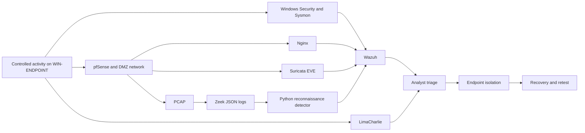

# Architecture and Telemetry Flow

## Lab Roles

| Asset | Address | Role |
|---|---|---|
| WIN-ENDPOINT | 192.168.10.10 | Authorized source endpoint on USER_NET |
| Ubuntu DMZ / SOC-WAZUH | 192.168.20.10 | Authorized target, Nginx service, Wazuh, Suricata, Zeek analysis, and PCAP collection |
| pfSense | 192.168.10.1 / 192.168.20.1 | Segmentation and policy enforcement |
| LimaCharlie cloud | Managed service | Endpoint telemetry and network isolation/rejoin |

The Windows endpoint also had `10.0.2.15` and `192.168.56.20` on other lab adapters. These addresses are documented because multi-interface systems can cause apparent source-IP differences across tools.

## Logical Flow

## Evidence Layers

1. **Execution record:** exact test IDs, timestamps, status, and notes.
2. **Endpoint:** Windows Security Event ID 4625, Sysmon process creation, and native command output.
3. **Application:** Nginx access log for benign file transfer and SQLi-like URI.
4. **Network:** pfSense connectivity behavior, PCAP, Zeek metadata, Suricata EVE, and Python detector output.
5. **SIEM:** Wazuh rules `92057`, `100132`, `100140`, `100154`, and `100130`.
6. **EDR:** LimaCharlie process context, `segregate_network`, sensor availability, and `rejoin_network`.
