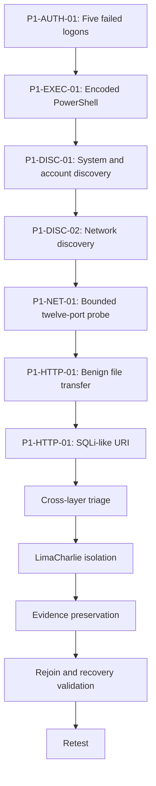

# Controlled Incident Plan

## Incident Identifier

`P1-INC01-R1`

## Objective

Validate whether the existing SOC stack can observe, correlate, triage, contain, recover from, and retest a controlled multi-stage incident without using malware.

## Reused Test Sources

| Incident step | Reusable source | Role in this incident |
|---|---|---|
| P1-AUTH-01 | P4-AUTH-01 | Controlled failed authentication |
| P1-EXEC-01 | P4-EXEC-01 | Benign encoded PowerShell |
| P1-DISC-01 | P4-DISC-01 | System and user discovery |
| P1-DISC-02 | P4-DISC-02 | Network configuration and connection discovery |
| P1-NET-01 | P4-NET-01 | Bounded service probing |
| P1-HTTP-01 | P4-FILE-01 | Controlled HTTP file transfer |
| P1-HTTP-02 | Incident-specific extension | Controlled SQLi-like request using the existing Wazuh web detection |

Detailed selection, execution, and retest records are stored in [`incident-tests/`](incident-tests/README.md). The reusable definitions remain authoritative in Project 6.

## Attack Chain

## Success Criteria

* At least one endpoint, one SIEM, and one network or application source must support the investigation.
* Containment must stop normal network connectivity without losing the EDR management channel.
* Recovery must restore network access.
* Gaps and partial results must be documented.
* The same core sequence must be repeatable during retest.
