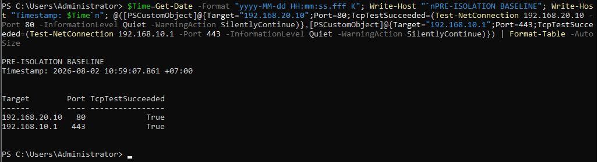

# Containment and Recovery

## Decision

Containment was performed after sufficient endpoint, SIEM, application, and network evidence had been collected. LimaCharlie network isolation was selected because it could block normal endpoint traffic without shutting down the virtual machine or destroying volatile process context.

## Pre-Containment State

The endpoint could reach the Ubuntu DMZ web service on TCP/80 and the pfSense gateway on TCP/443.

## Containment Result

After `segregate_network`, both tested TCP connections failed and ping reported complete loss. This behavior was expected and demonstrated the operational effect of isolation.

The LimaCharlie sensor remained manageable and returned system information during isolation.

## Recovery Result

The `rejoin_network` task returned success.

Normal connectivity to the DMZ service and pfSense returned immediately afterward.

## Recovery Checklist

| Check | Result |
|---|---|
| LimaCharlie rejoin task | Passed |
| DMZ TCP/80 connectivity | Passed after recovery |
| pfSense TCP/443 connectivity | Passed after recovery |
| LimaCharlie sensor availability | Passed |
| Wazuh agent baseline service state | Running before execution; buffer pressure documented separately |
| Test artifacts | Benign test only; no malware or persistence used |
| Firewall policy | No permanent policy change required for the validated isolation path |

A second `segregate_network` command succeeded during retest at 13:36:45. The evidence set does not contain a separate screenshot of a second rejoin after that command, so this report does not claim a second fully documented recovery cycle.
