# SOC Detection Validation and Incident Response Report

## 1. Executive Summary

This report documents incident `P1-INC01-R1`, a controlled detection-validation and response exercise completed on August 1–2, 2026. The lab reused the previously built Wazuh, Sysmon, LimaCharlie, pfSense, Suricata, Zeek, Python detector, Nginx, and monitoring components to test a complete analyst workflow instead of validating tools independently.

The exercise achieved reliable endpoint, SIEM, EDR, and web-application visibility. It also validated endpoint isolation and recovery. Network behavioral detection remained partial because the initial captured/derived logs did not contain the full twelve-port probe, and Suricata excerpts were dominated by unrelated or unattributed checksum alerts. A final non-empty PCAP was recaptured and integrity-checked, but the raw PCAP and final regenerated derived logs were not supplied in the uploaded evidence set.

## 2. Scope

| Field | Value |
|---|---|
| Incident ID | P1-INC01-R1 |
| Initial execution | August 1, 2026, 21:25–22:28 UTC+07 |
| Retest | August 2, 2026, 10:16–10:27 UTC+07 |
| Source | WIN-ENDPOINT, primarily 192.168.10.10 |
| Target | Ubuntu DMZ / SOC-WAZUH, 192.168.20.10 |
| Containment | LimaCharlie network isolation |
| Recovery | LimaCharlie rejoin and connectivity validation |
| Safety | Authorized, isolated, non-destructive, no malware |

## 2.1 Reused Test Catalog and Incident Test Set

Project 6 remains the authoritative source for reusable test definitions. Phase 3 did not duplicate that catalog. Instead, it created an incident-specific test set in [`incident-tests/`](incident-tests/README.md) that records which tests were selected, how their IDs were mapped to `P1-INC01-R1`, what was executed, and how the initial and retest results were evaluated.

The incident reused `P4-AUTH-01`, `P4-EXEC-01`, `P4-DISC-01`, `P4-DISC-02`, `P4-NET-01`, and `P4-FILE-01`. The SQLi-like request was an incident-specific extension that reused the existing Wazuh web-detection capability rather than a duplicated Project 6 test definition.

## 3. Environment Readiness

Before execution, the lab verified:

* Wazuh agent running on the endpoint.
* Sysmon running with automatic startup.
* Microsoft Defender enabled with real-time protection.
* Ubuntu time synchronization and monitored interfaces.
* Wazuh manager, indexer, dashboard, Filebeat, Nginx, and Suricata active.
* Suricata configuration loaded successfully.
* Python detector unit test passed.
* LimaCharlie sensor online.
* Baseline DMZ web connectivity and pfSense policy state.

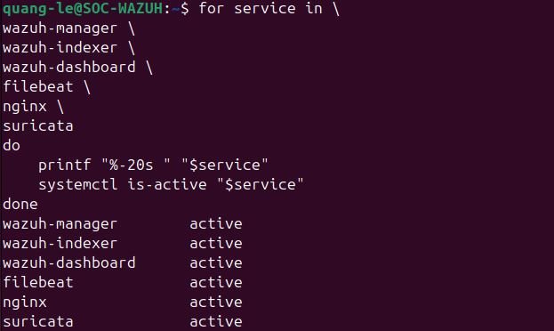

A material readiness warning was also recorded: the Wazuh agent buffer reached 90 percent and reported event discarding.

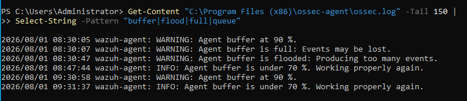

## 4. Controlled Incident Execution

### 4.1 Authentication Failure

Five wrong-password attempts were generated in a controlled manner. Windows Security Event ID 4625 provided direct endpoint evidence.

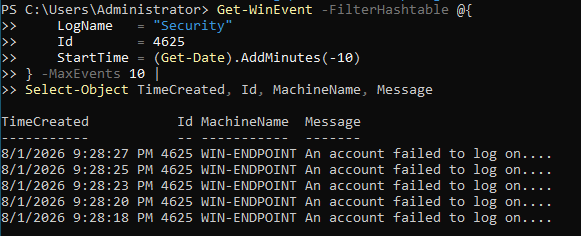

### 4.2 Encoded PowerShell

A benign encoded PowerShell command was executed. Sysmon, Wazuh rule 92057, and LimaCharlie all recorded the process.

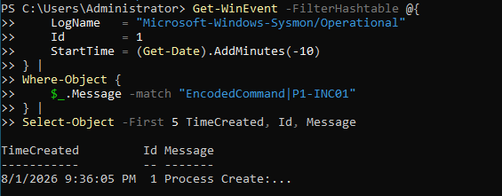

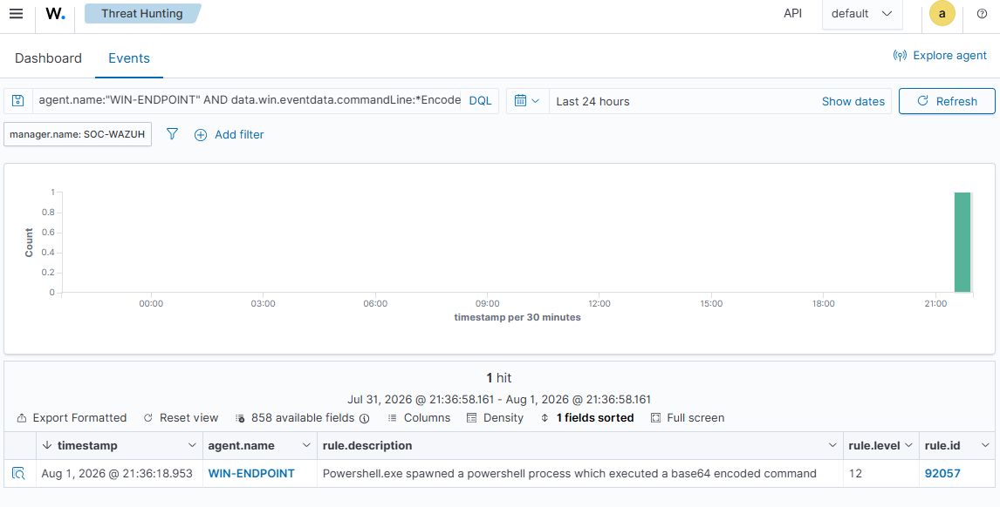

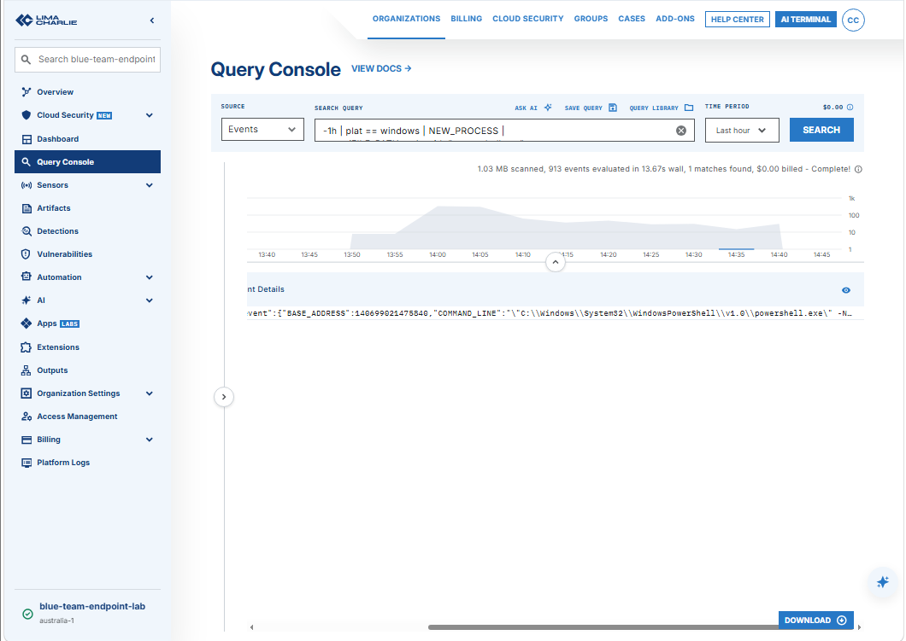

### 4.3 System and Account Discovery

The endpoint ran `whoami`, `hostname`, and `systeminfo`. Wazuh rule 100132 generated a dedicated alert with T1033/T1082-aligned mappings.

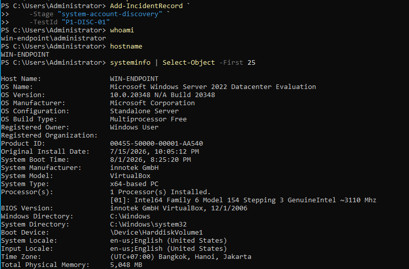

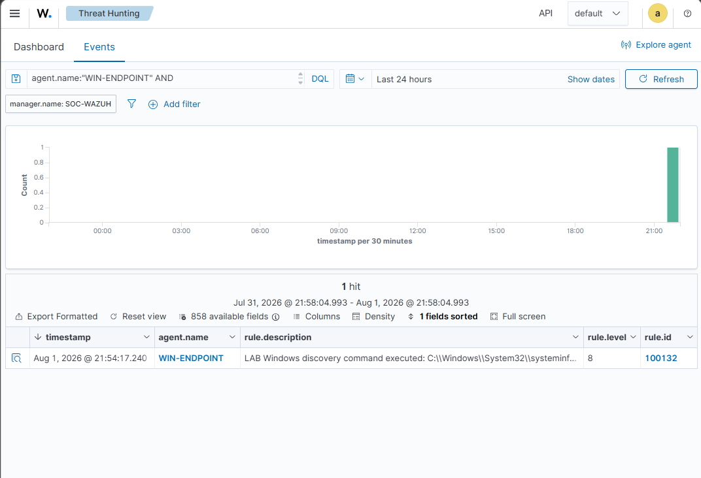

### 4.4 Network Discovery

The endpoint ran `ipconfig /all`, `route print`, `arp -a`, `netstat -ano`, and `Get-NetTCPConnection`. Wazuh rule 100140 generated multiple results.

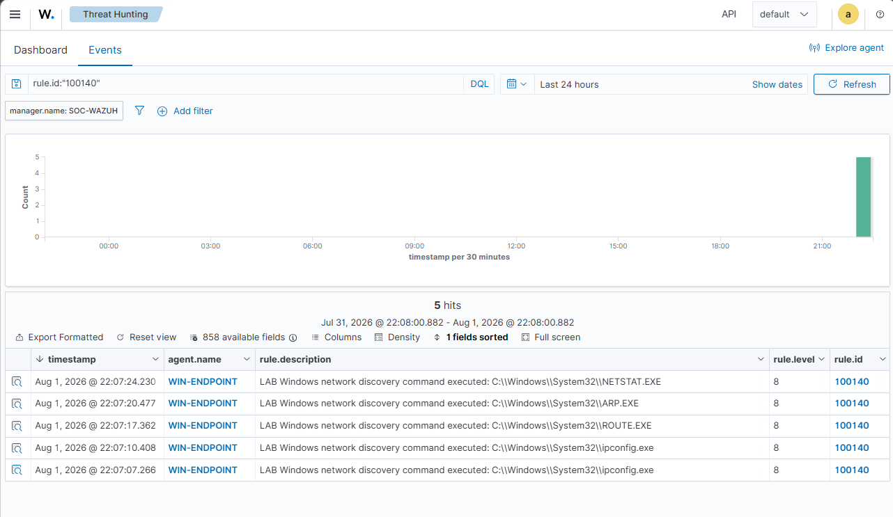

### 4.5 Bounded Service Probe

The source tested twelve predefined ports against the authorized target. TCP/80 and TCP/443 were reachable; the remaining displayed ports were closed or blocked.

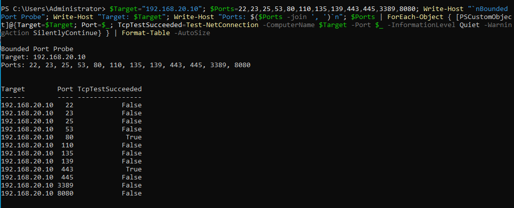

This execution fact is stronger than the initial derived network logs. The Zeek/Python results did not include the complete port diversity and must not be used to deny that the test occurred.

### 4.6 Controlled HTTP Activity

The endpoint downloaded a 43-byte benign text file and sent a SQLi-like URI. Nginx, Zeek HTTP, and Wazuh provided correlation.

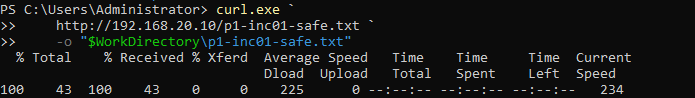

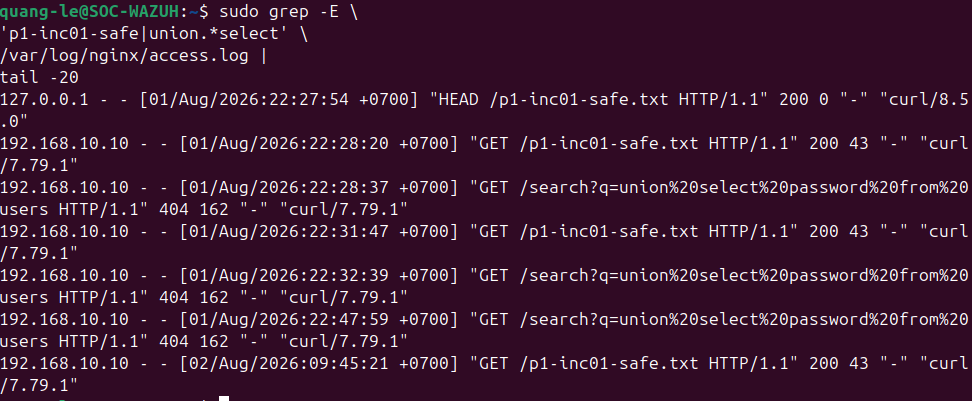

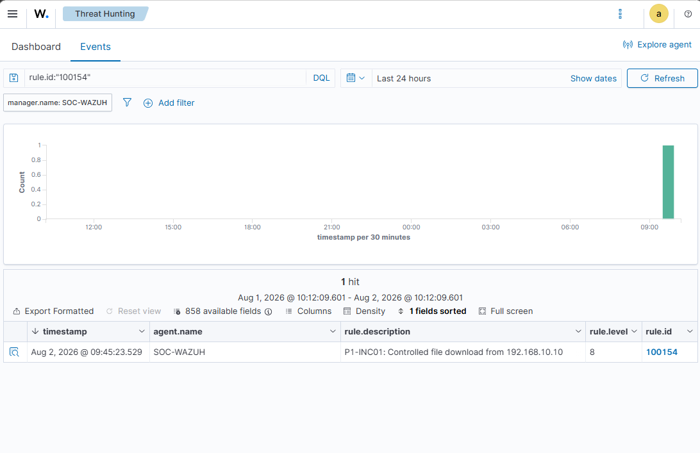

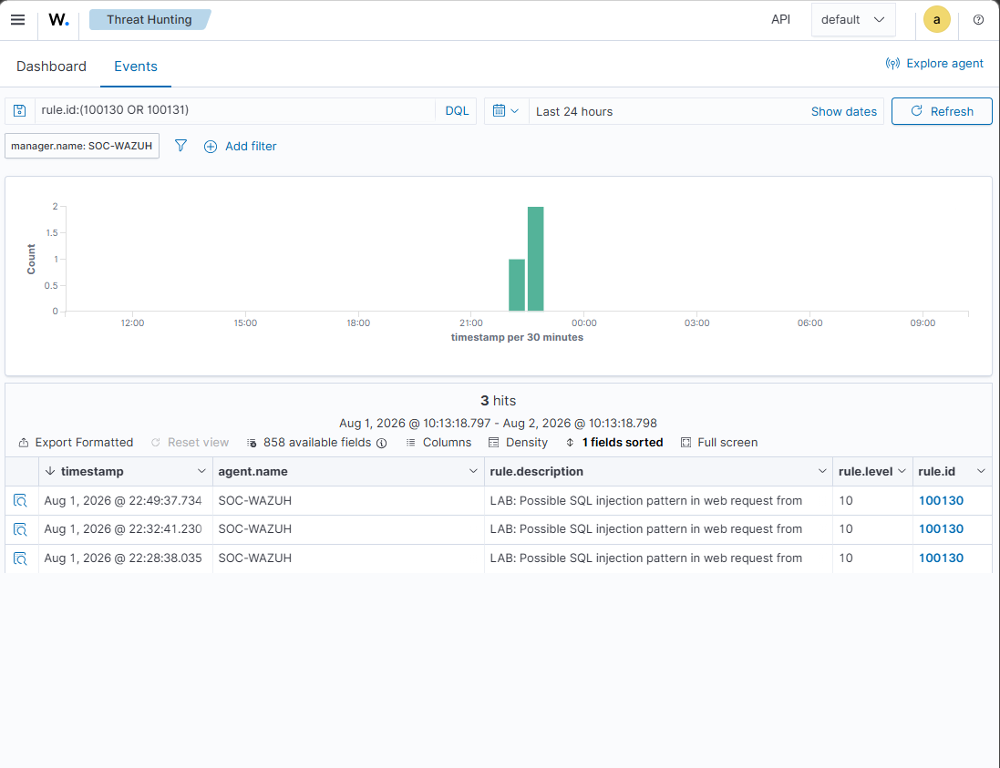

## 5. Cross-Layer Correlation

| Activity | Endpoint | Application / network | SIEM / EDR |
|---|---|---|---|
| Failed logons | Security 4625 | Not required | Endpoint evidence confirmed; dedicated Wazuh authentication expansion not included |
| Encoded PowerShell | Sysmon Event ID 1 | Not required | Wazuh 92057 and LimaCharlie process event |
| System discovery | Native command output | Not required | Wazuh 100132 |
| Network discovery | Native commands | Local network state | Wazuh 100140 |
| Bounded probe | Execution transcript | Partial Zeek/Suricata/Python representation | Network detection partial |
| File transfer | curl and file hash | Nginx and Zeek HTTP | Wazuh 100154 |
| SQLi-like URI | curl output | Nginx and Zeek HTTP | Wazuh 100130 |
| Isolation | Failed connectivity | Network access blocked | LimaCharlie task success; sensor remained connected |
| Recovery | Connectivity restored | Services reachable | LimaCharlie rejoin success |

## 6. Network Analysis

### 6.1 Zeek

Zeek `conn.log` and `http.log` provided useful metadata. HTTP evidence matched the benign file transfer and SQLi-like URI.

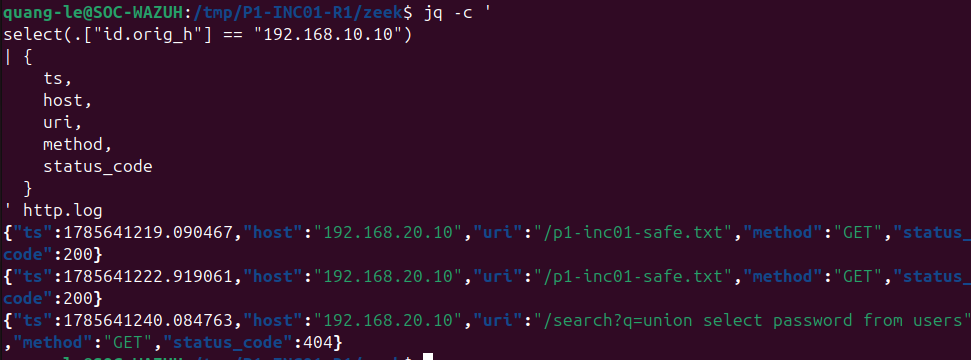

However, the initial unique-port calculation showed only three destination ports, which did not match the twelve-port execution record.

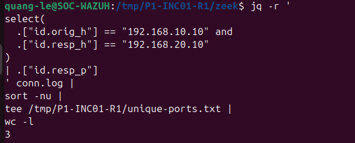

### 6.2 Python Detector

The detector classified the available input as low risk with `baseline_or_low_activity`. This was an accurate result for the limited observed input, but it was not a complete representation of the controlled probe.

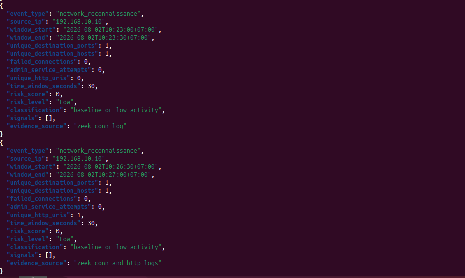

### 6.3 Suricata

The reviewed EVE output contained repeated invalid-checksum alerts and limited flow evidence. These records were not cleanly attributable to the service probe and are treated as troubleshooting evidence rather than validated scan alerts.

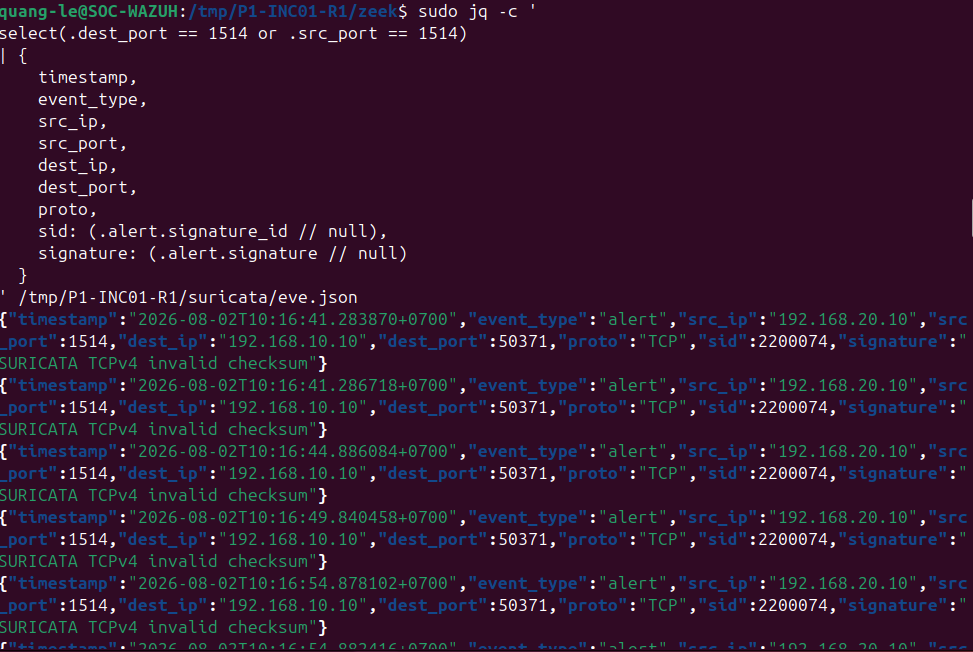

## 7. Analyst Triage

The analyst established that:

* The activity originated from the authorized lab endpoint.
* Test IDs and timestamps matched the execution record.
* PowerShell and discovery alerts matched known controlled commands.
* The HTTP artifact was a benign lab file.
* The SQLi-like request returned an Nginx 404 and did not prove exploitation.
* No evidence supported persistence, lateral movement, credential compromise, exfiltration, or malware.
* The network-probe execution was real, but network-derived detection evidence was incomplete.

## 8. Containment

Before isolation, the endpoint could reach the DMZ web service and pfSense management listener used for validation. After LimaCharlie isolation, both tested TCP connections failed and ping showed complete loss.

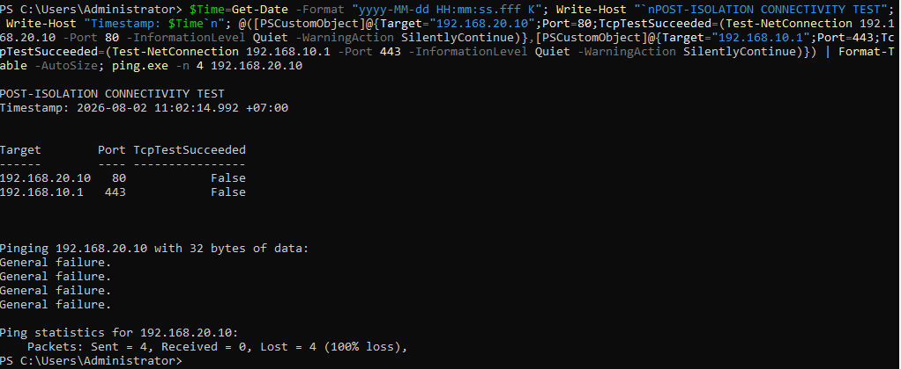

The EDR sensor remained connected.

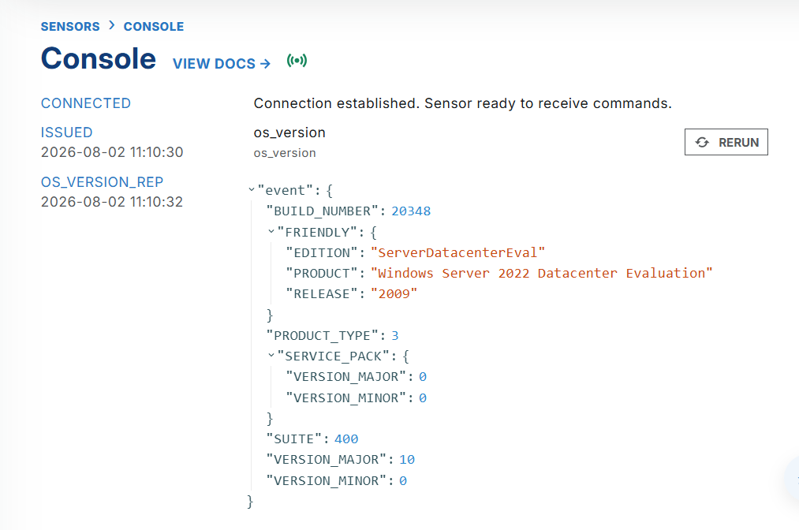

## 9. Recovery

`rejoin_network` returned success and both tested services became reachable again.

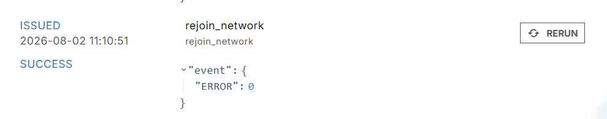

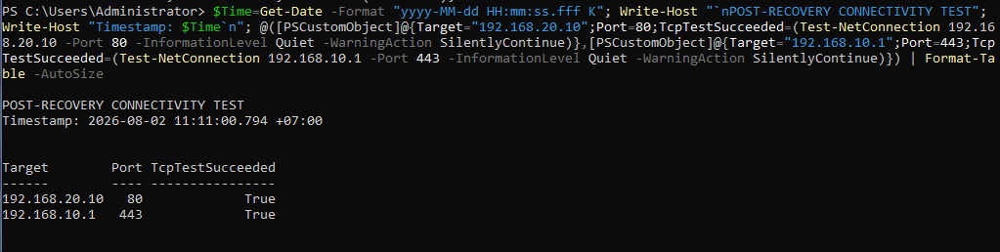

## 10. Retest

The controlled sequence was repeated on August 2. Wazuh again detected encoded PowerShell and web activity, and LimaCharlie again exposed detailed PowerShell process context.

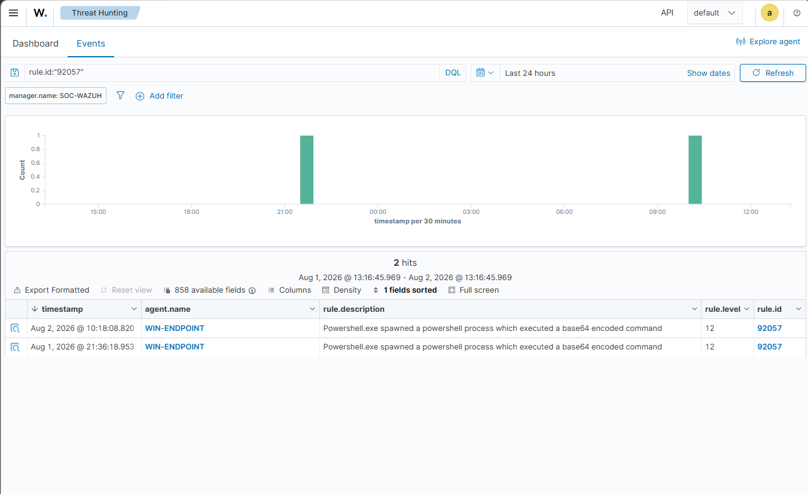

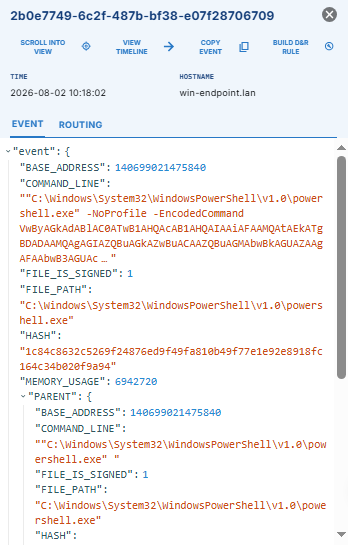

A second isolation task returned success.

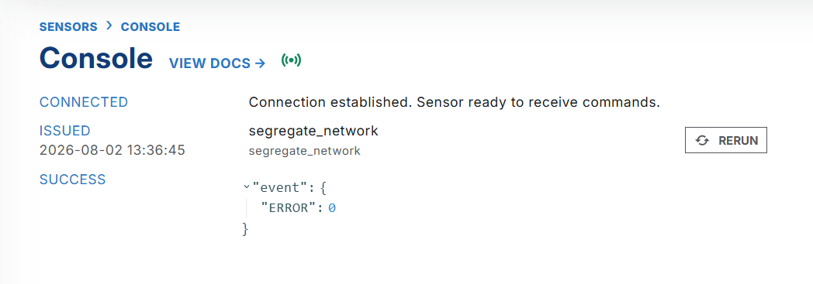

Endpoint, SIEM, HTTP, and EDR validation passed again. The network behavioral layer remained partial because final derived logs from the recaptured PCAP were not supplied.

## 11. PCAP Preservation and Integrity

The initial capture was missing, and a first recapture attempt produced an empty 24-byte PCAP with zero packets. The final recapture corrected the interface/filter workflow and produced:

| Property | Value |
|---|---|
| File | P1-INC01-R1-recapture.pcap |
| Size | 4,313 kB reported by capinfos |
| Packets | 5,246 |
| Duration | 111.382056 seconds |
| First packet | 2026-08-02 13:46:58.358191 |
| Last packet | 2026-08-02 13:48:49.740247 |
| SHA-256 | eb892a293b7cbcb1d4032fb7326e13633256f410a8b19933d12c9ac70c6e183c |
| Strict time order | False |

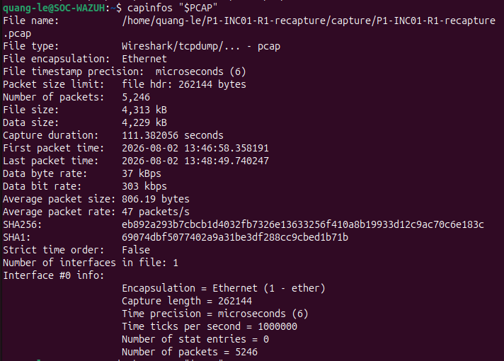

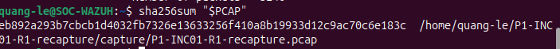

The raw PCAP is not included in this package. It should only be added after confirming that it is the exact hashed file and contains no unintended sensitive traffic.

## 12. Detection Gaps and Tuning

### Confirmed gaps

1. Initial network capture/derived logs did not fully represent the twelve-port probe.
2. Wazuh agent buffer pressure created a risk of event loss.
3. Suricata EVE evidence was noisy and not cleanly attributable.
4. Multiple endpoint interfaces complicated source-IP correlation across tools.
5. `Strict time order: False` in the final PCAP requires timestamp-aware analysis.

### Tuning actions

* Validate the capture interface and packet count before ending a run.
* Hash and document the capture immediately.
* Generate all derived logs from the same hashed PCAP.
* Use fresh per-run directories and explicit time windows.
* Stabilize Wazuh buffering and manager connectivity before execution.
* Filter Suricata by time, source, destination, and five-tuple.
* Normalize all timestamps to UTC+07 or UTC before building the master timeline.

## 13. Scope and Impact

| Question | Evidence-based answer |
|---|---|
| How many hosts were involved? | One authorized Windows source and one Ubuntu target. |
| How many accounts were involved? | One local lab administrator account. |
| Was Internet command-and-control observed? | No. |
| Was lateral movement successful? | Not performed or observed. |
| Was persistence present? | Not performed or observed. |
| Was data exfiltrated? | No evidence. |
| Was malware executed? | No. |
| Were services impacted? | Only temporary intentional network loss during EDR isolation. |

## 14. Lessons Learned

* Preserve an execution record independently of tool logs.
* Correlate facts across tools instead of trusting one alert source.
* Treat low scores and missing alerts as input/coverage questions, not automatic proof of benign activity.
* Verify containment from the endpoint, service, and EDR-management perspectives.
* Record failures such as empty captures and event flooding because they directly affect evidentiary confidence.
* Use Passed, Partial, Gap, and Unknown honestly.

## 15. Conclusion

`P1-INC01-R1` demonstrates a complete, repeatable SOC detection-validation and incident-response workflow. Endpoint, SIEM, EDR, application, containment, recovery, and retest objectives were achieved. Network behavioral coverage remains explicitly Partial until the final hashed PCAP is processed into matching Zeek, Suricata, and Python outputs.
