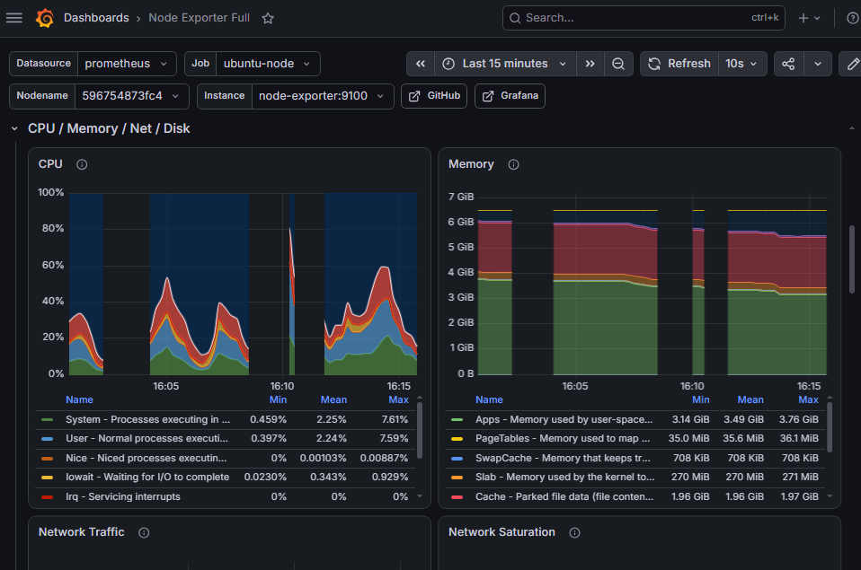

# Grafana Dashboard

The lab imported and used the **Node Exporter Full** dashboard to visualize:

- CPU utilization and load
- Memory usage
- Network receive/transmit traffic
- Disk I/O
- Filesystem capacity
- Disk utilization
- Linux pressure stall information

A controlled `stress-ng` test produced visible CPU activity. The repository describes this as an imported dashboard configured for the lab; it does not claim every panel was authored from scratch.

