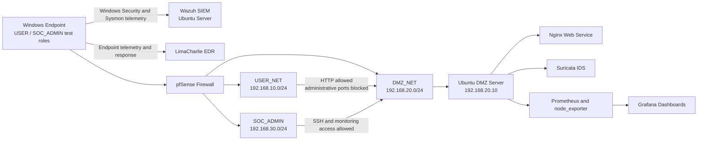

# SOC Blue Team Detection Engineering Portfolio

## Overview

This repository documents a hands-on SOC Blue Team learning environment built to practice log onboarding, detection engineering, endpoint investigation, network segmentation, intrusion detection, infrastructure monitoring, and SOC-style reporting.

The portfolio is organized by **security function**, while each project remains self-contained. A reviewer can open one project folder and find its report, validation results, evidence, rules or configuration, troubleshooting notes, and screenshots without searching across unrelated directories.

> The lab reused one Windows virtual machine between the USER and SOC_ADMIN roles during controlled validation. Suricata was deployed as an IDS sensor rather than an inline IPS.

## Lab Architecture



## Project Progress

| Project | Focus | Documentation | Evidence |
|---|---|---|---|
| Wazuh Log Onboarding | Windows, Sysmon, Linux, and Nginx log collection | [Project README](01-siem/wazuh-log-onboarding/README.md) · [Report](01-siem/wazuh-log-onboarding/report.md) | [Screenshot evidence](01-siem/wazuh-log-onboarding/screenshots/evidence-index.md) |
| Wazuh Detection Engineering | Custom detections, validation, and alert investigation | [Project README](01-siem/wazuh-detection-engineering/README.md) · [Report](01-siem/wazuh-detection-engineering/report.md) | [Screenshot evidence](01-siem/wazuh-detection-engineering/screenshots/evidence-index.md) |
| LimaCharlie EDR | Endpoint telemetry, detection, investigation, and isolation | [Project README](02-edr-endpoint-security/limacharlie-edr-lab/README.md) · [Report](02-edr-endpoint-security/limacharlie-edr-lab/report.md) | [Screenshot evidence](02-edr-endpoint-security/limacharlie-edr-lab/screenshots/evidence-index.md) |
| Firewall, IDS, and Monitoring | pfSense segmentation, Suricata IDS, Prometheus, and Grafana | [Project README](03-network-security/firewall-ids-monitoring-lab/README.md) · [Report](03-network-security/firewall-ids-monitoring-lab/report.md) | [Screenshot evidence](03-network-security/firewall-ids-monitoring-lab/screenshots/evidence-index.md) |

## Key Outcomes

| Area | Outcome |
|---|---|
| Log collection | Onboarded Windows Security, Sysmon, Linux authentication, and Nginx logs into Wazuh |
| Detection engineering | Developed and validated detections for brute force, suspicious PowerShell, web attacks, and reconnaissance |
| Endpoint response | Investigated LimaCharlie telemetry and tested endpoint network isolation and recovery |
| Network security | Enforced USER, DMZ, and SOC_ADMIN segmentation using pfSense |
| Network detection | Created Suricata rules for SQL injection, XSS, and TCP SYN scan activity |
| Monitoring | Collected Linux host metrics using Prometheus and visualized them in Grafana |
| Troubleshooting | Diagnosed host firewall, interface selection, service health, DNS, and monitoring data-source issues |
| Reporting | Produced evidence logs, validation records, troubleshooting notes, and incident reports |

## Repository Structure

```text
soc-blue-team-detection-engineering/
├── README.md
├── 01-siem/
│   ├── README.md
│   ├── wazuh-log-onboarding/
│   └── wazuh-detection-engineering/
├── 02-edr-endpoint-security/
│   ├── README.md
│   └── limacharlie-edr-lab/
└── 03-network-security/
    ├── README.md
    └── firewall-ids-monitoring-lab/
        ├── README.md
        ├── report.md
        ├── validation-summary.md
        ├── firewall/
        ├── ids/
        ├── monitoring/
        ├── incident-reports/
        ├── scripts/
        └── screenshots/
```

## Skills Demonstrated

| Skill area | Practical evidence in this repository |
|---|---|
| SIEM deployment and log onboarding | Wazuh manager/dashboard, Windows agent, Sysmon, Linux authentication logs, and Nginx access logs |
| Windows and Linux telemetry analysis | Windows Security events, Sysmon process/file/network events, SSH logs, and web-server logs |
| Detection engineering | Wazuh custom rules, threshold and correlation logic, safe test generation, rule validation, and false-positive notes |
| Alert triage and incident reporting | Evidence tables, analyst conclusions, timelines, impact, containment, remediation, and lessons learned |
| Endpoint detection and response | LimaCharlie sensor deployment, process context, reconnaissance detections, SIEM correlation, and network isolation testing |
| Firewall policy and segmentation | pfSense zones, aliases, least-privilege allow/deny rules, logging, and role-based administration |
| Network intrusion detection | Suricata configuration, `fast.log`, `eve.json`, and custom SQLi/XSS/SYN signatures |
| Monitoring and observability | Prometheus, node_exporter, Grafana, PromQL, host metrics, and controlled load validation |
| Troubleshooting methodology | Packet capture, service status, firewall-layer isolation, DNS/egress recovery, interface correction, and config validation |
| MITRE ATT&CK mapping | T1110, T1059.001, T1046, T1021, T1190, and related behavior-based analysis |
| Scripting and reproducibility | PowerShell and Bash traffic generators, XML/YAML rules, Docker Compose, and reusable configuration files |

## Project 1 — Wazuh Log Onboarding

The first project established the telemetry foundation. A local Wazuh environment collected Windows authentication events, Sysmon endpoint telemetry, Ubuntu SSH events, and Nginx web requests generated through controlled tests.

**Project links:** [Project README](01-siem/wazuh-log-onboarding/) · [Technical report](01-siem/wazuh-log-onboarding/report.md) · [Evidence log](01-siem/wazuh-log-onboarding/evidence-log.md) · [Validation tests](01-siem/wazuh-log-onboarding/validation-tests.md) · [Screenshots](01-siem/wazuh-log-onboarding/screenshots/)

## Project 2 — Wazuh Detection Engineering

The second project converted collected telemetry into detection use cases for SSH brute force, repeated Windows failed logons, successful authentication after failures, suspicious PowerShell, and web attack patterns. The work includes custom Wazuh rules, `wazuh-logtest` validation, detection documentation, and SOC-style incident reports.

**Project links:** [Project README](01-siem/wazuh-detection-engineering/) · [Technical report](01-siem/wazuh-detection-engineering/report.md) · [Custom rules](01-siem/wazuh-detection-engineering/custom-rules.xml) · [Detection use cases](01-siem/wazuh-detection-engineering/detections/) · [Incident reports](01-siem/wazuh-detection-engineering/incident-reports/) · [Screenshots](01-siem/wazuh-detection-engineering/screenshots/)

## Project 3 — LimaCharlie EDR Detection and Response

The endpoint-security project deployed a LimaCharlie sensor, investigated process and parent-process context, detected Windows reconnaissance commands, correlated EDR telemetry with Sysmon and Wazuh, and tested the operational effect of network isolation.

**Project links:** [Project README](02-edr-endpoint-security/limacharlie-edr-lab/) · [Technical report](02-edr-endpoint-security/limacharlie-edr-lab/report.md) · [Detection rules](02-edr-endpoint-security/limacharlie-edr-lab/detection-rules.yml) · [Detection notes](02-edr-endpoint-security/limacharlie-edr-lab/detections/) · [Incident reports](02-edr-endpoint-security/limacharlie-edr-lab/incident-reports/) · [Screenshots](02-edr-endpoint-security/limacharlie-edr-lab/screenshots/)

## Project 4 — Firewall, IDS, and Infrastructure Monitoring

The network-security project built three pfSense zones, enforced least-privilege access to a DMZ, detected controlled web-attack and scan traffic with Suricata, and monitored the Ubuntu server with Prometheus and Grafana. It also records real troubleshooting involving UFW, DNS/package access, Suricata interface naming, Docker networking, and timestamp normalization.

**Project links:** [Project README](03-network-security/firewall-ids-monitoring-lab/) · [Full report](03-network-security/firewall-ids-monitoring-lab/report.md) · [Firewall](03-network-security/firewall-ids-monitoring-lab/firewall/) · [Suricata IDS](03-network-security/firewall-ids-monitoring-lab/ids/suricata/) · [Custom rules](03-network-security/firewall-ids-monitoring-lab/ids/custom-rules/) · [Monitoring](03-network-security/firewall-ids-monitoring-lab/monitoring/) · [Incident reports](03-network-security/firewall-ids-monitoring-lab/incident-reports/) · [Screenshots](03-network-security/firewall-ids-monitoring-lab/screenshots/)

## Portfolio Highlights

- Built an evidence-backed SOC portfolio spanning SIEM, EDR, firewall segmentation, IDS, metrics monitoring, and incident reporting.
- Collected and investigated Windows, Sysmon, Linux authentication, Nginx, EDR, firewall, IDS, and host-metrics data.
- Wrote and validated custom detection logic for brute force, suspicious PowerShell, SQL injection, XSS, reconnaissance, and scan behavior.
- Applied least-privilege network policy by allowing required application traffic and denying unauthorized administrative access.
- Correlated security events across endpoint telemetry, SIEM alerts, firewall enforcement, IDS signatures, and system metrics.
- Documented failures and recovery steps instead of presenting only successful screenshots.

## Integrated Lab Narrative

Across the completed projects, the portfolio follows a practical defensive workflow:

1. **Collect telemetry** from endpoints, operating systems, authentication services, and web applications.
2. **Create detections** and validate them with safe, repeatable test activity.
3. **Investigate endpoint context** using EDR process telemetry and SIEM correlation.
4. **Restrict network access** with segmentation and role-based firewall policy.
5. **Detect suspicious network behavior** using IDS signatures and structured event data.
6. **Add operational context** through infrastructure metrics and dashboards.
7. **Document findings** with evidence, limitations, containment, remediation, and lessons learned.

## Current Limitations and Next Focus

- Suricata has been validated in IDS mode, not inline IPS mode.
- Some LimaCharlie response-recovery and monitoring-alert delivery evidence remains partial.
- The next portfolio improvement is a complete Splunk ingestion, SPL investigation, and dashboard project using the existing Windows, Sysmon, Linux, Nginx, firewall, and Suricata data sources.

## Evidence Policy

Every screenshot is stored inside its project. Markdown image embeds are wrapped in links, so selecting an image opens the corresponding screenshot file. Results without sufficient evidence are marked as partial, configured-only, or not implemented.
