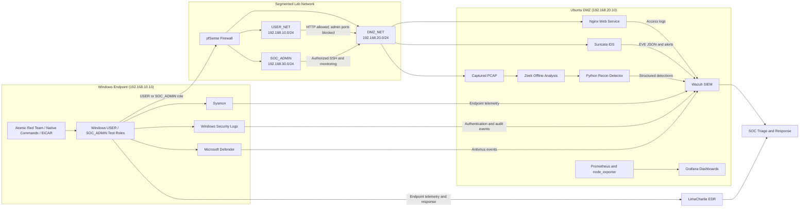

# SOC Blue Team Detection Engineering Portfolio
## Overview

This repository documents a hands-on SOC Blue Team learning environment built to practice log onboarding, detection engineering, endpoint investigation, network segmentation, intrusion detection, infrastructure monitoring, threat hunting, ATT&CK-aligned testing, incident response, and SOC-style reporting.
The portfolio is organized by **security function**, while each project remains self-contained. A reviewer can open one project folder and find its report, validation results, evidence, rules or configuration, troubleshooting notes, and screenshots without searching across unrelated directories.
> The lab reused one Windows virtual machine between the USER and SOC_ADMIN roles during controlled validation. Suricata was deployed as an IDS sensor rather than an inline IPS. All adversary-emulation and incident-validation activity was authorized, isolated, non-destructive, and executed only inside owned virtual machines.
## Lab Architecture


```mermaid
flowchart LR
    subgraph ENDPOINT["Windows Endpoint (192.168.10.10)"]
        TESTS["Atomic Red Team / Native Commands / EICAR"]
        WIN["Windows USER / SOC_ADMIN Test Roles"]
        SYSMON["Sysmon"]
        SECURITY["Windows Security Logs"]
        DEFENDER["Microsoft Defender"]

        TESTS --> WIN
        WIN --> SYSMON
        WIN --> SECURITY
        WIN --> DEFENDER
    end
    subgraph NETWORK["Segmented Lab Network"]
        PFS["pfSense Firewall"]
        USER["USER_NET<br/>192.168.10.0/24"]
        DMZ["DMZ_NET<br/>192.168.20.0/24"]
        ADMIN["SOC_ADMIN<br/>192.168.30.0/24"]

        PFS --> USER
        PFS --> DMZ
        PFS --> ADMIN
    end
    subgraph SERVER["Ubuntu DMZ (192.168.20.10)"]
        WAZUH["Wazuh SIEM"]
        NGINX["Nginx Web Service"]
        SURICATA["Suricata IDS"]
        PCAP["Captured PCAP"]
        ZEEK["Zeek Offline Analysis"]
        PYTHON["Python Recon Detector"]
        PROM["Prometheus and node_exporter"]
        GRAFANA["Grafana Dashboards"]
        NGINX -->|"Access logs"| WAZUH
        SURICATA -->|"EVE JSON and alerts"| WAZUH
        PCAP --> ZEEK
        ZEEK --> PYTHON
        PYTHON -->|"Structured detections"| WAZUH
        PROM --> GRAFANA
    end

    LC["LimaCharlie EDR"]
    ANALYST["SOC Triage and Response"]

    WIN -->|"USER or SOC_ADMIN role"| PFS
    USER -->|"HTTP allowed; admin ports blocked"| DMZ
    ADMIN -->|"Authorized SSH and monitoring"| DMZ

    DMZ --> NGINX
    DMZ --> SURICATA
    DMZ --> PCAP
    SYSMON -->|"Endpoint telemetry"| WAZUH
    SECURITY -->|"Authentication and audit events"| WAZUH
    DEFENDER -->|"Antivirus events"| WAZUH
    WIN -->|"Endpoint telemetry and response"| LC
    WAZUH --> ANALYST
    LC --> ANALYST
```
## Project Progress
| Project | Focus | Documentation | Evidence |
|---|---|---|---|
| Wazuh Log Onboarding | Windows, Sysmon, Linux, and Nginx log collection | [Project README](01-siem/wazuh-log-onboarding/README.md) · [Report](01-siem/wazuh-log-onboarding/report.md) | [Screenshots](01-siem/wazuh-log-onboarding/screenshots/evidence-index.md) |
| Wazuh Detection Engineering | Custom detections, validation, and alert investigation | [Project README](01-siem/wazuh-detection-engineering/README.md) · [Report](01-siem/wazuh-detection-engineering/report.md) | [Screenshots](01-siem/wazuh-detection-engineering/screenshots/evidence-index.md) |
| LimaCharlie EDR | Endpoint telemetry, detection, investigation, and isolation | [Project README](02-edr-endpoint-security/limacharlie-edr-lab/README.md) · [Report](02-edr-endpoint-security/limacharlie-edr-lab/report.md) | [Screenshots](02-edr-endpoint-security/limacharlie-edr-lab/screenshots/evidence-index.md) |
| Firewall, IDS, and Monitoring | pfSense segmentation, Suricata IDS, Prometheus, and Grafana | [Project README](03-network-security/firewall-ids-monitoring-lab/README.md) · [Report](03-network-security/firewall-ids-monitoring-lab/report.md) | [Screenshots](03-network-security/firewall-ids-monitoring-lab/screenshots/evidence-index.md) |
| Network Threat Hunting | PCAP, Wireshark, Zeek, Suricata, Python scoring, and Wazuh correlation | [Project README](03-network-security/network-threat-hunting-lab/README.md) · [Report](03-network-security/network-threat-hunting-lab/report.md) | [Screenshots](03-network-security/network-threat-hunting-lab/screenshots/evidence-index.md) |
| **Safe Adversary Emulation** | Safe ATT&CK-aligned tests, cross-layer telemetry validation, cleanup, and capability analysis | [Project README](04-adversary-emulation/safe-adversary-emulation-lab/README.md) · [Report](04-adversary-emulation/safe-adversary-emulation-lab/report.md) | [Screenshots](04-adversary-emulation/safe-adversary-emulation-lab/screenshots/evidence-index.md) |
| **SOC Detection Validation and Incident Response** | Integrated incident execution, cross-layer triage, containment, recovery, gap analysis, tuning, and retest | [Project README](05-incident-response/soc-detection-validation-and-incident-response/README.md) · [Report](05-incident-response/soc-detection-validation-and-incident-response/report.md) | [Screenshots](05-incident-response/soc-detection-validation-and-incident-response/screenshots/evidence-index.md) |
## Key Outcomes
| Area | Outcome |
|---|---|
| Log collection | Onboarded Windows Security, Sysmon, Linux authentication, Nginx, Defender, and custom JSON logs into Wazuh |
| Detection engineering | Developed and validated detections for brute force, suspicious PowerShell, discovery, file transfer, web attacks, and reconnaissance |
| Endpoint response | Investigated LimaCharlie telemetry and tested endpoint isolation and recovery in the EDR foundation lab |
| Network security | Enforced USER, DMZ, and SOC_ADMIN segmentation using pfSense |
| Network detection | Correlated Suricata signatures, Zeek metadata, firewall decisions, and Python behavioral scoring |
| Safe adversary emulation | Executed eight controlled test cases with ATT&CK mapping, expected telemetry, actual evidence, cleanup, and gap analysis |
| Incident response | Correlated a multi-stage controlled incident across endpoint, application, network, SIEM, and EDR; then contained, recovered, analyzed gaps, and retested |
| Monitoring | Collected Linux host metrics using Prometheus and visualized them in Grafana |
| Troubleshooting | Documented real failures involving adapters, Wazuh connectivity, event-channel subscriptions, event flooding, packet capture, timestamp ordering, Suricata parsing, and false-positive attribution |
| Reporting | Produced evidence indexes, validation matrices, incident-style findings, limitations, and lessons learned |
## Repository Structure
```text
soc-blue-team-detection-engineering/
├── README.md
├── 01-siem/
│   ├── wazuh-log-onboarding/
│   └── wazuh-detection-engineering/
├── 02-edr-endpoint-security/
│   └── limacharlie-edr-lab/
├── 03-network-security/
│   ├── firewall-ids-monitoring-lab/
│   └── network-threat-hunting-lab/
├── 04-adversary-emulation/
│   ├── README.md
│   └── safe-adversary-emulation-lab/
│       ├── README.md
│       ├── report.md
│       ├── test-catalog/
│       ├── atomic-red-team/
│       ├── mitre-attck/
│       ├── telemetry/
│       ├── test-results/
│       ├── troubleshooting/
│       └── screenshots/
└── 05-incident-response/
    ├── README.md
    └── soc-detection-validation-and-incident-response/
        ├── README.md
        ├── incident-tests/
        ├── report.md
        ├── incident-report.md
        ├── attack-timeline.md
        ├── telemetry-matrix.md
        ├── detection-coverage.md
        ├── containment-and-recovery.md
        ├── gaps-and-tuning.md
        ├── troubleshooting/
        └── screenshots/
```
## Skills Demonstrated
| Skill area | Practical evidence in this repository |
|---|---|
| SIEM deployment and log onboarding | Wazuh manager/dashboard, Windows agent, Sysmon, Defender, Linux, Nginx, and JSON alert sources |
| Windows and Linux telemetry analysis | Security events, Sysmon process/file/network events, Defender events, SSH logs, and web-server logs |
| Detection engineering | Wazuh custom rules, ATT&CK mapping, threshold logic, safe test generation, rule validation, and false-positive analysis |
| Alert triage and reporting | Evidence tables, analyst conclusions, timelines, scope, limitations, remediation, and lessons learned |
| Endpoint detection and response | LimaCharlie process context, sensor health, Wazuh correlation, isolation testing, and recovery checks |
| Firewall policy and segmentation | pfSense zones, aliases, least-privilege rules, logging, and role-based access |
| Network intrusion detection | Suricata configuration, EVE JSON, local signatures, stream-noise analysis, and rule-tuning recommendations |
| Network behavior analytics | Zeek JSON logs, PCAP investigation, Python time-window aggregation, risk scoring, and Wazuh JSON integration |
| ATT&CK-aligned validation | T1059.001, T1082, T1016, T1087, T1110, T1105, and T1046 test coverage |
| Integrated incident response | Baseline, controlled execution, cross-layer correlation, containment, recovery, gap analysis, tuning, and retest |
| Safety and repeatability | Rules of engagement, snapshots, authorized assets, prohibited actions, cleanup, and retest records |
| Troubleshooting methodology | Layered service checks, packet capture, event-channel verification, buffer analysis, and run-specific log isolation |
## Project 1 — Wazuh Log Onboarding

The first project established the telemetry foundation. A local Wazuh environment collected Windows authentication events, Sysmon endpoint telemetry, Ubuntu SSH events, and Nginx web requests generated through controlled tests.
**Project links:** [Project README](01-siem/wazuh-log-onboarding/) · [Technical report](01-siem/wazuh-log-onboarding/report.md) · [Evidence log](01-siem/wazuh-log-onboarding/evidence-log.md) · [Validation tests](01-siem/wazuh-log-onboarding/validation-tests.md) · [Screenshots](01-siem/wazuh-log-onboarding/screenshots/)
## Project 2 — Wazuh Detection Engineering

The second project converted collected telemetry into detection use cases for SSH brute force, repeated Windows failed logons, successful authentication after failures, suspicious PowerShell, and web attack patterns. The work includes custom Wazuh rules, `wazuh-logtest` validation, detection documentation, and SOC-style incident reports.
**Project links:** [Project README](01-siem/wazuh-detection-engineering/) · [Technical report](01-siem/wazuh-detection-engineering/report.md) · [Custom rules](01-siem/wazuh-detection-engineering/custom-rules.xml) · [Detection use cases](01-siem/wazuh-detection-engineering/detections/) · [Incident reports](01-siem/wazuh-detection-engineering/incident-reports/) · [Screenshots](01-siem/wazuh-detection-engineering/screenshots/)
## Project 3 — LimaCharlie EDR Detection and Response

The endpoint-security project deployed a LimaCharlie sensor, investigated process and parent-process context, detected Windows reconnaissance commands, correlated EDR telemetry with Sysmon and Wazuh, and tested the operational effect of network isolation.
**Project links:** [Project README](02-edr-endpoint-security/limacharlie-edr-lab/) · [Technical report](02-edr-endpoint-security/limacharlie-edr-lab/report.md) · [Detection rules](02-edr-endpoint-security/limacharlie-edr-lab/detection-rules.yml) · [Detection notes](02-edr-endpoint-security/limacharlie-edr-lab/detections/) · [Incident reports](02-edr-endpoint-security/limacharlie-edr-lab/incident-reports/) · [Screenshots](02-edr-endpoint-security/limacharlie-edr-lab/screenshots/)
## Project 4 — Firewall, IDS, and Infrastructure Monitoring

The network-security project built three pfSense zones, enforced least-privilege access to a DMZ, detected controlled web-attack and scan traffic with Suricata, and monitored the Ubuntu server with Prometheus and Grafana. It also records real troubleshooting involving UFW, DNS and package access, Suricata interface naming, Docker networking, and timestamp normalization.
**Project links:** [Project README](03-network-security/firewall-ids-monitoring-lab/) · [Full report](03-network-security/firewall-ids-monitoring-lab/report.md) · [Firewall](03-network-security/firewall-ids-monitoring-lab/firewall/) · [Suricata IDS](03-network-security/firewall-ids-monitoring-lab/ids/suricata/) · [Custom rules](03-network-security/firewall-ids-monitoring-lab/ids/custom-rules/) · [Monitoring](03-network-security/firewall-ids-monitoring-lab/monitoring/) · [Incident reports](03-network-security/firewall-ids-monitoring-lab/incident-reports/) · [Screenshots](03-network-security/firewall-ids-monitoring-lab/screenshots/)
## Project 5 — Zeek-Suricata Network Threat Hunting

This project extends the segmented network lab with five reproducible PCAP datasets, Wireshark packet validation, Zeek JSON metadata, Suricata reconnaissance signatures, a configurable Python detector, and Wazuh ingestion. The final TCP SYN scenario demonstrates one activity through all six evidence layers and includes threshold tuning and false-positive analysis.
**Project links:** [Project README](03-network-security/network-threat-hunting-lab/) · [Technical report](03-network-security/network-threat-hunting-lab/report.md) · [PCAP investigations](03-network-security/network-threat-hunting-lab/pcap-investigations/) · [Python detector](03-network-security/network-threat-hunting-lab/python-detector/) · [Wazuh integration](03-network-security/network-threat-hunting-lab/wazuh-integration/) · [Incident report](03-network-security/network-threat-hunting-lab/incident-reports/network-reconnaissance-report.md) · [Screenshots](03-network-security/network-threat-hunting-lab/screenshots/)
## Project 6 — Safe Adversary Emulation and ATT&CK-Aligned Detection Testing
This phase created a controlled test catalog for encoded PowerShell, system and network discovery, account discovery, authentication failures, HTTP file transfer, network reconnaissance, and EICAR antivirus validation. The project compares expected telemetry with actual evidence across Sysmon, Windows Security, Defender, LimaCharlie, Wazuh, Nginx, Zeek, Suricata, Python, and pfSense. Every test includes safety constraints and cleanup validation.
**Project links:** [Project README](04-adversary-emulation/safe-adversary-emulation-lab/) · [Technical report](04-adversary-emulation/safe-adversary-emulation-lab/report.md) · [Test catalog](04-adversary-emulation/safe-adversary-emulation-lab/test-catalog/test-index.md) · [Capability matrix](04-adversary-emulation/safe-adversary-emulation-lab/test-results/capability-matrix.md) · [Troubleshooting](04-adversary-emulation/safe-adversary-emulation-lab/troubleshooting/) · [Screenshots](04-adversary-emulation/safe-adversary-emulation-lab/screenshots/evidence-index.md)
## Project 7 — SOC Detection Validation and Incident Response
This phase reused the existing safe test catalog and SOC stack in incident `P1-INC01-R1`. The controlled chain included failed authentication, encoded PowerShell, system and network discovery, a bounded twelve-port probe, a benign HTTP transfer, and a SQLi-like URI. Evidence was correlated across Windows Security, Sysmon, Wazuh, LimaCharlie, Nginx, Zeek, Suricata, Python, pfSense, and PCAP metadata before endpoint isolation, recovery, gap analysis, and retest.
**Project links:** [Project README](05-incident-response/soc-detection-validation-and-incident-response/) · [Technical report](05-incident-response/soc-detection-validation-and-incident-response/report.md) · [Incident report](05-incident-response/soc-detection-validation-and-incident-response/incident-report.md) · [Incident tests](05-incident-response/soc-detection-validation-and-incident-response/incident-tests/) · [Timeline](05-incident-response/soc-detection-validation-and-incident-response/attack-timeline.md) · [Validation results](05-incident-response/soc-detection-validation-and-incident-response/validation-tests.md) · [Troubleshooting](05-incident-response/soc-detection-validation-and-incident-response/troubleshooting/) · [Screenshots](05-incident-response/soc-detection-validation-and-incident-response/screenshots/evidence-index.md)
## Portfolio Highlights
- Built an evidence-backed SOC portfolio spanning SIEM, EDR, firewall segmentation, IDS, threat hunting, safe adversary emulation, infrastructure monitoring, incident response, and incident reporting.
- Collected and investigated Windows, Sysmon, Defender, Linux authentication, Nginx, EDR, firewall, Zeek, Suricata, and host-metrics data.
- Wrote and validated detection logic for brute force, suspicious PowerShell, discovery activity, controlled file transfer, SQL injection, XSS, reconnaissance, and scan behavior.
- Applied least-privilege network policy by allowing required application traffic and denying unauthorized administrative access.
- Correlated security events across endpoint telemetry, SIEM alerts, firewall enforcement, IDS signatures, PCAP evidence, behavioral scoring, and infrastructure metrics.
- Executed ATT&CK-aligned tests under documented rules of engagement, cleanup procedures, and recovery controls.
- Validated endpoint containment, EDR management continuity, recovery, and before/after retest in one integrated incident.
- Documented failures, partial results, false positives, and recovery steps instead of presenting only successful screenshots.
## Integrated Lab Narrative
1. Collect endpoint, operating-system, authentication, application, and network telemetry.
2. Build detections and validate them using safe, repeatable activity.
3. Investigate process and network context across EDR, SIEM, Zeek, Suricata, and firewall evidence.
4. Compare expected versus actual telemetry and record collection or detection gaps.
5. Clean up artifacts, validate service health, and preserve evidence.
6. Reuse the validated test catalog in an integrated incident for triage, containment, recovery, tuning, and retest.
7. Preserve the incident evidence for the next Windows DFIR timeline-reconstruction phase.
## Current Limitations and Next Focus
- Suricata remains in IDS mode rather than inline IPS mode.
- The bounded probe in `P1-INC01-R1` was proven by the execution record, but the initial Zeek/Python input did not preserve the complete twelve-port set and Suricata attribution remained partial.
- Wazuh agent buffering and intermittent manager connectivity may delay or lose events during high-volume startup periods.
- EICAR validates antivirus detection and quarantine, but it is not a substitute for full malware-behavior emulation.
- The final incident PCAP was recaptured and hashed, but final Zeek, Suricata, and Python artifacts should be regenerated from that exact PCAP before claiming complete network behavioral validation.
- The next roadmap stage is Windows DFIR and master timeline reconstruction using the preserved incident evidence.
## Evidence Policy

Every screenshot is stored inside its project and recorded in an evidence index. Results without sufficient evidence are marked as partial, gap, configured-only, or not validated. Test binaries, credentials, tokens, VM disks, and harmful artifacts are not stored in this repository.
