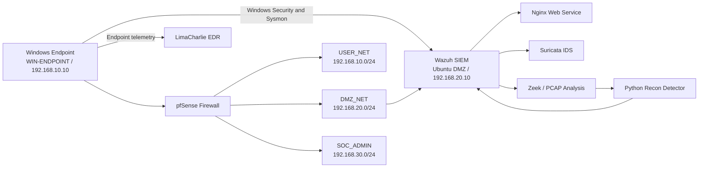

# SOC Blue Team Detection Engineering Portfolio

## Overview

This repository documents a hands-on SOC Blue Team learning environment built to practice log onboarding, detection engineering, endpoint investigation, network segmentation, intrusion detection, infrastructure monitoring, threat hunting, ATT&CK-aligned testing, and SOC-style reporting.

The portfolio is organized by **security function**, while each project remains self-contained. A reviewer can open one project folder and find its report, validation results, evidence, rules or configuration, troubleshooting notes, and screenshots without searching across unrelated directories.

> The lab reused one Windows virtual machine between the USER and SOC_ADMIN roles during controlled validation. Suricata was deployed as an IDS sensor rather than an inline IPS. All adversary-emulation activity was authorized, isolated, non-destructive, and executed only inside owned virtual machines.

## Lab Architecture


```mermaid
flowchart LR
    WIN["Windows Endpoint<br/>WIN-ENDPOINT / 192.168.10.10"]
    WAZUH["Wazuh SIEM<br/>Ubuntu DMZ / 192.168.20.10"]
    LC["LimaCharlie EDR"]
    PFS["pfSense Firewall"]
    USER["USER_NET<br/>192.168.10.0/24"]
    DMZ["DMZ_NET<br/>192.168.20.0/24"]
    ADMIN["SOC_ADMIN<br/>192.168.30.0/24"]
    NGINX["Nginx Web Service"]
    SURICATA["Suricata IDS"]
    ZEEK["Zeek / PCAP Analysis"]
    PY["Python Recon Detector"]

    WIN -->|"Windows Security and Sysmon"| WAZUH
    WIN -->|"Endpoint telemetry"| LC
    WIN --> PFS
    PFS --> USER
    PFS --> DMZ
    PFS --> ADMIN
    DMZ --> WAZUH
    WAZUH --> NGINX
    WAZUH --> SURICATA
    WAZUH --> ZEEK
    ZEEK --> PY
    PY --> WAZUH
```

## Project Progress

| Project | Focus | Documentation | Evidence |
|---|---|---|---|
| Wazuh Log Onboarding | Windows, Sysmon, Linux, and Nginx log collection | [Project README](01-siem/wazuh-log-onboarding/README.md) · [Report](01-siem/wazuh-log-onboarding/report.md) | [Screenshots](01-siem/wazuh-log-onboarding/screenshots/evidence-index.md) |
| Wazuh Detection Engineering | Custom detections, validation, and alert investigation | [Project README](01-siem/wazuh-detection-engineering/README.md) · [Report](01-siem/wazuh-detection-engineering/report.md) | [Screenshots](01-siem/wazuh-detection-engineering/screenshots/evidence-index.md) |
| LimaCharlie EDR | Endpoint telemetry, detection, investigation, and isolation | [Project README](02-edr-endpoint-security/limacharlie-edr-lab/README.md) · [Report](02-edr-endpoint-security/limacharlie-edr-lab/report.md) | [Screenshots](02-edr-endpoint-security/limacharlie-edr-lab/screenshots/evidence-index.md) |
| Firewall, IDS, and Monitoring | pfSense segmentation, Suricata IDS, Prometheus, and Grafana | [Project README](03-network-security/firewall-ids-monitoring-lab/README.md) · [Report](03-network-security/firewall-ids-monitoring-lab/report.md) | [Screenshots](03-network-security/firewall-ids-monitoring-lab/screenshots/evidence-index.md) |
| Network Threat Hunting | PCAP, Wireshark, Zeek, Suricata, Python scoring, and Wazuh correlation | [Project README](03-network-security/network-threat-hunting-lab/README.md) · [Report](03-network-security/network-threat-hunting-lab/report.md) | [Screenshots](03-network-security/network-threat-hunting-lab/screenshots/evidence-index.md) |
| **Safe Adversary Emulation** | Safe ATT&CK-aligned tests, cross-layer telemetry validation, cleanup, and capability analysis | [Project README](04-adversary-emulation/safe-adversary-emulation-lab/README.md) · [Report](04-adversary-emulation/safe-adversary-emulation-lab/report.md) | [Screenshots](04-adversary-emulation/safe-adversary-emulation-lab/screenshots/evidence-index.md) |

## Key Outcomes

| Area | Outcome |
|---|---|
| Log collection | Onboarded Windows Security, Sysmon, Linux authentication, Nginx, Defender, and custom JSON logs into Wazuh |
| Detection engineering | Developed and validated detections for brute force, suspicious PowerShell, discovery, file transfer, web attacks, and reconnaissance |
| Endpoint response | Investigated LimaCharlie telemetry and tested endpoint isolation and recovery in the EDR foundation lab |
| Network security | Enforced USER, DMZ, and SOC_ADMIN segmentation using pfSense |
| Network detection | Correlated Suricata signatures, Zeek metadata, firewall decisions, and Python behavioral scoring |
| Safe adversary emulation | Executed eight controlled test cases with ATT&CK mapping, expected telemetry, actual evidence, cleanup, and gap analysis |
| Monitoring | Collected Linux host metrics using Prometheus and visualized them in Grafana |
| Troubleshooting | Documented real failures involving adapters, Wazuh connectivity, event-channel subscriptions, event flooding, Suricata parsing, and false-positive attribution |
| Reporting | Produced evidence indexes, validation matrices, incident-style findings, limitations, and lessons learned |

## Repository Structure

```text
soc-blue-team-detection-engineering/
├── README.md
├── 01-siem/
│   ├── wazuh-log-onboarding/
│   └── wazuh-detection-engineering/
├── 02-edr-endpoint-security/
│   └── limacharlie-edr-lab/
├── 03-network-security/
│   ├── firewall-ids-monitoring-lab/
│   └── network-threat-hunting-lab/
└── 04-adversary-emulation/
    ├── README.md
    └── safe-adversary-emulation-lab/
        ├── README.md
        ├── report.md
        ├── test-catalog/
        ├── atomic-red-team/
        ├── mitre-attck/
        ├── telemetry/
        ├── test-results/
        ├── troubleshooting/
        └── screenshots/
```

## Skills Demonstrated

| Skill area | Practical evidence in this repository |
|---|---|
| SIEM deployment and log onboarding | Wazuh manager/dashboard, Windows agent, Sysmon, Defender, Linux, Nginx, and JSON alert sources |
| Windows and Linux telemetry analysis | Security events, Sysmon process/file/network events, Defender events, SSH logs, and web-server logs |
| Detection engineering | Wazuh custom rules, ATT&CK mapping, threshold logic, safe test generation, rule validation, and false-positive analysis |
| Alert triage and reporting | Evidence tables, analyst conclusions, timelines, scope, limitations, remediation, and lessons learned |
| Endpoint detection and response | LimaCharlie process context, sensor health, Wazuh correlation, isolation testing, and recovery checks |
| Firewall policy and segmentation | pfSense zones, aliases, least-privilege rules, logging, and role-based access |
| Network intrusion detection | Suricata configuration, EVE JSON, local signatures, stream-noise analysis, and rule-tuning recommendations |
| Network behavior analytics | Zeek JSON logs, PCAP investigation, Python time-window aggregation, risk scoring, and Wazuh JSON integration |
| ATT&CK-aligned validation | T1059.001, T1082, T1016, T1087, T1110, T1105, and T1046 test coverage |
| Safety and repeatability | Rules of engagement, snapshots, authorized assets, prohibited actions, cleanup, and retest records |
| Troubleshooting methodology | Layered service checks, packet capture, event-channel verification, buffer analysis, and run-specific log isolation |

## Project 1 — Wazuh Log Onboarding

The first project established the telemetry foundation by collecting Windows authentication events, Sysmon endpoint telemetry, Ubuntu SSH events, and Nginx web requests.

## Project 2 — Wazuh Detection Engineering

The second project converted collected telemetry into detection use cases for brute force, suspicious PowerShell, successful authentication after failures, and controlled web-attack patterns.

## Project 3 — LimaCharlie EDR Detection and Response

The endpoint-security project deployed a LimaCharlie sensor, investigated process context, correlated EDR telemetry with Wazuh, and tested network isolation and recovery.

## Project 4 — Firewall, IDS, and Infrastructure Monitoring

The network-security project built three pfSense zones, enforced least-privilege access to a DMZ, validated Suricata IDS detections, and monitored the Ubuntu server with Prometheus and Grafana.

## Project 5 — Zeek-Suricata Network Threat Hunting

This project added reproducible PCAP datasets, Wireshark validation, Zeek JSON metadata, Suricata signatures, a configurable Python reconnaissance detector, and Wazuh ingestion.

## Project 6 — Safe Adversary Emulation and ATT&CK-Aligned Detection Testing

This phase created a controlled test catalog for encoded PowerShell, system and network discovery, account discovery, authentication failures, HTTP file transfer, network reconnaissance, and EICAR antivirus validation. The project compares expected telemetry with actual evidence across Sysmon, Windows Security, Defender, LimaCharlie, Wazuh, Nginx, Zeek, Suricata, Python, and pfSense. Every test includes safety constraints and cleanup validation.

**Project links:** [Project README](04-adversary-emulation/safe-adversary-emulation-lab/) · [Technical report](04-adversary-emulation/safe-adversary-emulation-lab/report.md) · [Test catalog](04-adversary-emulation/safe-adversary-emulation-lab/test-catalog/test-index.md) · [Capability matrix](04-adversary-emulation/safe-adversary-emulation-lab/test-results/capability-matrix.md) · [Troubleshooting](04-adversary-emulation/safe-adversary-emulation-lab/troubleshooting/) · [Screenshots](04-adversary-emulation/safe-adversary-emulation-lab/screenshots/evidence-index.md)

## Integrated Lab Narrative

1. Collect endpoint, operating-system, authentication, application, and network telemetry.
2. Build detections and validate them using safe, repeatable activity.
3. Investigate process and network context across EDR, SIEM, Zeek, Suricata, and firewall evidence.
4. Compare expected versus actual telemetry and record collection or detection gaps.
5. Clean up artifacts, validate service health, and preserve evidence.
6. Reuse the validated test catalog in the next purple-team phase.

## Current Limitations and Next Focus

- Suricata remains in IDS mode rather than inline IPS mode.
- P4-NET-01 produced valid Zeek, firewall, Python, and Wazuh evidence, but isolated Suricata attribution remained partial and the live EVE file contained unrelated stream alerts.
- Wazuh agent buffering and intermittent manager connectivity may delay or lose events during high-volume startup periods.
- EICAR validates antivirus detection and quarantine, but it is not a substitute for full malware-behavior emulation.
- The next roadmap stage is an integrated purple-team incident that reuses this test catalog for detection, triage, containment, recovery, tuning, and retest.

## Evidence Policy

Every screenshot is stored inside its project and recorded in an evidence index. Results without sufficient evidence are marked as partial, gap, configured-only, or not validated. Test binaries, credentials, tokens, VM disks, and harmful artifacts are not stored in this repository.
