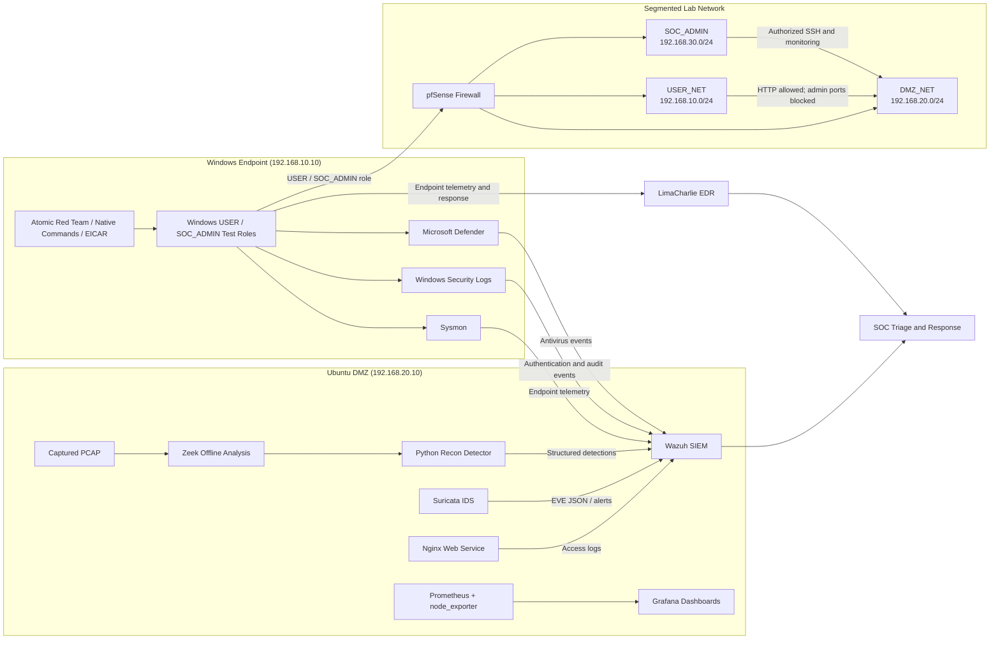

# SOC Blue Team Detection Engineering Portfolio

## Overview

This repository is a hands-on SOC Blue Team and Detection Engineering lab built to demonstrate an end-to-end workflow across **telemetry collection, detection engineering, endpoint and network investigation, threat hunting, adversary emulation and incident response**.

The projects are connected as one security workflow rather than isolated tool demonstrations:

> **Collect telemetry → build detections → validate activity → investigate evidence → correlate across layers → contain → recover → tune → retest**

The portfolio is organized by **security function**, while each project remains self-contained with its own documentation, evidence, validation results and troubleshooting notes.

> **Lab scope:** All adversary-emulation and incident-validation activity was authorized, isolated and non-destructive inside owned virtual machines. Suricata is deployed as an IDS rather than an inline IPS.

## Lab Architecture


```mermaid
flowchart LR
    subgraph ENDPOINT["Windows Endpoint (192.168.10.10)"]
        TESTS["Atomic Red Team / Native Commands / EICAR"]
        WIN["Windows USER / SOC_ADMIN Test Roles"]
        SYSMON["Sysmon"]
        SECURITY["Windows Security Logs"]
        DEFENDER["Microsoft Defender"]

        TESTS --> WIN
        WIN --> SYSMON
        WIN --> SECURITY
        WIN --> DEFENDER
    end

    subgraph NETWORK["Segmented Lab Network"]
        PFS["pfSense Firewall"]
        USER["USER_NET<br/>192.168.10.0/24"]
        DMZ["DMZ_NET<br/>192.168.20.0/24"]
        ADMIN["SOC_ADMIN<br/>192.168.30.0/24"]

        PFS --> USER
        PFS --> DMZ
        PFS --> ADMIN
    end

    subgraph SERVER["Ubuntu DMZ (192.168.20.10)"]
        WAZUH["Wazuh SIEM"]
        NGINX["Nginx Web Service"]
        SURICATA["Suricata IDS"]
        PCAP["Captured PCAP"]
        ZEEK["Zeek Offline Analysis"]
        PYTHON["Python Recon Detector"]
        PROM["Prometheus + node_exporter"]
        GRAFANA["Grafana Dashboards"]

        NGINX -->|"Access logs"| WAZUH
        SURICATA -->|"EVE JSON / alerts"| WAZUH
        PCAP --> ZEEK
        ZEEK --> PYTHON
        PYTHON -->|"Structured detections"| WAZUH
        PROM --> GRAFANA
    end

    LC["LimaCharlie EDR"]
    ANALYST["SOC Triage and Response"]

    WIN -->|"USER / SOC_ADMIN role"| PFS
    USER -->|"HTTP allowed; admin ports blocked"| DMZ
    ADMIN -->|"Authorized SSH and monitoring"| DMZ

    SYSMON -->|"Endpoint telemetry"| WAZUH
    SECURITY -->|"Authentication and audit events"| WAZUH
    DEFENDER -->|"Antivirus events"| WAZUH
    WIN -->|"Endpoint telemetry and response"| LC

    WAZUH --> ANALYST
    LC --> ANALYST
```

### Architecture at a glance

- **Endpoint:** Windows Security, Sysmon, Defender, LimaCharlie
- **Network:** pfSense, Suricata, Zeek, Wireshark, PCAP
- **Analysis & monitoring:** Wazuh, Python, Prometheus, Grafana


## Project Progress

| Project | Focus | Documentation | Evidence |
|---|---|---|---|
| Wazuh Log Onboarding | Windows, Sysmon, Linux, and Nginx telemetry collection | [README](01-siem/wazuh-log-onboarding/README.md) · [Report](01-siem/wazuh-log-onboarding/report.md) | [Evidence](01-siem/wazuh-log-onboarding/screenshots/evidence-index.md) |
| Wazuh Detection Engineering | Custom detections, validation, and alert investigation | [README](01-siem/wazuh-detection-engineering/README.md) · [Report](01-siem/wazuh-detection-engineering/report.md) | [Evidence](01-siem/wazuh-detection-engineering/screenshots/evidence-index.md) |
| LimaCharlie EDR | Endpoint telemetry, detection, investigation, and isolation | [README](02-edr-endpoint-security/limacharlie-edr-lab/README.md) · [Report](02-edr-endpoint-security/limacharlie-edr-lab/report.md) | [Evidence](02-edr-endpoint-security/limacharlie-edr-lab/screenshots/evidence-index.md) |
| Firewall, IDS, and Monitoring | pfSense segmentation, Suricata IDS, Prometheus, and Grafana | [README](03-network-security/firewall-ids-monitoring-lab/README.md) · [Report](03-network-security/firewall-ids-monitoring-lab/report.md) | [Evidence](03-network-security/firewall-ids-monitoring-lab/screenshots/evidence-index.md) |
| Network Threat Hunting | PCAP, Wireshark, Zeek, Suricata, Python scoring and Wazuh correlation | [README](03-network-security/network-threat-hunting-lab/README.md) · [Report](03-network-security/network-threat-hunting-lab/report.md) | [Evidence](03-network-security/network-threat-hunting-lab/screenshots/evidence-index.md) |
| **Safe Adversary Emulation** | Safe ATT&CK-aligned tests, cross-layer telemetry validation, cleanup and capability analysis | [README](04-adversary-emulation/safe-adversary-emulation-lab/README.md) · [Report](04-adversary-emulation/safe-adversary-emulation-lab/report.md) | [Evidence](04-adversary-emulation/safe-adversary-emulation-lab/screenshots/evidence-index.md) |
| **SOC Detection Validation and Incident Response** | Integrated incident execution, cross-layer triage, containment, recovery, gap analysis, tuning and retest | [README](05-incident-response/soc-detection-validation-and-incident-response/README.md) · [Report](05-incident-response/soc-detection-validation-and-incident-response/report.md) | [Evidence](05-incident-response/soc-detection-validation-and-incident-response/screenshots/evidence-index.md) |

## Key Outcomes

| Area | Outcome |
|---|---|
| Telemetry | Collected endpoint, authentication, web, firewall, IDS, EDR, network and host-metric telemetry |
| Detection Engineering | Built and validated detections for authentication attacks, PowerShell, discovery, web attacks, transfer and reconnaissance |
| Endpoint Security | Investigated process context with LimaCharlie, Sysmon, Wazuh and tested isolation/recovery |
| Network Security | Applied USER, DMZ and SOC_ADMIN segmentation with pfSense and least-privilege rules |
| Threat Hunting | Used PCAP, Wireshark, Zeek, Suricata and Python behavioral scoring for network investigation |
| Validation | Used ATT&CK-aligned safe tests to compare expected telemetry, observed evidence and detection coverage |
| Incident Response | Correlated endpoint, application, network, SIEM, EDR evidence before containment, recovery, tuning and retest |
| Troubleshooting | Documented issues involving connectivity, event channels, packet capture, parsing, timestamps and false positives |

## Repository Structure

```text
soc-blue-team-detection-engineering/
├── README.md
├── 01-siem/
│   ├── wazuh-log-onboarding/
│   └── wazuh-detection-engineering/
├── 02-edr-endpoint-security/
│   └── limacharlie-edr-lab/
├── 03-network-security/
│   ├── firewall-ids-monitoring-lab/
│   └── network-threat-hunting-lab/
├── 04-adversary-emulation/
│   └── safe-adversary-emulation-lab/
└── 05-incident-response/
    └── soc-detection-validation-and-incident-response/
```

## Skills Demonstrated

| Skill area | Practical evidence |
|---|---|
| SIEM & Log Onboarding | Wazuh with Windows Security, Sysmon, Defender, Linux, Nginx and JSON sources |
| Detection Engineering | Custom Wazuh rules, `wazuh-logtest`, thresholds, correlation, ATT&CK mapping, tuning |
| Endpoint Security | LimaCharlie process context, EDR telemetry, Sysmon/Wazuh correlation, isolation |
| Network Security | pfSense segmentation, firewall policy, Suricata IDS, PCAP and Zeek analysis |
| Threat Hunting | Wireshark investigation, Zeek metadata, Python time-window aggregation and risk scoring |
| Adversary Emulation | Controlled ATT&CK-aligned tests with expected/observed telemetry comparison |
| Incident Response | Triage, cross-layer correlation, containment, recovery, gap analysis, retest |
| Troubleshooting | Service health, connectivity, event-channel, packet-capture, parsing, and attribution analysis |

## Project 1 — Wazuh Log Onboarding

The first project establishes the telemetry foundation by collecting **Windows Security, Sysmon, Ubuntu SSH and Nginx** events into Wazuh.

**Project links:** [README](01-siem/wazuh-log-onboarding/) · [Report](01-siem/wazuh-log-onboarding/report.md) · [Evidence](01-siem/wazuh-log-onboarding/evidence-log.md) · [Validation](01-siem/wazuh-log-onboarding/validation-tests.md)

## Project 2 — Wazuh Detection Engineering

The second project turns collected telemetry into detections for **SSH brute force, repeated Windows failed logons, suspicious PowerShell, web attack patterns**, with rule validation and SOC-style investigation.

**Project links:** [README](01-siem/wazuh-detection-engineering/) · [Report](01-siem/wazuh-detection-engineering/report.md) · [Custom rules](01-siem/wazuh-detection-engineering/custom-rules.xml) · [Detections](01-siem/wazuh-detection-engineering/detections/)

## Project 3 — LimaCharlie EDR Detection and Response

This project focuses on **endpoint telemetry, process investigation, Windows reconnaissance detection, EDR/Sysmon/Wazuh correlation and network isolation**.

**Project links:** [README](02-edr-endpoint-security/limacharlie-edr-lab/) · [Report](02-edr-endpoint-security/limacharlie-edr-lab/report.md) · [Detection rules](02-edr-endpoint-security/limacharlie-edr-lab/detection-rules.yml) · [Incident reports](02-edr-endpoint-security/limacharlie-edr-lab/incident-reports/)

## Project 4 — Firewall, IDS and Infrastructure Monitoring

This project builds **pfSense segmentation**, least-privilege access to the DMZ, Suricata IDS detection, Linux infrastructure monitoring with Prometheus and Grafana.

**Project links:** [README](03-network-security/firewall-ids-monitoring-lab/) · [Report](03-network-security/firewall-ids-monitoring-lab/report.md) · [Firewall](03-network-security/firewall-ids-monitoring-lab/firewall/) · [Suricata](03-network-security/firewall-ids-monitoring-lab/ids/suricata/) · [Monitoring](03-network-security/firewall-ids-monitoring-lab/monitoring/)

## Project 5 — Zeek-Suricata Network Threat Hunting

This project combines **PCAP, Wireshark, Zeek, Suricata, Python behavioral scoring, Wazuh** to investigate network reconnaissance and tune a behavioral detection.

**Project links:** [README](03-network-security/network-threat-hunting-lab/) · [Report](03-network-security/network-threat-hunting-lab/report.md) · [PCAP investigations](03-network-security/network-threat-hunting-lab/pcap-investigations/) · [Python detector](03-network-security/network-threat-hunting-lab/python-detector/) · [Wazuh integration](03-network-security/network-threat-hunting-lab/wazuh-integration/)

## Project 6 — Safe Adversary Emulation and ATT&CK-Aligned Detection Testing

This phase uses controlled tests for **PowerShell, discovery, authentication failures, HTTP transfer, reconnaissance, EICAR**, comparing expected telemetry with observed evidence across endpoint, network, and SIEM layers.

**Project links:** [README](04-adversary-emulation/safe-adversary-emulation-lab/) · [Report](04-adversary-emulation/safe-adversary-emulation-lab/report.md) · [Test catalog](04-adversary-emulation/safe-adversary-emulation-lab/test-catalog/test-index.md) · [Capability matrix](04-adversary-emulation/safe-adversary-emulation-lab/test-results/capability-matrix.md)

## Project 7 — SOC Detection Validation and Incident Response

The final phase reuses the SOC stack in an integrated incident covering **authentication failures, encoded PowerShell, discovery, network probing, HTTP transfer, a SQLi-like URI**, followed by investigation, containment, recovery, tuning, and retest.

**Project links:** [README](05-incident-response/soc-detection-validation-and-incident-response/) · [Report](05-incident-response/soc-detection-validation-and-incident-response/report.md) · [Incident report](05-incident-response/soc-detection-validation-and-incident-response/incident-report.md) · [Timeline](05-incident-response/soc-detection-validation-and-incident-response/attack-timeline.md) · [Detection coverage](05-incident-response/soc-detection-validation-and-incident-response/detection-coverage.md)

## Integrated Lab Narrative

1. Collect endpoint, operating-system, application, authentication and network telemetry.
2. Build and validate detections using controlled activity.
3. Investigate and correlate endpoint, SIEM, EDR, firewall, IDS, PCAP and network metadata.
4. Compare expected versus observed telemetry and identify gaps.
5. Contain and recover the affected endpoint where required.
6. Tune detections and retest the workflow.

## Reference Documentation

### SIEM & Detection Engineering

- [Wazuh Documentation](https://documentation.wazuh.com/current/)
- [Wazuh Architecture](https://documentation.wazuh.com/current/getting-started/architecture.html)
- [Wazuh Rules](https://documentation.wazuh.com/current/user-manual/ruleset/rules/index.html)
- [Wazuh Decoders](https://documentation.wazuh.com/current/user-manual/ruleset/decoders/index.html)
- [Wazuh Rule/Decoder Testing](https://documentation.wazuh.com/current/user-manual/ruleset/testing.html)

### Endpoint & EDR

- [Microsoft Sysmon](https://learn.microsoft.com/en-us/sysinternals/downloads/sysmon)
- [Sysmon Events](https://learn.microsoft.com/en-us/windows/security/operating-system-security/sysmon/sysmon-events)
- [LimaCharlie Documentation](https://docs.limacharlie.io/)
- [LimaCharlie Response Actions](https://docs.limacharlie.io/8-reference/response-actions/)

### Network Security

- [pfSense Documentation](https://docs.netgate.com/pfsense/en/latest/)
- [Suricata Documentation](https://docs.suricata.io/)
- [Zeek Documentation](https://docs.zeek.org/en/current/)
- [Wireshark Documentation](https://www.wireshark.org/docs/)
- [tcpdump Documentation](https://www.tcpdump.org/manpages/tcpdump.1.html)

### Monitoring & Adversary Emulation

- [Prometheus Documentation](https://prometheus.io/docs/)
- [PromQL Basics](https://prometheus.io/docs/prometheus/latest/querying/basics/)
- [Grafana Documentation](https://grafana.com/docs/grafana/latest/)
- [MITRE ATT&CK](https://attack.mitre.org/)
- [Atomic Red Team](https://www.atomicredteam.io/docs/atomic-red-team)

### My Personal Guide (Youtube)

- [Wazuh - Quick Setup](https://youtube.com/playlist?list=PLuvjU3X29_ONcu_WIDbi8HTKXESRTnnl2&si=Jjz3urvGmD_c1JEN)
- [Wazuh - Detailed Setup](https://youtu.be/q84m_C5rJ5k?si=xWDSCBPILeWEDMNa)
- [LimaCharlie](https://youtube.com/playlist?list=PLO8_Yc4h5cIoskxKBo6uz2Q4RIloiiMq0&si=QIw3MDnifKxIYX7V)
- [Suricata](https://youtube.com/playlist?list=PLFqw30a25lWTuo_WLAUSfWEwe5RNDLsBA&si=pd9hzAXPXUy3DjMG)
- [Zeek](https://youtu.be/WBid7AZ5w4A?si=LhFSFJgzQC6i6ubG)
- [Prometheus](https://youtube.com/playlist?list=PLrMP04WSdCjrL4OBnaqXRy8X3XEd7ZrKf&si=PUnkyGU_V7S4G1iv)

## Evidence Policy

Every project stores its own evidence index and supporting validation material. Results without sufficient evidence are marked as **partial, gap, configured-only, or not validated**.

The repository intentionally documents limitations, false positives, failures, and troubleshooting findings rather than presenting only successful screenshots.
