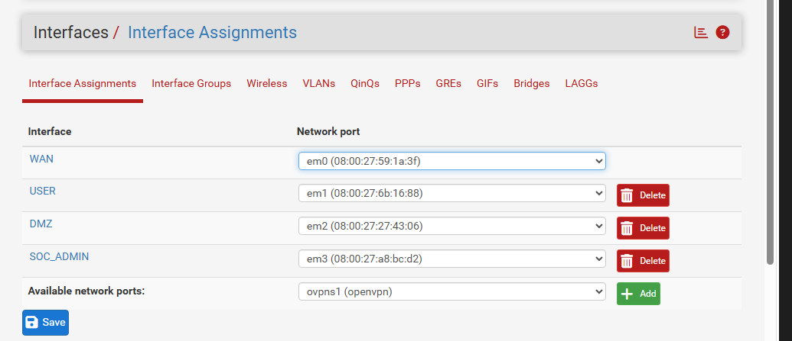
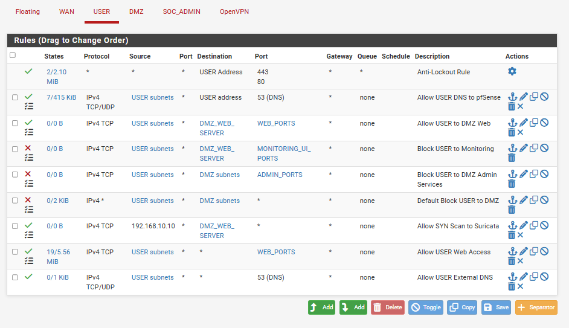
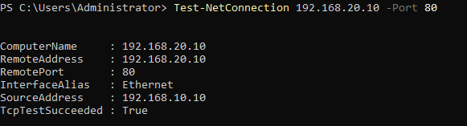
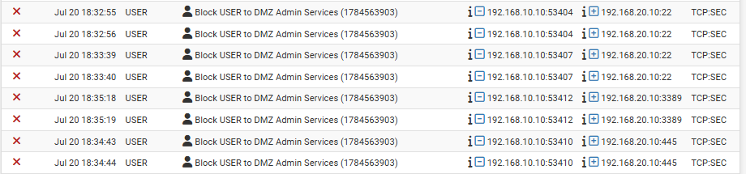
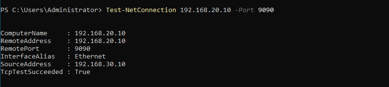
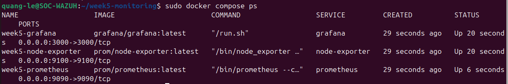

# Week 5 Report — Firewall, IDS/IPS, and Metrics Monitoring

## 1. Executive Summary

Week 5 extended the SOC portfolio from endpoint and SIEM visibility into network segmentation, network intrusion detection, and infrastructure observability. The lab used pfSense to create `USER_NET`, `DMZ_NET`, and `SOC_ADMIN`; Ubuntu hosted Nginx, Suricata, Prometheus, Grafana, and node_exporter; and a Windows VM generated controlled traffic and validated role-based access.

The final firewall policy allowed standard users to reach Nginx while blocking SSH, SMB, RDP, Grafana, and Prometheus. SOC_ADMIN retained approved access to SSH and the monitoring consoles. Suricata generated alerts for local SQL injection, XSS, and TCP SYN scan signatures. Prometheus successfully scraped both itself and the Ubuntu node, and Grafana displayed CPU, memory, disk, network, filesystem, and pressure metrics during controlled tests.

The project also captured realistic troubleshooting: UFW blocked Nginx even when pfSense permitted traffic; Ubuntu DMZ package installation required temporary recovery from DNS/egress problems; Suricata initially referenced nonexistent `eth0`; Prometheus configuration required correction; Grafana needed Docker service-name networking; and container UTC timestamps had to be normalized against the host's UTC+7 display.

No compromise occurred. All suspicious activity was intentionally generated inside the isolated lab.

## 2. Objectives

- Build a multi-zone firewall topology with WAN, USER, DMZ, and SOC administration boundaries.
- Apply and verify least-privilege allow/deny rules.
- Map pfSense constructs to FortiGate-style firewall policy concepts.
- Deploy Suricata in IDS mode and analyze `fast.log` and `eve.json`.
- Write and validate custom SQLi, XSS, and SYN-scan signatures.
- Deploy Prometheus, node_exporter, and Grafana.
- Query and visualize CPU, memory, disk, network, filesystem, and pressure metrics.
- Restrict management consoles to SOC_ADMIN.
- Produce validation records, incident reports, MITRE mappings, and troubleshooting analysis.

## 3. Lab Architecture

```text
                              VirtualBox NAT / Internet
                                        |
                              WAN — pfSense firewall
                                        |
                  +---------------------+---------------------+
                  |                     |                     |
               USER_NET               DMZ_NET              SOC_ADMIN
          192.168.10.0/24       192.168.20.0/24       192.168.30.0/24
                  |                     |                     |
        Windows test client      Ubuntu DMZ server      Windows admin role
          192.168.10.10            192.168.20.10          192.168.30.10
                                  ├── Nginx :80
                                  ├── Suricata IDS
                                  ├── Prometheus :9090
                                  ├── node_exporter :9100
                                  └── Grafana :3000
```

Because the laptop was limited to approximately three simultaneous VMs, the same Windows VM was used first as the USER role and later as the SOC_ADMIN role.



## 4. Tools and Roles

| Tool | Role |
|---|---|
| VirtualBox | Network isolation and VM execution |
| pfSense | Routing, segmentation, aliases, policy enforcement, and logs |
| Nginx | DMZ HTTP service and web access logging |
| UFW | Ubuntu host firewall |
| Suricata | IDS and network security monitoring |
| Docker Compose | Monitoring stack orchestration |
| Prometheus | Time-series collection and rule evaluation |
| node_exporter | Linux host metrics |
| Grafana | Metrics visualization |
| PowerShell | Connectivity tests and traffic generation |
| jq | Structured EVE JSON analysis |
| stress-ng | Bounded CPU-load simulation |

## 5. Network and IP Plan

| Component | Address | Role |
|---|---|---|
| pfSense USER | `192.168.10.1/24` | USER gateway |
| Windows USER | `192.168.10.10/24` | Standard-client tests |
| pfSense DMZ | `192.168.20.1/24` | DMZ gateway |
| Ubuntu DMZ | `192.168.20.10/24` | Web, IDS, and monitoring server |
| pfSense SOC_ADMIN | `192.168.30.1/24` | Administration gateway |
| Windows SOC_ADMIN | `192.168.30.10/24` | Authorized management tests |

## 6. Firewall Policy Design

### 6.1 Objects

- `DMZ_WEB_SERVER` = `192.168.20.10`
- `WEB_PORTS` = TCP `80,443`
- `ADMIN_PORTS` = TCP `22,445,3389`

### 6.2 Final policy summary

| Source | Destination | Service | Action | Validation |
|---|---|---|---|---|
| USER_NET | DMZ web server | HTTP/HTTPS | Allow | TCP/80 passed |
| USER_NET | DMZ | SSH/SMB/RDP | Block and log | 22/445/3389 failed; logs matched |
| USER_NET | DMZ | Other traffic | Default deny | Rule configured |
| SOC_ADMIN | DMZ server | SSH | Allow | TCP/22 passed |
| SOC_ADMIN | DMZ server | Grafana/Prometheus | Allow | TCP/3000 and 9090 passed |
| USER_NET | DMZ server | Grafana/Prometheus | Block | TCP/3000 and 9090 failed |
| DMZ | USER_NET | Unsolicited traffic | Block | Policy configured |



### 6.3 Why the result is meaningful

The policy demonstrates least privilege and role separation. USER_NET receives only the application service it needs. Administrative services are reserved for SOC_ADMIN. Deny logging supplies evidence for triage and distinguishes firewall enforcement from application failure.

## 7. Firewall Validation Results

### 7.1 Allowed web traffic

`curl.exe` returned the Nginx page, and `Test-NetConnection 192.168.20.10 -Port 80` returned `TcpTestSucceeded: True`.



### 7.2 Blocked administrative traffic

USER_NET tests to TCP/22, TCP/445, and TCP/3389 failed. pfSense displayed corresponding denied packets.




### 7.3 Role-based monitoring access

SOC_ADMIN successfully reached TCP/3000 and TCP/9090, while USER_NET failed on both ports.




## 8. FortiGate-Style Policy Mapping

The pfSense implementation maps to common FortiGate constructs:

| Implemented in pfSense | FortiGate-style equivalent |
|---|---|
| Interface rule tab | Incoming interface policy |
| Routed destination zone | Outgoing interface |
| `DMZ_WEB_SERVER` alias | Address object |
| `WEB_PORTS` / `ADMIN_PORTS` | Service objects/groups |
| Pass/block | Accept/deny action |
| Ordered rules | Ordered firewall policies |
| Packet logging | Forward-traffic logging |
| Suricata inspection | IPS/security-profile concept |

This is a conceptual translation. A FortiGate device was not deployed.

## 9. Suricata Deployment and Troubleshooting

### 9.1 Initial failure

Suricata initially referenced `eth0`, but the Ubuntu DMZ NIC used predictable naming. The service log showed `af-packet: eth0: failed to find interface`, and the rule path was not yet loaded.

### 9.2 Correction

- Verified the real NIC with `ip -br address` and `ip route`.
- Updated AF_PACKET to the DMZ interface.
- Set HOME_NET to `192.168.20.0/24`.
- Loaded `/var/lib/suricata/rules/local.rules`.
- Ran `suricata -T` before restarting.
- Confirmed the service was active.


## 10. Suricata Detection Results

### 10.1 Final custom signatures

| SID | Logic | Result |
|---|---|---|
| `1000001` | Established HTTP URI contains `union` and `select` | Alerted |
| `1000002` | Established HTTP URI contains `<script` | Alerted |
| `1000003` | 15 TCP SYN packets from one source in ten seconds | Alerted |


### 10.2 Alert evidence

`fast.log` recorded the three LOCAL signatures. `eve.json` exposed structured alert details for analyst review. Nginx access logs independently confirmed the HTTP requests.


### 10.3 Security interpretation

The alerts prove pattern recognition, not exploit success. No database or vulnerable application was present, and the tests did not execute malware or obtain unauthorized access. The rules are intentionally simple educational signatures and require tuning for production use.

## 11. Prometheus and Grafana Deployment

The stack ran as three Docker Compose services. `promtool` validated both configuration and rules. node_exporter exposed host metrics, and Prometheus showed the `prometheus` and `ubuntu-node` targets as UP.




Grafana used `http://prometheus:9090` because containers communicate through the Compose service name. The data source query succeeded.

## 12. Metrics and Controlled Load Results

Prometheus returned data for:

- CPU usage
- memory usage
- filesystem usage
- network receive rate
- network transmit rate

A bounded `stress-ng` run created visible CPU utilization. `top` showed the responsible process and Grafana displayed the spike. Other Node Exporter Full panels showed memory, network, disk I/O, filesystem, disk utilization, and pressure information.


### Alert-validation boundary

Alert rules were present and syntactically valid, and the final view returned to normal after the test. A complete screenshot set showing a rule firing, a delivered notification, and recovery was not captured. Query/dashboard validation is therefore **Passed**, while end-to-end alert-delivery validation is **Partial**.

## 13. Correlation Case

The lab demonstrates a layered analyst workflow:

1. pfSense blocked unauthorized user-zone access to remote services.
2. Suricata detected suspicious patterns in traffic sent to an allowed DMZ web service and in a controlled SYN burst.
3. Prometheus and Grafana provided host-operational context during test activity.

The evidence was collected across controlled test windows and multiple days. It is valid as a defense-in-depth scenario, but the report does not claim that every firewall, IDS, and metric screenshot belongs to one production incident at the same second.

## 14. Troubleshooting Analysis

### 14.1 pfSense allowed HTTP, but Ubuntu did not respond

A packet capture showed SYN packets reaching Ubuntu without a SYN-ACK. Nginx was listening correctly, so UFW was identified as the blocking layer. The final fix was an explicit UFW allow rule for USER_NET to TCP/80. This is a strong example of isolating network-firewall, host-firewall, and application layers.

### 14.2 Ubuntu DMZ package and DNS problems

The server could reach an IP but encountered DNS/package access problems. A temporary VirtualBox NAT and DHCP configuration was used to install required packages, followed by restoration of the static DMZ configuration. A production-quality solution would instead permit controlled DNS and update egress through pfSense.

### 14.3 Suricata interface and rule-path errors

The initial `eth0` assumption and missing rule match were corrected by inspecting the actual interface, setting AF_PACKET/HOME_NET, loading `local.rules`, testing configuration, and restarting.

### 14.4 Prometheus restart and Grafana no-data state

The Prometheus configuration and mounts were corrected and validated with promtool. Grafana was pointed to the Docker service URL, and the time range/job selection was checked.

### 14.5 Timestamp presentation

The host showed UTC+7 while containers showed UTC. Correlation should normalize timestamps rather than treat the display difference as clock drift.

## 15. MITRE ATT&CK Mapping

| Tactic | Technique | ID | Evidence context |
|---|---|---|---|
| Discovery | Network Service Discovery | T1046 | SYN scan/multi-port service probing |
| Lateral Movement | Remote Services | T1021 | Attempts to access SSH, SMB, and RDP |
| Initial Access | Exploit Public-Facing Application | T1190 | SQLi/XSS patterns against a DMZ web endpoint |

MITRE mappings describe behavior. Because this was authorized lab traffic, they do not imply a confirmed adversary.

## 16. Limitations

- Suricata ran in IDS mode, not inline IPS mode.
- No FortiGate appliance or FortiOS VM was deployed.
- pfSense and Suricata logs were not yet forwarded to Wazuh or Splunk.
- A single Windows VM was reused for USER and SOC_ADMIN roles.
- DMZ-to-USER default-deny was configured but lacks a dedicated reverse-direction client test screenshot.
- Normal HTTP negative testing was not captured as a dedicated Suricata no-alert screenshot.
- Grafana used an imported Node Exporter dashboard rather than a fully custom dashboard authored from zero.
- End-to-end alert notification firing/recovery was not completely evidenced.
- Metrics focused on the Linux host, not detailed application instrumentation.

## 17. Recommendations and Next Steps

- Forward pfSense syslog and Suricata EVE JSON to Wazuh or Splunk.
- Add a dedicated SOC_ADMIN VM and a separate attacker/test VM when hardware permits.
- Create explicit egress policies for DNS, package mirrors, and rule updates.
- Add Grafana notification channels and capture firing, notification, acknowledgement, and recovery.
- Add blackbox_exporter to monitor Nginx availability and latency.
- Tune Suricata signatures and add repeatable benign negative tests.
- Add dashboard annotations from firewall/IDS events.
- Consider inline IPS only after validating fail-open/fail-closed behavior and rollback in an isolated lab.

## 18. Final Status

Week 5 is portfolio-ready as an evidence-based firewall, IDS, and monitoring project. It demonstrates architecture design, policy implementation, positive and negative testing, network alert analysis, metrics investigation, troubleshooting discipline, and accurate reporting of limitations.
